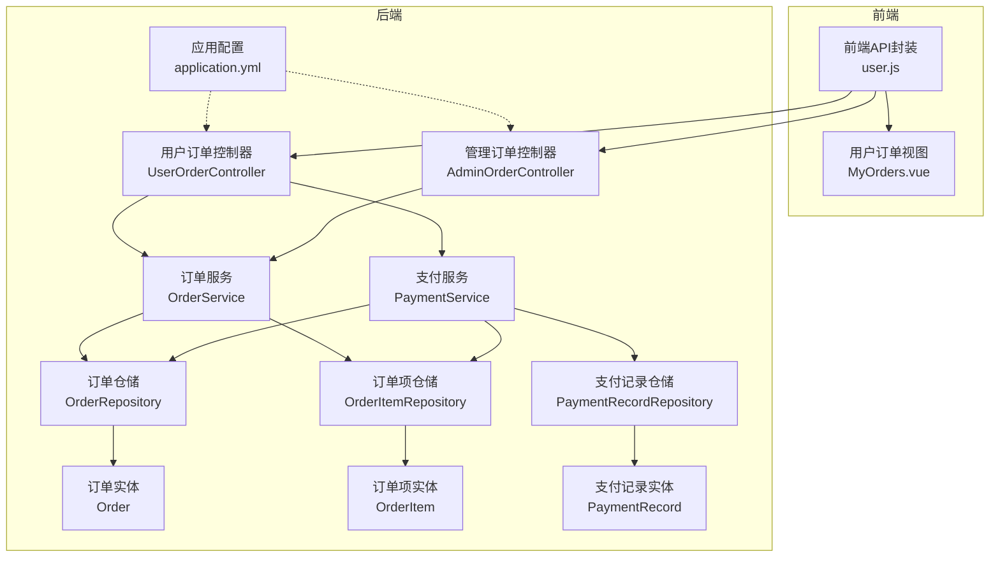
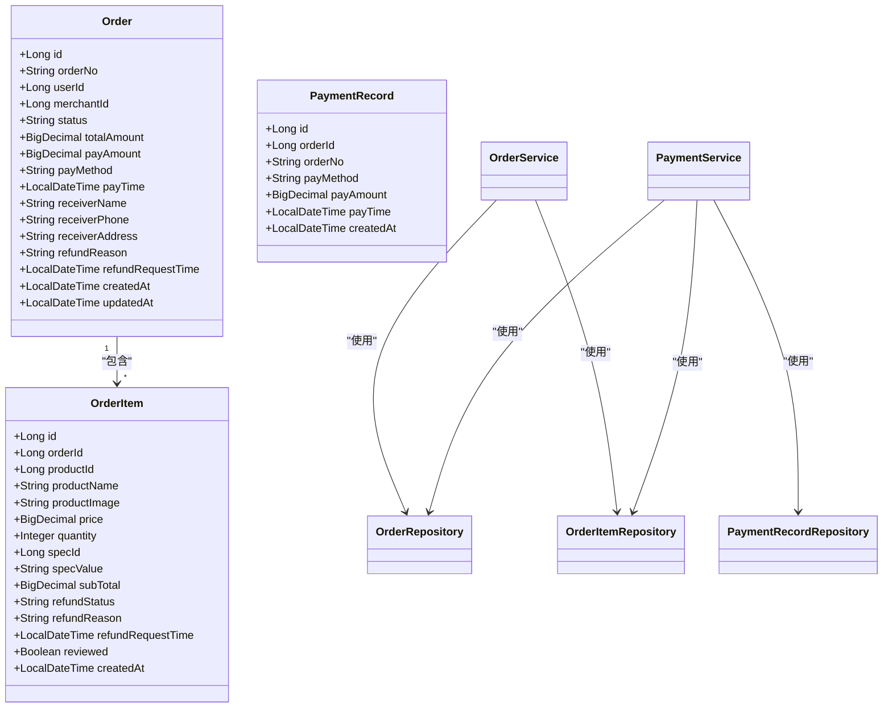
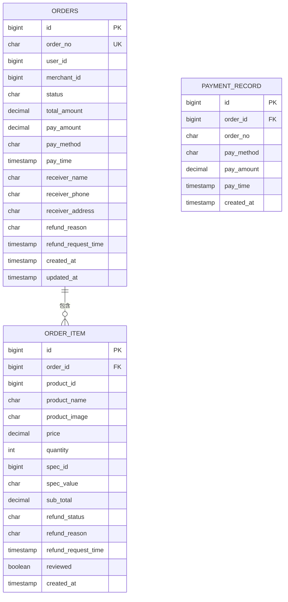
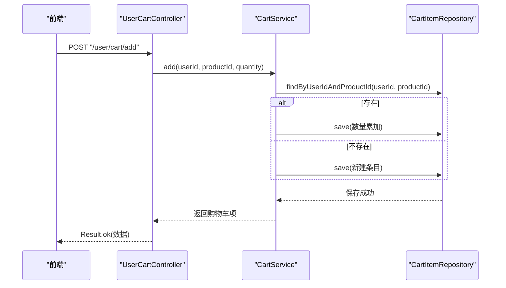
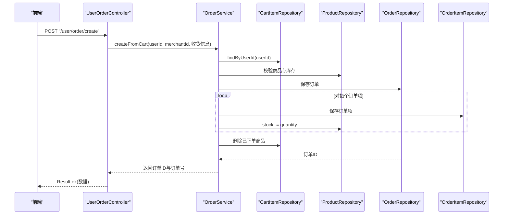
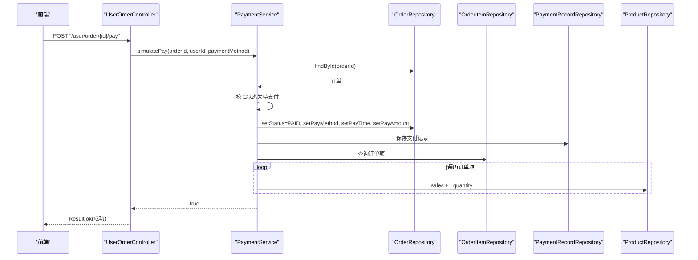
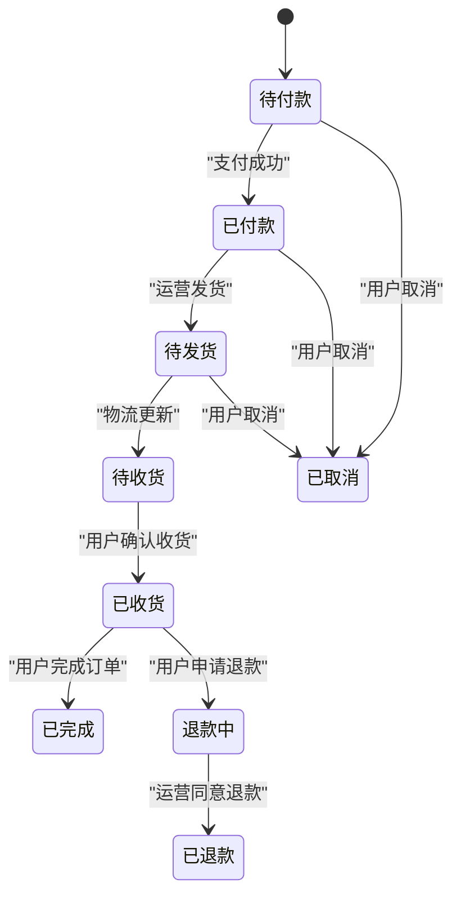
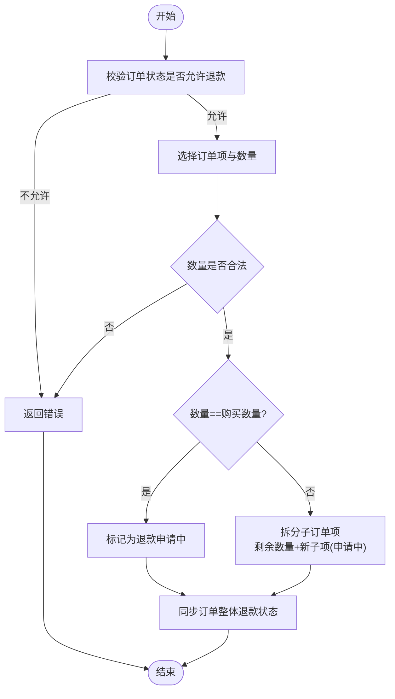
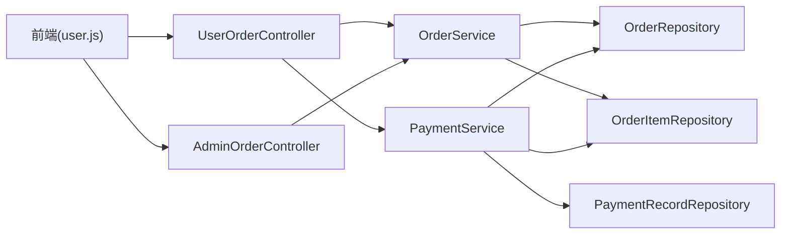

# 订单管理系统

<cite>
**本文引用的文件**
- [Order.java](file://backend/src/main/java/com/mall/entity/Order.java)
- [OrderItem.java](file://backend/src/main/java/com/mall/entity/OrderItem.java)
- [OrderService.java](file://backend/src/main/java/com/mall/service/OrderService.java)
- [UserOrderController.java](file://backend/src/main/java/com/mall/controller/user/UserOrderController.java)
- [AdminOrderController.java](file://backend/src/main/java/com/mall/controller/admin/AdminOrderController.java)
- [OrderRepository.java](file://backend/src/main/java/com/mall/repository/OrderRepository.java)
- [PaymentService.java](file://backend/src/main/java/com/mall/service/PaymentService.java)
- [PaymentRecord.java](file://backend/src/main/java/com/mall/entity/PaymentRecord.java)
- [PaymentRecordRepository.java](file://backend/src/main/java/com/mall/repository/PaymentRecordRepository.java)
- [CartItem.java](file://backend/src/main/java/com/mall/entity/CartItem.java)
- [CartItemDTO.java](file://backend/src/main/java/com/mall/dto/CartItemDTO.java)
- [CartService.java](file://backend/src/main/java/com/mall/service/CartService.java)
- [UserCartController.java](file://backend/src/main/java/com/mall/controller/user/UserCartController.java)
- [application.yml](file://backend/src/main/resources/application.yml)
- [user.js](file://frontend/src/api/user.js)
- [MyOrders.vue](file://frontend/src/views/user/MyOrders.vue)
</cite>

## 目录
1. [简介](#简介)
2. [项目结构](#项目结构)
3. [核心组件](#核心组件)
4. [架构总览](#架构总览)
5. [详细组件分析](#详细组件分析)
6. [依赖关系分析](#依赖关系分析)
7. [性能考量](#性能考量)
8. [故障排查指南](#故障排查指南)
9. [结论](#结论)
10. [附录](#附录)

## 简介
本系统围绕“订单生命周期”构建，覆盖购物车管理、订单创建、订单支付、订单状态跟踪、订单查询、退款申请与处理等完整链路。后端采用 Spring Boot + JPA，数据库为 MySQL；前端基于 Vue 3 + Element Plus，提供订单列表、详情、支付、取消、收货、退款等交互界面。系统通过模拟支付完成支付流程，同时在业务层实现库存扣减与销量增长。

## 项目结构
后端按职责分层组织：controller 控制器、service 服务层、repository 数据访问层、entity 实体层、dto 数据传输对象、config 配置类、exception 异常处理等。前端按角色划分布局与视图，用户端提供订单相关页面与 API 调用封装。

图表来源
- [UserOrderController.java:19-198](file://backend/src/main/java/com/mall/controller/user/UserOrderController.java#L19-L198)
- [AdminOrderController.java:17-45](file://backend/src/main/java/com/mall/controller/admin/AdminOrderController.java#L17-L45)
- [OrderService.java:23-280](file://backend/src/main/java/com/mall/service/OrderService.java#L23-L280)
- [PaymentService.java:21-67](file://backend/src/main/java/com/mall/service/PaymentService.java#L21-L67)
- [OrderRepository.java:13-27](file://backend/src/main/java/com/mall/repository/OrderRepository.java#L13-L27)
- [Order.java:9-83](file://backend/src/main/java/com/mall/entity/Order.java#L9-L83)
- [OrderItem.java:9-73](file://backend/src/main/java/com/mall/entity/OrderItem.java#L9-L73)
- [PaymentRecord.java:9-46](file://backend/src/main/java/com/mall/entity/PaymentRecord.java#L9-L46)
- [application.yml:1-36](file://backend/src/main/resources/application.yml#L1-L36)

章节来源
- [application.yml:1-36](file://backend/src/main/resources/application.yml#L1-L36)

## 核心组件
- 订单实体与订单项实体：定义订单与订单项的数据结构、字段约束与时间戳。
- 订单服务：负责从购物车下单、库存扣减、状态更新、取消订单、退款申请与处理、订单项退款拆分与合并。
- 支付服务：模拟支付，设置订单状态为已支付、写入支付记录、更新商品销量。
- 订单控制器（用户/管理）：暴露 REST 接口，处理用户侧下单、支付、收货、取消、退款申请，以及管理侧订单查询。
- 仓储层：基于 JPA 的订单、订单项、支付记录仓储，提供分页查询与条件查询。
- 购物车模块：提供购物车增删改查，支撑订单创建。

章节来源
- [Order.java:9-83](file://backend/src/main/java/com/mall/entity/Order.java#L9-L83)
- [OrderItem.java:9-73](file://backend/src/main/java/com/mall/entity/OrderItem.java#L9-L73)
- [OrderService.java:23-280](file://backend/src/main/java/com/mall/service/OrderService.java#L23-L280)
- [PaymentService.java:21-67](file://backend/src/main/java/com/mall/service/PaymentService.java#L21-L67)
- [OrderRepository.java:13-27](file://backend/src/main/java/com/mall/repository/OrderRepository.java#L13-L27)
- [UserOrderController.java:19-198](file://backend/src/main/java/com/mall/controller/user/UserOrderController.java#L19-L198)
- [AdminOrderController.java:17-45](file://backend/src/main/java/com/mall/controller/admin/AdminOrderController.java#L17-L45)
- [CartItem.java:8-50](file://backend/src/main/java/com/mall/entity/CartItem.java#L8-L50)
- [CartService.java:14-61](file://backend/src/main/java/com/mall/service/CartService.java#L14-L61)

## 架构总览
系统采用经典的 MVC 分层与领域驱动设计：
- 控制器层：接收请求、参数校验、调用服务层、返回统一结果包装。
- 服务层：编排业务逻辑，事务控制，跨实体协调（订单、订单项、商品、支付记录）。
- 仓储层：数据持久化抽象，提供查询方法。
- 实体层：数据模型与生命周期事件（创建/更新时间）。
- 前端：通过 API 封装调用后端接口，渲染订单列表、详情与操作面板。

图表来源
- [Order.java:9-83](file://backend/src/main/java/com/mall/entity/Order.java#L9-L83)
- [OrderItem.java:9-73](file://backend/src/main/java/com/mall/entity/OrderItem.java#L9-L73)
- [PaymentRecord.java:9-46](file://backend/src/main/java/com/mall/entity/PaymentRecord.java#L9-L46)
- [OrderService.java:23-280](file://backend/src/main/java/com/mall/service/OrderService.java#L23-L280)
- [PaymentService.java:21-67](file://backend/src/main/java/com/mall/service/PaymentService.java#L21-L67)
- [OrderRepository.java:13-27](file://backend/src/main/java/com/mall/repository/OrderRepository.java#L13-L27)

## 详细组件分析

### 订单数据模型设计
- 订单表字段涵盖订单号、用户与商户标识、状态、金额、收货信息、退款相关信息、时间戳等。
- 订单项表字段包含商品快照、单价、数量、小计、退款状态与评价标记等。
- 支付记录表用于记录支付方式、金额与时间，保证支付数据完整性。

图表来源
- [Order.java:18-81](file://backend/src/main/java/com/mall/entity/Order.java#L18-L81)
- [OrderItem.java:18-71](file://backend/src/main/java/com/mall/entity/OrderItem.java#L18-L71)
- [PaymentRecord.java:19-44](file://backend/src/main/java/com/mall/entity/PaymentRecord.java#L19-L44)

章节来源
- [Order.java:9-83](file://backend/src/main/java/com/mall/entity/Order.java#L9-L83)
- [OrderItem.java:9-73](file://backend/src/main/java/com/mall/entity/OrderItem.java#L9-L73)
- [PaymentRecord.java:9-46](file://backend/src/main/java/com/mall/entity/PaymentRecord.java#L9-L46)

### 购物车管理
- 购物车实体支持唯一约束（用户+商品+规格），避免重复叠加。
- 购物车服务提供添加、修改数量、删除等操作，新增时若存在相同商品则累加数量。
- 用户控制器提供添加、修改数量、删除接口，配合前端购物车页面使用。

图表来源
- [UserCartController.java:34-66](file://backend/src/main/java/com/mall/controller/user/UserCartController.java#L34-L66)
- [CartService.java:25-44](file://backend/src/main/java/com/mall/service/CartService.java#L25-L44)
- [CartItem.java:8-50](file://backend/src/main/java/com/mall/entity/CartItem.java#L8-L50)

章节来源
- [CartItem.java:8-50](file://backend/src/main/java/com/mall/entity/CartItem.java#L8-L50)
- [CartService.java:14-61](file://backend/src/main/java/com/mall/service/CartService.java#L14-L61)
- [UserCartController.java:34-66](file://backend/src/main/java/com/mall/controller/user/UserCartController.java#L34-L66)

### 订单创建与库存扣减
- 从购物车创建订单：按当前用户与运营筛选购物车商品，校验库存充足后生成订单与订单项，扣减商品库存，清空对应购物车项。
- 订单号格式：以“O”开头，拼接时间戳与随机片段，保证唯一性。
- 事务保障：下单、扣减库存、清空购物车在同一个事务内执行，确保一致性。

图表来源
- [UserOrderController.java:33-50](file://backend/src/main/java/com/mall/controller/user/UserOrderController.java#L33-L50)
- [OrderService.java:33-88](file://backend/src/main/java/com/mall/service/OrderService.java#L33-L88)
- [OrderRepository.java:13-27](file://backend/src/main/java/com/mall/repository/OrderRepository.java#L13-L27)

章节来源
- [OrderService.java:33-88](file://backend/src/main/java/com/mall/service/OrderService.java#L33-L88)
- [OrderRepository.java:13-27](file://backend/src/main/java/com/mall/repository/OrderRepository.java#L13-L27)

### 订单支付流程集成
- 模拟支付：用户点击支付后，调用支付服务将订单状态置为已支付，写入支付记录，更新商品销量。
- 支付方式默认为“WECHAT”，可传入指定方式。
- 支付前置条件：订单存在且状态为“待支付”。

图表来源
- [UserOrderController.java:102-111](file://backend/src/main/java/com/mall/controller/user/UserOrderController.java#L102-L111)
- [PaymentService.java:30-65](file://backend/src/main/java/com/mall/service/PaymentService.java#L30-L65)

章节来源
- [PaymentService.java:18-67](file://backend/src/main/java/com/mall/service/PaymentService.java#L18-L67)
- [UserOrderController.java:102-111](file://backend/src/main/java/com/mall/controller/user/UserOrderController.java#L102-L111)

### 订单状态跟踪与生命周期
- 用户可进行的操作：取消（收货前）、确认收货、完成订单、申请退款。
- 运营可进行的操作：发货（需订单已支付）、同意退款（仅限退款申请中）。
- 状态转换规则：
  - PENDING → PAID（支付成功）
  - PAID → SHIPPED（运营发货）
  - SHIPPED → RECEIVED（用户确认收货）
  - RECEIVED → COMPLETED（用户完成订单）
  - PENDING/PAID/TO_SHIP → CANCELLED（用户取消）
  - RECEIVED → REFUND_REQUESTED（用户申请退款）
  - REFUND_REQUESTED → REFUNDED（运营同意退款）

图表来源
- [OrderService.java:115-145](file://backend/src/main/java/com/mall/service/OrderService.java#L115-L145)
- [UserOrderController.java:113-133](file://backend/src/main/java/com/mall/controller/user/UserOrderController.java#L113-L133)
- [MerchantOrderController.java:61-85](file://backend/src/main/java/com/mall/controller/merchant/MerchantOrderController.java#L61-L85)

章节来源
- [OrderService.java:115-145](file://backend/src/main/java/com/mall/service/OrderService.java#L115-L145)
- [UserOrderController.java:113-133](file://backend/src/main/java/com/mall/controller/user/UserOrderController.java#L113-L133)

### 退款申请与处理
- 单项退款：支持部分数量退款，系统自动拆分子订单项；若数量等于购买数量，则标记为退款申请中。
- 批量退款：一次选择多个订单项与数量，逐项校验并处理。
- 订单级同步：当所有订单项均处于“退款申请中/已退款”时，订单整体标记为“退款中”。

图表来源
- [OrderService.java:186-252](file://backend/src/main/java/com/mall/service/OrderService.java#L186-L252)

章节来源
- [OrderService.java:166-252](file://backend/src/main/java/com/mall/service/OrderService.java#L166-L252)

### 订单查询与统计
- 用户查询：分页查询我的订单，支持按状态过滤与关键词搜索。
- 管理查询：分页查询全站订单，支持详情查看。
- 前端统计：展示各状态订单数量与当前页订单数，辅助运营与用户快速定位。

章节来源
- [UserOrderController.java:52-100](file://backend/src/main/java/com/mall/controller/user/UserOrderController.java#L52-L100)
- [AdminOrderController.java:25-43](file://backend/src/main/java/com/mall/controller/admin/AdminOrderController.java#L25-L43)
- [MyOrders.vue:31-50](file://frontend/src/views/user/MyOrders.vue#L31-L50)

### API 调用示例
以下为前端调用后端接口的典型路径（仅列出路径与用途，具体参数以接口定义为准）：
- 创建订单：POST /user/order/create
- 我的订单列表：GET /user/order?page=&size=
- 订单详情：GET /user/order/{id}
- 订单支付：POST /user/order/{id}/pay
- 取消订单（收货前）：POST /user/order/{id}/cancel
- 确认收货：POST /user/order/{id}/confirm-receive
- 完成订单：POST /user/order/{id}/complete
- 申请退款：POST /user/order/{id}/refund-request
- 单项退款申请：POST /user/order/{orderId}/items/{itemId}/refund-request
- 批量退款申请：POST /user/order/{orderId}/items/batch-refund-request
- 管理端订单列表：GET /admin/order?page=&size=
- 管理端订单详情：GET /admin/order/{id}

章节来源
- [user.js:58-112](file://frontend/src/api/user.js#L58-L112)
- [UserOrderController.java:33-196](file://backend/src/main/java/com/mall/controller/user/UserOrderController.java#L33-L196)
- [AdminOrderController.java:25-43](file://backend/src/main/java/com/mall/controller/admin/AdminOrderController.java#L25-L43)

## 依赖关系分析
- 控制器依赖服务层；服务层依赖仓储层；仓储层依赖实体。
- 订单服务与支付服务共同依赖订单、订单项、支付记录仓储。
- 前端通过 API 封装调用控制器接口，控制器返回统一 Result 包装。

图表来源
- [UserOrderController.java:19-198](file://backend/src/main/java/com/mall/controller/user/UserOrderController.java#L19-L198)
- [AdminOrderController.java:17-45](file://backend/src/main/java/com/mall/controller/admin/AdminOrderController.java#L17-L45)
- [OrderService.java:23-280](file://backend/src/main/java/com/mall/service/OrderService.java#L23-L280)
- [PaymentService.java:21-67](file://backend/src/main/java/com/mall/service/PaymentService.java#L21-L67)

章节来源
- [OrderRepository.java:13-27](file://backend/src/main/java/com/mall/repository/OrderRepository.java#L13-L27)
- [OrderService.java:23-280](file://backend/src/main/java/com/mall/service/OrderService.java#L23-L280)
- [PaymentService.java:21-67](file://backend/src/main/java/com/mall/service/PaymentService.java#L21-L67)

## 性能考量
- 分页查询：用户与管理端均使用分页接口，避免一次性加载大量订单。
- 事务边界：下单与支付均在事务内执行，减少并发场景下的数据不一致风险。
- 查询优化：仓储层提供按用户、商户、状态等条件的分页查询，前端按需筛选。
- 前端渲染：订单列表采用骨架屏与懒加载策略，提升用户体验。

## 故障排查指南
- 下单失败（库存不足）：检查商品库存与购物车数量，确保下单前库存充足。
- 支付失败：确认订单状态为“待支付”，支付方式合法；查看支付记录是否写入。
- 取消失败：仅“待支付/已支付/待发货”状态下可取消；已收货或退款中不可取消。
- 退款异常：仅“已收货”或“退款中”状态下可申请；单项退款数量需合法；批量退款需正确传递 itemIds 与 itemQuantities。
- 查询无数据：确认分页参数与筛选条件；管理端需具备相应权限。

章节来源
- [OrderService.java:123-161](file://backend/src/main/java/com/mall/service/OrderService.java#L123-L161)
- [PaymentService.java:30-45](file://backend/src/main/java/com/mall/service/PaymentService.java#L30-L45)
- [UserOrderController.java:135-152](file://backend/src/main/java/com/mall/controller/user/UserOrderController.java#L135-L152)

## 结论
本订单管理系统以清晰的分层架构与完善的订单生命周期管理为核心，结合购物车、支付、退款等关键流程，提供了完整的电商订单能力。通过统一的 API 封装与前端交互，开发者可快速理解并扩展订单相关功能。建议在生产环境中进一步完善支付网关对接、异步任务与分布式锁、审计日志与监控告警等能力。

## 附录
- 数据库连接与 JPA 配置位于 application.yml，包含数据源、JPA 方言与端口等。
- 前端订单页面提供状态筛选、搜索、分页与退款申请交互，便于用户自助管理订单。

章节来源
- [application.yml:1-36](file://backend/src/main/resources/application.yml#L1-L36)
- [MyOrders.vue:1-120](file://frontend/src/views/user/MyOrders.vue#L1-L120)