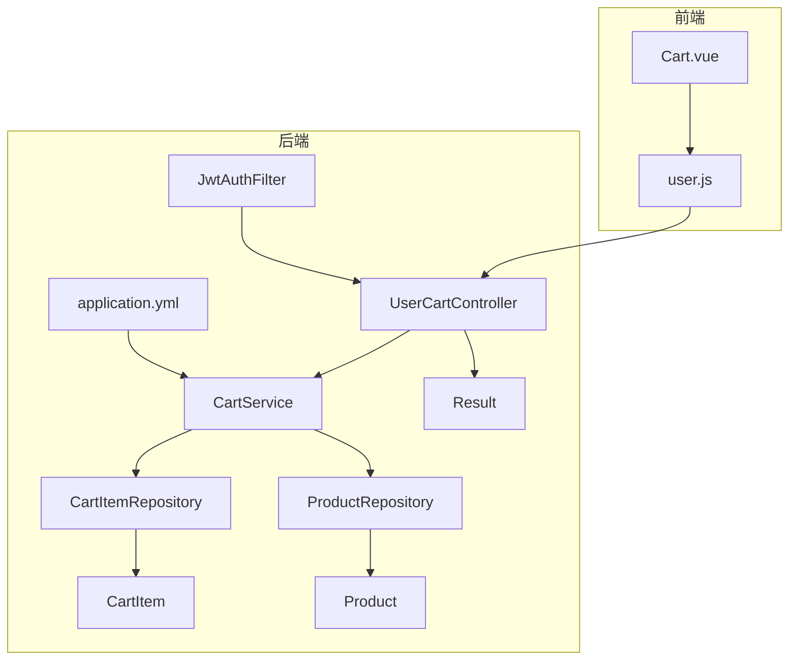
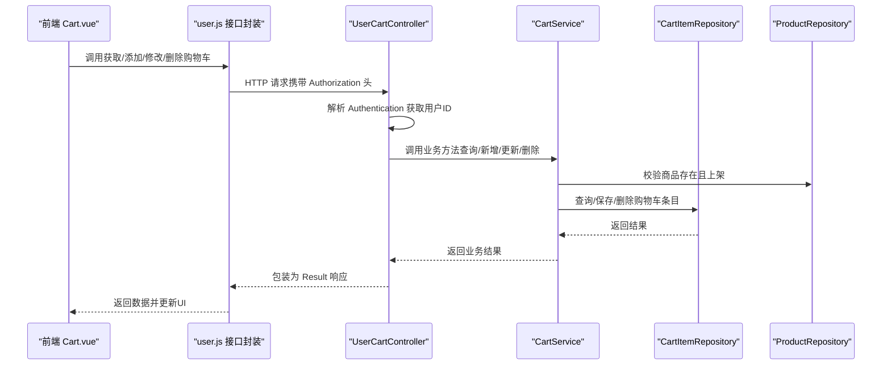
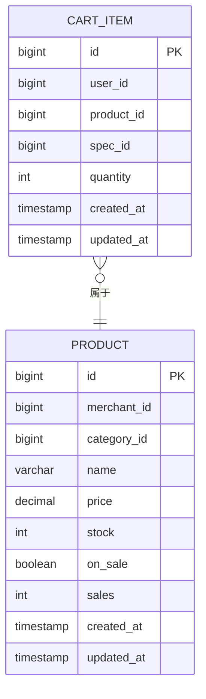
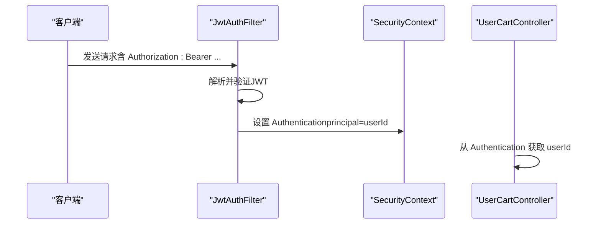
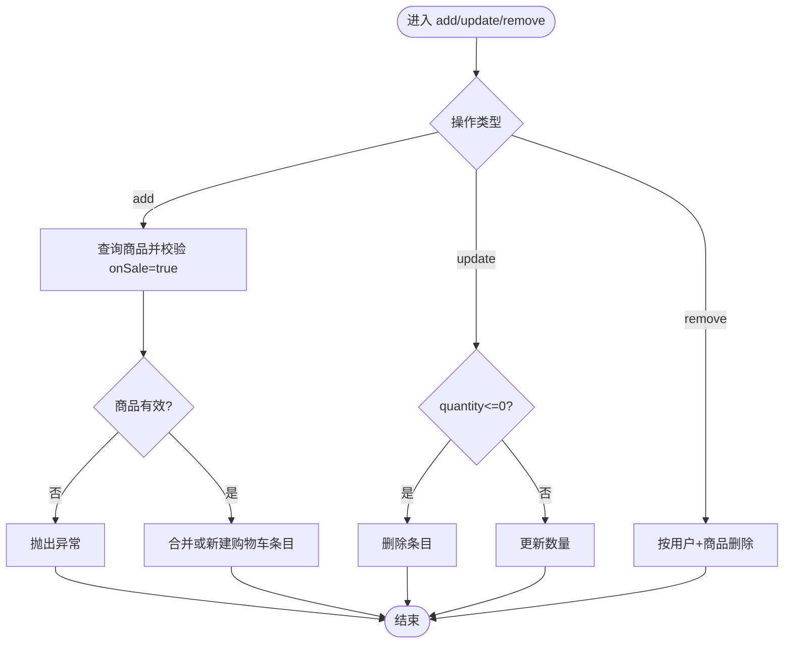
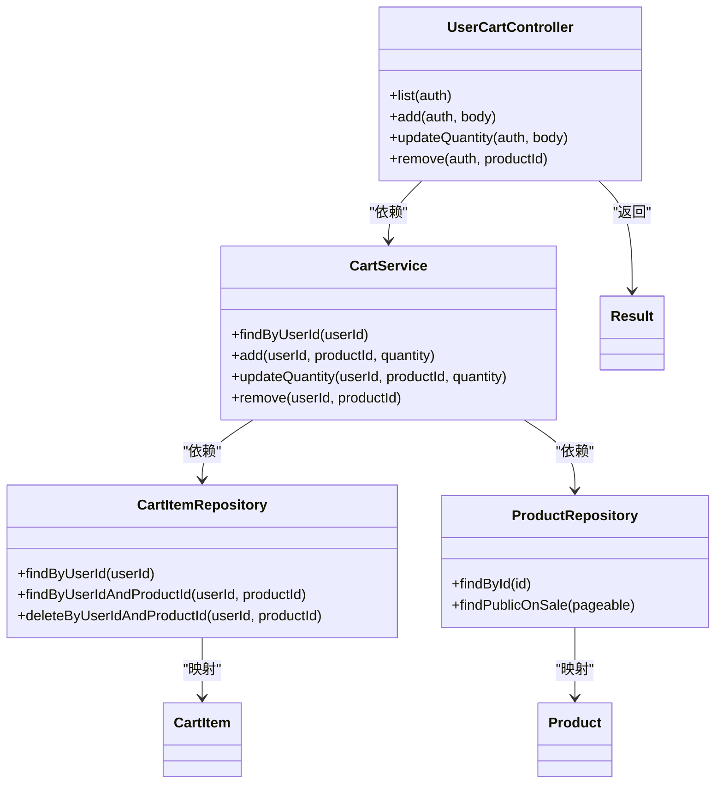

# 购物车管理

<cite>
**本文引用的文件**
- [UserCartController.java](file://backend/src/main/java/com/mall/controller/user/UserCartController.java)
- [CartService.java](file://backend/src/main/java/com/mall/service/CartService.java)
- [CartItemRepository.java](file://backend/src/main/java/com/mall/repository/CartItemRepository.java)
- [CartItem.java](file://backend/src/main/java/com/mall/entity/CartItem.java)
- [CartItemDTO.java](file://backend/src/main/java/com/mall/dto/CartItemDTO.java)
- [CartItemRequest.java](file://backend/src/main/java/com/mall/dto/CartItemRequest.java)
- [ProductRepository.java](file://backend/src/main/java/com/mall/repository/ProductRepository.java)
- [Product.java](file://backend/src/main/java/com/mall/entity/Product.java)
- [application.yml](file://backend/src/main/resources/application.yml)
- [JwtAuthFilter.java](file://backend/src/main/java/com/mall/security/JwtAuthFilter.java)
- [Result.java](file://backend/src/main/java/com/mall/dto/Result.java)
- [Cart.vue](file://frontend/src/views/user/Cart.vue)
- [user.js](file://frontend/src/api/user.js)
</cite>

## 目录
1. [简介](#简介)
2. [项目结构](#项目结构)
3. [核心组件](#核心组件)
4. [架构总览](#架构总览)
5. [详细组件分析](#详细组件分析)
6. [依赖分析](#依赖分析)
7. [性能考虑](#性能考虑)
8. [故障排查指南](#故障排查指南)
9. [结论](#结论)
10. [附录](#附录)

## 简介
本技术文档围绕购物车管理功能进行系统性梳理，覆盖查询购物车列表、添加商品到购物车、修改商品数量、删除购物车商品等核心操作；阐述数据模型设计、用户会话管理、商品上架状态校验机制以及购物车持久化策略；提供完整的API接口定义、请求参数、响应格式与错误处理规范；并给出业务逻辑实现要点、异常处理与性能优化建议，帮助开发者正确实现与维护购物车功能。

## 项目结构
后端采用Spring Boot分层架构，购物车相关代码分布如下：
- 控制器层：用户端购物车接口控制器
- 服务层：购物车业务逻辑与事务控制
- 数据访问层：JPA仓库接口
- 实体层：购物车条目与商品实体
- DTO层：接口传输对象
- 安全层：基于JWT的认证过滤器
- 配置：数据库与JPA配置
- 前端：Vue页面与API调用封装

图表来源
- [UserCartController.java:1-67](file://backend/src/main/java/com/mall/controller/user/UserCartController.java#L1-L67)
- [CartService.java:1-62](file://backend/src/main/java/com/mall/service/CartService.java#L1-L62)
- [CartItemRepository.java:1-21](file://backend/src/main/java/com/mall/repository/CartItemRepository.java#L1-L21)
- [ProductRepository.java:1-125](file://backend/src/main/java/com/mall/repository/ProductRepository.java#L1-L125)
- [CartItem.java:1-50](file://backend/src/main/java/com/mall/entity/CartItem.java#L1-L50)
- [Product.java:1-101](file://backend/src/main/java/com/mall/entity/Product.java#L1-L101)
- [application.yml:1-36](file://backend/src/main/resources/application.yml#L1-L36)
- [JwtAuthFilter.java:1-57](file://backend/src/main/java/com/mall/security/JwtAuthFilter.java#L1-L57)
- [Result.java:1-24](file://backend/src/main/java/com/mall/dto/Result.java#L1-L24)
- [Cart.vue:1-909](file://frontend/src/views/user/Cart.vue#L1-L909)
- [user.js:1-162](file://frontend/src/api/user.js#L1-L162)

章节来源
- [UserCartController.java:1-67](file://backend/src/main/java/com/mall/controller/user/UserCartController.java#L1-L67)
- [application.yml:1-36](file://backend/src/main/resources/application.yml#L1-L36)

## 核心组件
- 控制器：提供用户端购物车接口，负责接收请求、解析用户身份并调用服务层。
- 服务层：封装购物车业务逻辑，包含查询、新增、修改数量、删除等操作，并进行商品有效性校验。
- 仓储层：通过JPA接口访问数据库，提供按用户与商品维度的查询与删除能力。
- 实体层：购物车条目与商品实体，定义字段与时间戳更新策略。
- DTO层：用于接口返回的数据结构定义。
- 安全层：JWT过滤器解析请求头中的令牌，注入认证上下文。
- 前端：购物车页面负责展示与交互，调用用户API完成增删改查。

章节来源
- [UserCartController.java:14-67](file://backend/src/main/java/com/mall/controller/user/UserCartController.java#L14-L67)
- [CartService.java:14-62](file://backend/src/main/java/com/mall/service/CartService.java#L14-L62)
- [CartItemRepository.java:9-21](file://backend/src/main/java/com/mall/repository/CartItemRepository.java#L9-L21)
- [CartItem.java:8-50](file://backend/src/main/java/com/mall/entity/CartItem.java#L8-L50)
- [Product.java:9-101](file://backend/src/main/java/com/mall/entity/Product.java#L9-L101)
- [CartItemDTO.java:1-33](file://backend/src/main/java/com/mall/dto/CartItemDTO.java#L1-L33)
- [CartItemRequest.java:1-17](file://backend/src/main/java/com/mall/dto/CartItemRequest.java#L1-L17)
- [JwtAuthFilter.java:18-57](file://backend/src/main/java/com/mall/security/JwtAuthFilter.java#L18-L57)
- [Result.java:10-24](file://backend/src/main/java/com/mall/dto/Result.java#L10-L24)
- [Cart.vue:310-480](file://frontend/src/views/user/Cart.vue#L310-L480)
- [user.js:18-36](file://frontend/src/api/user.js#L18-L36)

## 架构总览
购物车模块遵循“控制器-服务-仓储-实体”的分层设计，前端通过HTTP接口与后端交互，后端通过JWT认证获取当前用户标识，再执行相应的业务操作。

图表来源
- [UserCartController.java:27-65](file://backend/src/main/java/com/mall/controller/user/UserCartController.java#L27-L65)
- [CartService.java:21-60](file://backend/src/main/java/com/mall/service/CartService.java#L21-L60)
- [CartItemRepository.java:11-20](file://backend/src/main/java/com/mall/repository/CartItemRepository.java#L11-L20)
- [ProductRepository.java:13-125](file://backend/src/main/java/com/mall/repository/ProductRepository.java#L13-L125)
- [Result.java:16-22](file://backend/src/main/java/com/mall/dto/Result.java#L16-L22)
- [Cart.vue:375-421](file://frontend/src/views/user/Cart.vue#L375-L421)
- [user.js:18-36](file://frontend/src/api/user.js#L18-L36)

## 详细组件分析

### 数据模型设计
- 购物车条目（CartItem）
  - 主键自增，唯一约束：用户ID + 商品ID + 规格ID，保证同一用户对同一商品规格的唯一性。
  - 字段包含用户ID、商品ID、规格ID、数量、创建与更新时间戳。
  - 预持久化与预更新时自动填充时间戳。
- 商品（Product）
  - 字段包含基础信息、价格、库存、销量、上下架状态等。
  - 提供多种公开查询接口，结合商家启用状态进行过滤。

图表来源
- [CartItem.java:17-48](file://backend/src/main/java/com/mall/entity/CartItem.java#L17-L48)
- [Product.java:18-88](file://backend/src/main/java/com/mall/entity/Product.java#L18-L88)

章节来源
- [CartItem.java:8-50](file://backend/src/main/java/com/mall/entity/CartItem.java#L8-L50)
- [Product.java:9-101](file://backend/src/main/java/com/mall/entity/Product.java#L9-L101)

### 用户会话管理
- 后端通过JWT过滤器解析请求头中的Authorization头，提取Bearer Token并解析用户ID与角色，注入到SecurityContext。
- 控制器通过Authentication参数获取当前用户ID，确保购物车操作绑定到正确的用户上下文。

图表来源
- [JwtAuthFilter.java:30-47](file://backend/src/main/java/com/mall/security/JwtAuthFilter.java#L30-L47)
- [UserCartController.java:22-32](file://backend/src/main/java/com/mall/controller/user/UserCartController.java#L22-L32)

章节来源
- [JwtAuthFilter.java:18-57](file://backend/src/main/java/com/mall/security/JwtAuthFilter.java#L18-L57)
- [UserCartController.java:14-32](file://backend/src/main/java/com/mall/controller/user/UserCartController.java#L14-L32)

### 商品上架状态与库存检查机制
- 新增购物车条目时，服务层先查询商品是否存在且处于上架状态，若不满足则抛出异常。
- 若同用户同商品（含规格）已存在，则累加数量；否则新建条目。
- 修改数量时，若数量小于等于0，则直接删除该条目；否则仅更新数量。
- 删除时按用户ID与商品ID删除对应条目。

图表来源
- [CartService.java:25-60](file://backend/src/main/java/com/mall/service/CartService.java#L25-L60)
- [ProductRepository.java:13-44](file://backend/src/main/java/com/mall/repository/ProductRepository.java#L13-L44)

章节来源
- [CartService.java:21-60](file://backend/src/main/java/com/mall/service/CartService.java#L21-L60)
- [ProductRepository.java:13-125](file://backend/src/main/java/com/mall/repository/ProductRepository.java#L13-L125)

### 购物车持久化策略
- 使用JPA与MySQL存储购物车条目，唯一约束避免重复添加相同商品规格。
- 通过JpaRepository提供的方法实现按用户ID查询、按用户+商品查询、按用户+商品删除等操作。
- 配置文件中设置Hibernate方言、DDL策略、SQL显示与OpenInView关闭，保证一致性与性能。

章节来源
- [CartItemRepository.java:9-21](file://backend/src/main/java/com/mall/repository/CartItemRepository.java#L9-L21)
- [application.yml:9-17](file://backend/src/main/resources/application.yml#L9-L17)

### API接口文档

- 查询购物车列表
  - 方法与路径：GET /user/cart
  - 认证：需要JWT
  - 请求参数：无
  - 响应数据：Result<List<CartItem>>
  - 异常：无特定异常处理（由全局异常处理器统一包装）

- 添加商品到购物车
  - 方法与路径：POST /user/cart/add
  - 认证：需要JWT
  - 请求体：
    - productId: 商品ID（Long）
    - quantity: 数量（可选，默认1）
  - 响应数据：Result<CartItem>
  - 异常：商品不存在或未上架时返回失败

- 修改购物车商品数量
  - 方法与路径：PUT /user/cart/quantity
  - 认证：需要JWT
  - 请求体：
    - productId: 商品ID（Long）
    - quantity: 数量（int，必须>0）
  - 响应数据：Result<Void>
  - 异常：数量<=0时删除条目；其他异常返回失败

- 从购物车移除商品
  - 方法与路径：DELETE /user/cart/{productId}
  - 认证：需要JWT
  - 路径参数：productId（Long）
  - 响应数据：Result<Void>
  - 异常：无特定异常处理

章节来源
- [UserCartController.java:27-65](file://backend/src/main/java/com/mall/controller/user/UserCartController.java#L27-L65)
- [Result.java:16-22](file://backend/src/main/java/com/mall/dto/Result.java#L16-L22)

### 前端集成与交互
- 前端页面通过user.js封装的API调用后端接口，加载购物车列表并拉取商品详情，计算小计与合计。
- 支持数量增减、删除商品、结算流程（创建订单与支付），并在交互过程中进行必要的输入校验与提示。

章节来源
- [Cart.vue:375-477](file://frontend/src/views/user/Cart.vue#L375-L477)
- [user.js:18-36](file://frontend/src/api/user.js#L18-L36)

## 依赖分析
- 控制器依赖服务层；服务层依赖两个仓储接口；仓储接口依赖JPA；实体依赖JPA注解。
- 安全过滤器在请求到达控制器之前解析JWT并注入认证上下文。
- 响应统一使用Result包装，便于前后端一致的错误处理。

图表来源
- [UserCartController.java:20-25](file://backend/src/main/java/com/mall/controller/user/UserCartController.java#L20-L25)
- [CartService.java:18-19](file://backend/src/main/java/com/mall/service/CartService.java#L18-L19)
- [CartItemRepository.java:9-21](file://backend/src/main/java/com/mall/repository/CartItemRepository.java#L9-L21)
- [ProductRepository.java:13-125](file://backend/src/main/java/com/mall/repository/ProductRepository.java#L13-L125)
- [CartItem.java:8-50](file://backend/src/main/java/com/mall/entity/CartItem.java#L8-L50)
- [Product.java:9-101](file://backend/src/main/java/com/mall/entity/Product.java#L9-L101)
- [Result.java:10-24](file://backend/src/main/java/com/mall/dto/Result.java#L10-L24)

章节来源
- [UserCartController.java:14-67](file://backend/src/main/java/com/mall/controller/user/UserCartController.java#L14-L67)
- [CartService.java:14-62](file://backend/src/main/java/com/mall/service/CartService.java#L14-L62)
- [CartItemRepository.java:9-21](file://backend/src/main/java/com/mall/repository/CartItemRepository.java#L9-L21)
- [ProductRepository.java:13-125](file://backend/src/main/java/com/mall/repository/ProductRepository.java#L13-L125)
- [Result.java:10-24](file://backend/src/main/java/com/mall/dto/Result.java#L10-L24)

## 性能考虑
- 数据库层面
  - 为购物车表建立合适的索引以支持按用户ID与用户+商品ID查询。
  - 使用唯一约束避免重复插入，减少后续合并逻辑开销。
- 业务层面
  - 在新增时优先复用已有条目并累加数量，减少写入次数。
  - 修改数量时快速判断quantity<=0直接删除，避免无效更新。
- 缓存与异步
  - 对商品详情可在前端做缓存，减少重复请求。
  - 大量并发场景可考虑引入消息队列异步处理库存与订单变更。
- 日志与监控
  - 关闭不必要的SQL日志输出，避免I/O开销。
  - 对关键接口埋点监控，识别慢调用与异常峰值。

## 故障排查指南
- 常见错误与定位
  - 商品不存在或未上架：服务层在新增时进行校验，若失败会返回失败结果。
  - 数量非法：修改数量时若<=0会删除条目；若传参错误会导致失败。
  - 未登录或Token无效：JWT过滤器解析失败时请求无认证上下文，控制器无法获取userId。
- 响应格式
  - 成功：code=200，message="success"，data为具体数据。
  - 失败：code=400，message为错误信息，data=null。
- 前端处理
  - 页面在加载与交互时对数量进行边界校验，删除前进行二次确认。
  - 结算流程中对收货信息与支付方式进行必填校验。

章节来源
- [CartService.java:27-28](file://backend/src/main/java/com/mall/service/CartService.java#L27-L28)
- [CartService.java:47-50](file://backend/src/main/java/com/mall/service/CartService.java#L47-L50)
- [JwtAuthFilter.java:34-44](file://backend/src/main/java/com/mall/security/JwtAuthFilter.java#L34-L44)
- [Result.java:16-22](file://backend/src/main/java/com/mall/dto/Result.java#L16-L22)
- [Cart.vue:398-421](file://frontend/src/views/user/Cart.vue#L398-L421)

## 结论
购物车模块通过清晰的分层设计与严格的业务校验，实现了稳定可靠的增删改查能力。结合JWT认证、JPA持久化与统一响应包装，既保证了开发效率，也为后续扩展（如规格支持、促销叠加、缓存优化）提供了良好基础。建议在生产环境中进一步完善索引、监控与缓存策略，持续提升用户体验与系统稳定性。

## 附录
- 响应结构
  - 成功：{ code: 200, message: "success", data: T }
  - 失败：{ code: 400, message: "错误信息", data: null }
- 前端调用示例
  - 获取列表：getCart()
  - 添加商品：addCart({ productId, quantity })
  - 修改数量：updateCartQuantity({ productId, quantity })
  - 删除商品：removeCart(productId)

章节来源
- [Result.java:10-24](file://backend/src/main/java/com/mall/dto/Result.java#L10-L24)
- [user.js:18-36](file://frontend/src/api/user.js#L18-L36)