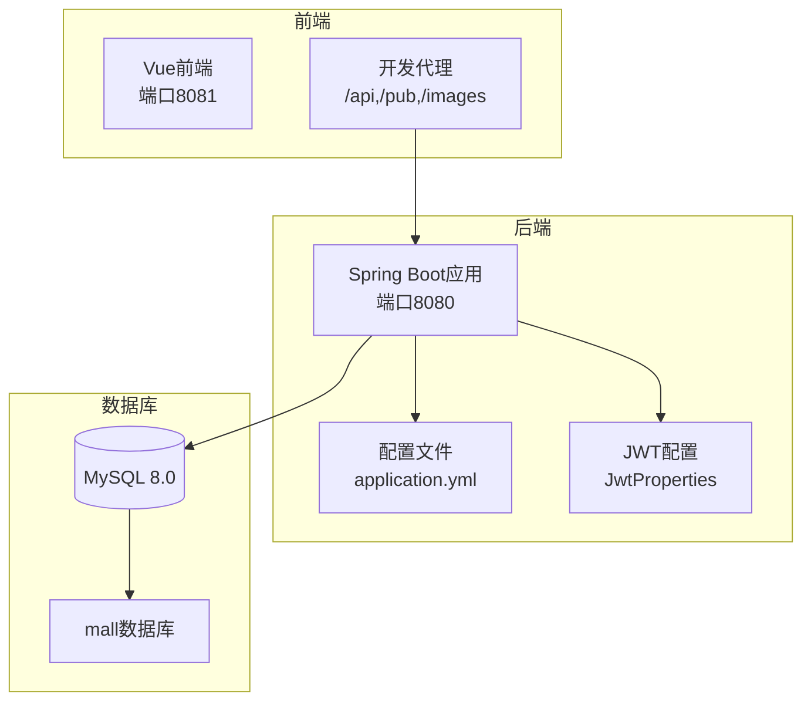
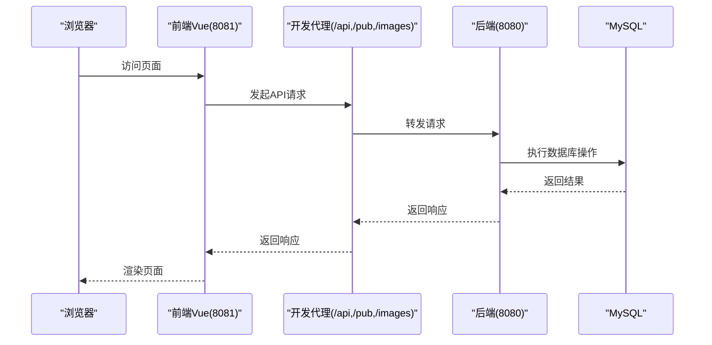
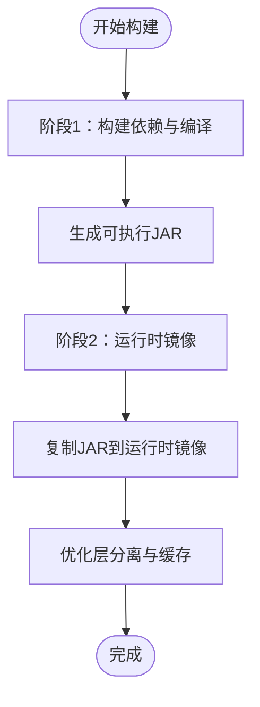
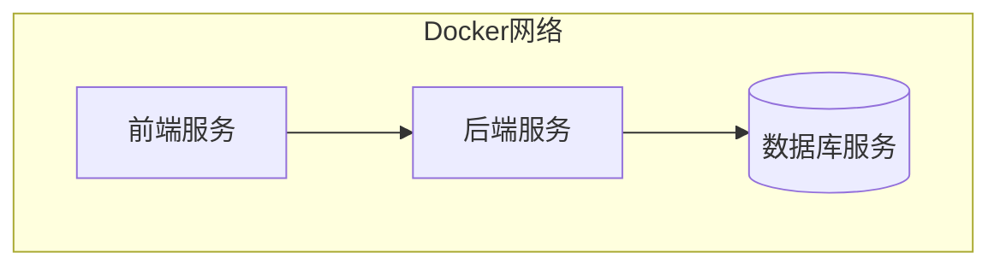
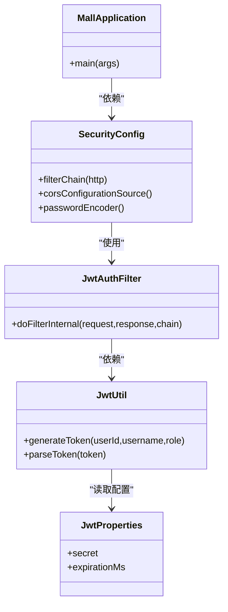

# Docker容器化部署

<cite>
**本文档引用的文件**
- [MallApplication.java](file://backend/src/main/java/com/mall/MallApplication.java)
- [application.yml](file://backend/src/main/resources/application.yml)
- [pom.xml](file://backend/pom.xml)
- [JwtProperties.java](file://backend/src/main/java/com/mall/config/JwtProperties.java)
- [SecurityConfig.java](file://backend/src/main/java/com/mall/config/SecurityConfig.java)
- [JwtUtil.java](file://backend/src/main/java/com/mall/security/JwtUtil.java)
- [JwtAuthFilter.java](file://backend/src/main/java/com/mall/security/JwtAuthFilter.java)
- [package.json](file://frontend/package.json)
- [vue.config.js](file://frontend/vue.config.js)
- [mall.sql](file://mall.sql)
- [banner.sql](file://backend/src/main/resources/banner.sql)
- [mvnw.cmd](file://backend/mvnw.cmd)
- [maven-wrapper.properties](file://backend/.mvn/wrapper/maven-wrapper.properties)
</cite>

## 目录
1. [简介](#简介)
2. [项目结构](#项目结构)
3. [核心组件](#核心组件)
4. [架构概览](#架构概览)
5. [详细组件分析](#详细组件分析)
6. [依赖分析](#依赖分析)
7. [性能考虑](#性能考虑)
8. [故障排除指南](#故障排除指南)
9. [结论](#结论)
10. [附录](#附录)

## 简介
本指南面向电商商城系统的Docker容器化部署，涵盖后端Spring Boot应用与前端Vue应用的镜像构建、多阶段优化、依赖打包策略；基于Docker Compose的服务编排、网络拓扑与服务依赖关系；容器运行参数、卷挂载策略与环境变量传递；健康检查、重启策略与资源限制配置；容器日志收集、调试方法与性能监控；以及容器安全最佳实践与镜像扫描。

## 项目结构
系统由前后端分离架构组成：
- 后端：基于Spring Boot 3.4.1（Java 17），使用MySQL作为持久化存储，提供REST API与静态资源服务。
- 前端：基于Vue 2.6.14，通过代理访问后端API，开发时监听8081端口。
- 数据库：MySQL 8.0，提供初始表结构与示例数据。

**图表来源**
- [application.yml:1-36](file://backend/src/main/resources/application.yml#L1-L36)
- [vue.config.js:1-19](file://frontend/vue.config.js#L1-L19)
- [MallApplication.java:1-13](file://backend/src/main/java/com/mall/MallApplication.java#L1-L13)

**章节来源**
- [application.yml:1-36](file://backend/src/main/resources/application.yml#L1-L36)
- [package.json:1-24](file://frontend/package.json#L1-L24)
- [vue.config.js:1-19](file://frontend/vue.config.js#L1-L19)

## 核心组件
- 后端应用启动入口：负责应用上下文初始化与端口监听。
- 配置管理：数据源连接、JPA设置、服务器端口与上下文路径、JWT密钥与过期时间、日志级别等。
- 安全配置：CORS策略、无状态会话、JWT过滤器链。
- 前端开发服务器：本地开发端口8081，代理转发至后端8080。
- 数据库脚本：提供完整的表结构与示例数据，支持快速初始化。

**章节来源**
- [MallApplication.java:1-13](file://backend/src/main/java/com/mall/MallApplication.java#L1-L13)
- [application.yml:1-36](file://backend/src/main/resources/application.yml#L1-L36)
- [SecurityConfig.java:1-73](file://backend/src/main/java/com/mall/config/SecurityConfig.java#L1-L73)
- [JwtProperties.java:1-17](file://backend/src/main/java/com/mall/config/JwtProperties.java#L1-L17)
- [JwtUtil.java:1-47](file://backend/src/main/java/com/mall/security/JwtUtil.java#L1-L47)
- [JwtAuthFilter.java:1-56](file://backend/src/main/java/com/mall/security/JwtAuthFilter.java#L1-L56)
- [package.json:1-24](file://frontend/package.json#L1-L24)
- [vue.config.js:1-19](file://frontend/vue.config.js#L1-L19)
- [mall.sql:1-200](file://mall.sql#L1-L200)

## 架构概览
系统采用三层架构：前端通过HTTP请求访问后端API，后端通过JPA访问MySQL数据库。开发环境使用Vue CLI代理将/api、/pub、/images前缀转发到后端，生产环境可由Nginx统一反向代理。

**图表来源**
- [vue.config.js:1-19](file://frontend/vue.config.js#L1-L19)
- [application.yml:22-25](file://backend/src/main/resources/application.yml#L22-L25)

## 详细组件分析

### 后端镜像构建与多阶段优化
- 基础镜像选择：建议使用官方OpenJDK 17基础镜像，确保与项目Java版本一致。
- 多阶段构建策略：
  - 第一阶段：使用Maven构建工具，下载依赖并编译打包，输出可执行JAR。
  - 第二阶段：仅复制第一阶段生成的JAR到运行时镜像，避免携带构建工具与依赖缓存，减小镜像体积。
- 依赖打包优化：
  - 使用Spring Boot Maven插件生成可执行JAR，减少运行时类路径复杂度。
  - 排除Lombok注解处理器在运行时的依赖，降低镜像大小。
- 分层策略：
  - 将依赖层与源码层分离，利用Docker缓存机制提升构建效率。
  - 将JAR文件与配置文件分别放置，便于更新配置而不重建依赖层。

**图表来源**
- [pom.xml:75-105](file://backend/pom.xml#L75-L105)
- [mvnw.cmd:1-189](file://backend/mvnw.cmd#L1-L189)
- [maven-wrapper.properties:1-3](file://backend/.mvn/wrapper/maven-wrapper.properties#L1-L3)

**章节来源**
- [pom.xml:16-18](file://backend/pom.xml#L16-L18)
- [pom.xml:75-105](file://backend/pom.xml#L75-L105)
- [mvnw.cmd:1-189](file://backend/mvnw.cmd#L1-L189)
- [maven-wrapper.properties:1-3](file://backend/.mvn/wrapper/maven-wrapper.properties#L1-L3)

### 前端镜像构建
- 基础镜像：使用Nginx官方镜像作为静态资源服务器。
- 构建流程：
  - 在构建阶段安装Node.js与包管理器，执行npm install与npm run build。
  - 将构建产物dist目录内容复制到Nginx默认站点目录。
  - 配置Nginx以80端口对外提供静态资源服务。
- 优化建议：
  - 使用多阶段构建，仅在构建阶段安装Node工具，最终镜像仅包含Nginx与静态文件。
  - 启用Gzip压缩与缓存策略，提升CDN与浏览器加载性能。

**章节来源**
- [package.json:5-8](file://frontend/package.json#L5-L8)

### Docker Compose编排配置
- 服务定义：
  - 后端服务：映射端口8080，挂载配置文件，设置环境变量覆盖数据库连接信息。
  - 前端服务：映射端口8080，挂载构建产物，配置Nginx代理规则。
  - 数据库服务：持久化数据卷，设置root密码与初始化脚本。
- 网络拓扑：
  - 所有服务位于同一自定义网络，实现服务间DNS解析与通信隔离。
  - 前端通过代理访问后端API，后端直接访问数据库。
- 服务依赖关系：
  - 后端依赖数据库服务，Compose通过healthcheck等待数据库就绪后再启动后端。
  - 前端依赖后端服务，通过环境变量或网络别名进行通信。

**图表来源**
- [application.yml:4-8](file://backend/src/main/resources/application.yml#L4-L8)
- [application.yml:22-25](file://backend/src/main/resources/application.yml#L22-L25)

**章节来源**
- [application.yml:4-8](file://backend/src/main/resources/application.yml#L4-L8)
- [application.yml:22-25](file://backend/src/main/resources/application.yml#L22-L25)

### 容器运行参数与卷挂载策略
- 端口映射：
  - 后端：宿主机8080映射容器8080，暴露API与静态资源端点。
  - 前端：宿主机8080映射容器80，提供静态资源服务。
- 卷挂载：
  - 数据库：持久化卷用于保存MySQL数据，避免容器删除导致数据丢失。
  - 配置文件：挂载application.yml到后端容器，便于动态调整数据库连接与日志级别。
  - 日志：挂载日志目录到宿主机，便于集中收集与分析。
- 环境变量：
  - 数据库连接：DB_URL、DB_USERNAME、DB_PASSWORD覆盖application.yml中的数据源配置。
  - JWT密钥：JWT_SECRET覆盖默认密钥，生产环境建议使用密钥管理服务注入。

**章节来源**
- [application.yml:4-8](file://backend/src/main/resources/application.yml#L4-L8)
- [JwtProperties.java:12-17](file://backend/src/main/java/com/mall/config/JwtProperties.java#L12-L17)

### 健康检查、重启策略与资源限制
- 健康检查：
  - 后端：对/actuator/health端点进行HTTP探测，失败重试次数与间隔根据业务SLA调整。
  - 数据库：使用mysql:8.0镜像自带健康检查，等待数据库可用后再启动后端。
- 重启策略：
  - 后端：unless-stopped，保证服务异常退出后自动恢复。
  - 前端：on-failure:3，限制重启次数防止无限循环。
- 资源限制：
  - CPU与内存限制：根据QPS与峰值内存设置合理上限，避免资源争用。
  - JVM参数：通过JAVA_OPTS传入堆大小、GC参数等，结合容器资源限制进行调优。

**章节来源**
- [application.yml:22-25](file://backend/src/main/resources/application.yml#L22-L25)

### 日志收集、调试方法与性能监控
- 日志收集：
  - 使用Docker日志驱动（如json-file）输出容器标准输出与错误流，结合集中式日志系统（如ELK）采集。
  - 后端日志级别：INFO，生产环境可按需调整至WARN或ERROR。
- 调试方法：
  - 开启远程调试：在后端容器中暴露调试端口并通过IDE进行远程调试。
  - 慢查询与事务：开启JPA慢查询日志与SQL输出，定位性能瓶颈。
- 性能监控：
  - JVM监控：集成Micrometer与Prometheus，暴露指标供Grafana可视化。
  - 数据库监控：使用MySQL慢查询日志与Performance Schema分析热点SQL。

**章节来源**
- [application.yml:32-36](file://backend/src/main/resources/application.yml#L32-L36)

### 容器安全最佳实践
- 镜像扫描：
  - 使用Trivy或Clair对镜像进行漏洞扫描，定期更新基础镜像与依赖。
- 权限最小化：
  - 运行用户：以非root用户运行容器，限制文件写权限。
  - 文件权限：仅授予容器运行所需的最小文件权限。
- 网络安全：
  - CORS配置：严格控制允许的源、方法与头部，生产环境禁止通配符。
  - JWT密钥：使用强随机密钥，定期轮换，避免硬编码在配置文件中。
- 传输安全：
  - HTTPS：生产环境启用TLS，强制HTTPS访问。
  - 密钥管理：使用密钥管理服务（如Vault）注入敏感配置。

**章节来源**
- [SecurityConfig.java:57-73](file://backend/src/main/java/com/mall/config/SecurityConfig.java#L57-L73)
- [JwtProperties.java:12-17](file://backend/src/main/java/com/mall/config/JwtProperties.java#L12-L17)

## 依赖分析
后端应用的关键依赖与配置关系如下：

**图表来源**
- [MallApplication.java:1-13](file://backend/src/main/java/com/mall/MallApplication.java#L1-L13)
- [SecurityConfig.java:1-73](file://backend/src/main/java/com/mall/config/SecurityConfig.java#L1-L73)
- [JwtProperties.java:1-17](file://backend/src/main/java/com/mall/config/JwtProperties.java#L1-L17)
- [JwtUtil.java:1-47](file://backend/src/main/java/com/mall/security/JwtUtil.java#L1-L47)
- [JwtAuthFilter.java:1-56](file://backend/src/main/java/com/mall/security/JwtAuthFilter.java#L1-L56)

**章节来源**
- [MallApplication.java:1-13](file://backend/src/main/java/com/mall/MallApplication.java#L1-L13)
- [SecurityConfig.java:1-73](file://backend/src/main/java/com/mall/config/SecurityConfig.java#L1-L73)
- [JwtProperties.java:1-17](file://backend/src/main/java/com/mall/config/JwtProperties.java#L1-L17)
- [JwtUtil.java:1-47](file://backend/src/main/java/com/mall/security/JwtUtil.java#L1-L47)
- [JwtAuthFilter.java:1-56](file://backend/src/main/java/com/mall/security/JwtAuthFilter.java#L1-L56)

## 性能考虑
- 启动性能：多阶段构建减少镜像体积，缩短拉取与启动时间。
- 运行性能：JVM参数与容器资源限制协同，避免内存溢出与频繁GC。
- 数据库性能：合理索引（如banner表的enabled与sort_order组合索引）与连接池配置。
- 前端性能：静态资源缓存与CDN加速，减少带宽与延迟。

**章节来源**
- [banner.sql:11](file://backend/src/main/resources/banner.sql#L11)
- [mall.sql:47-64](file://mall.sql#L47-L64)

## 故障排除指南
- 启动失败：
  - 检查数据库连接字符串与凭据是否正确，确认数据库服务已就绪。
  - 查看后端容器日志，定位异常堆栈与SQL错误。
- CORS问题：
  - 确认前端开发代理目标地址与后端允许的源一致。
  - 生产环境验证CORS配置，避免通配符导致的安全风险。
- JWT认证失败：
  - 校验JWT_SECRET是否与后端配置一致，确认密钥长度满足要求。
  - 检查客户端是否正确添加Authorization头与Bearer前缀。
- 前端无法访问API：
  - 确认Nginx或代理配置是否正确转发/api、/pub、/images前缀。
  - 检查后端端口映射与防火墙规则。

**章节来源**
- [application.yml:4-8](file://backend/src/main/resources/application.yml#L4-L8)
- [SecurityConfig.java:57-73](file://backend/src/main/java/com/mall/config/SecurityConfig.java#L57-L73)
- [JwtAuthFilter.java:21-56](file://backend/src/main/java/com/mall/security/JwtAuthFilter.java#L21-L56)
- [vue.config.js:4-18](file://frontend/vue.config.js#L4-L18)

## 结论
通过多阶段构建与精简的运行时镜像，结合Docker Compose的编排能力，电商商城系统可以实现高效、安全、可观测的容器化部署。配合合理的健康检查、重启策略与资源限制，能够显著提升系统的稳定性与可维护性。同时，遵循安全最佳实践与持续扫描策略，可有效降低容器化带来的安全风险。

## 附录
- 数据库初始化：使用提供的SQL脚本初始化mall数据库与表结构，确保后端JPA能够正常DDL更新。
- 前端构建：在CI/CD流水线中执行npm run build生成静态资源，供Nginx容器提供服务。

**章节来源**
- [mall.sql:1-200](file://mall.sql#L1-L200)
- [package.json:7](file://frontend/package.json#L7)