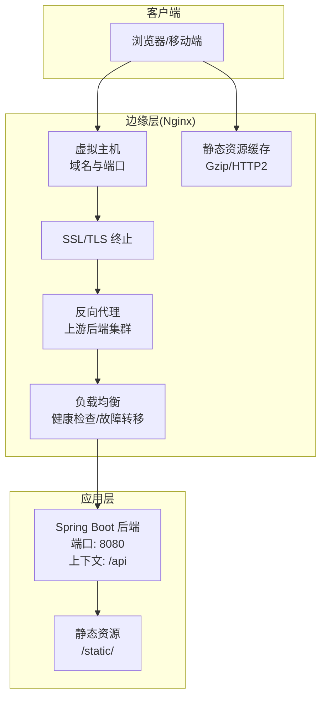
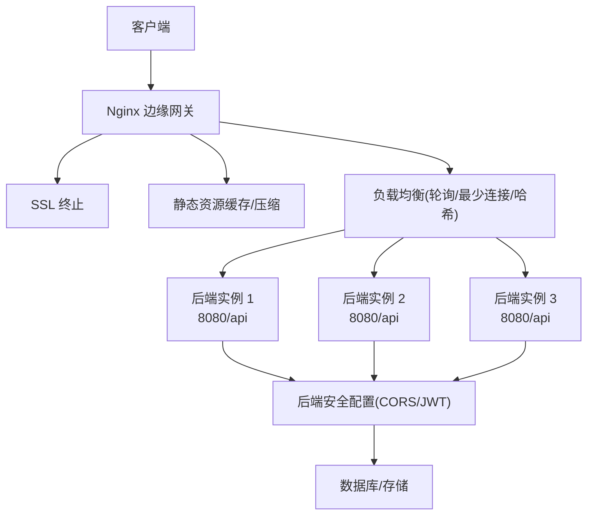
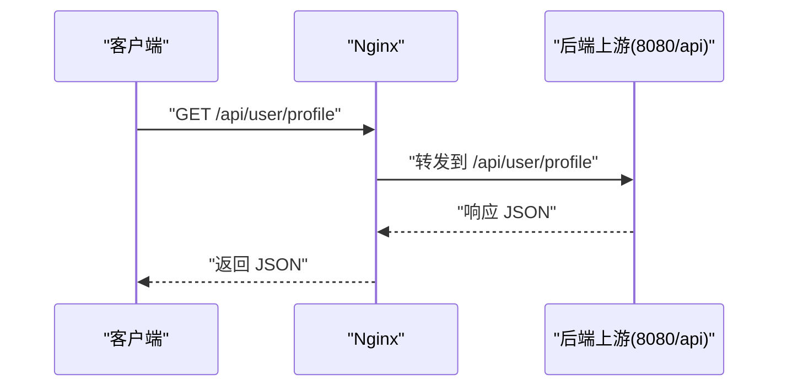
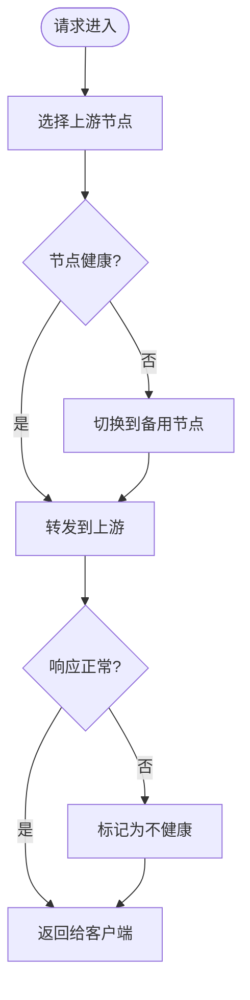
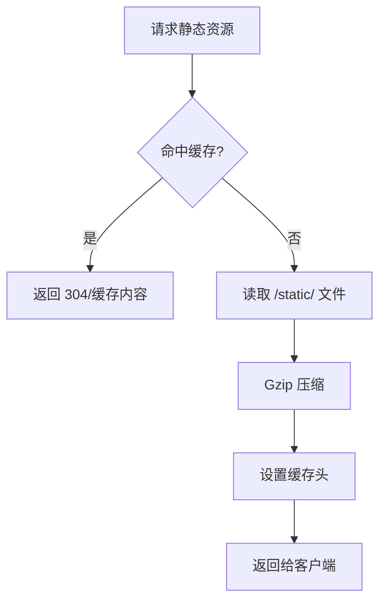
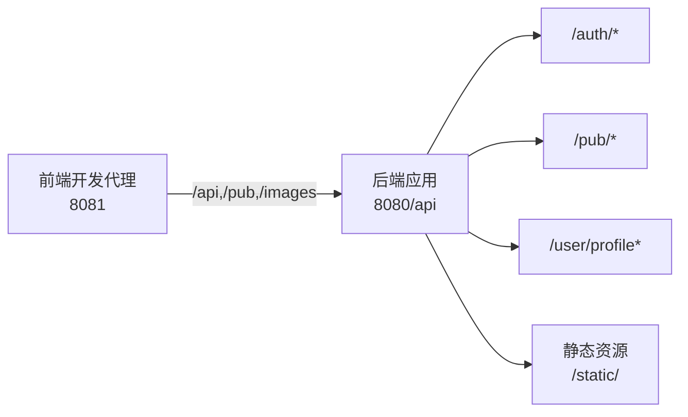

# Nginx反向代理与负载均衡

<cite>
**本文引用的文件**
- [application.yml](file://backend/src/main/resources/application.yml)
- [SecurityConfig.java](file://backend/src/main/java/com/mall/config/SecurityConfig.java)
- [vue.config.js](file://frontend/vue.config.js)
- [AuthController.java](file://backend/src/main/java/com/mall/controller/AuthController.java)
- [PubProductController.java](file://backend/src/main/java/com/mall/controller/pub/PubProductController.java)
- [UserProfileController.java](file://backend/src/main/java/com/mall/controller/user/UserProfileController.java)
- [MallApplication.java](file://backend/src/main/java/com/mall/MallApplication.java)
</cite>

## 目录
1. [简介](#简介)
2. [项目结构](#项目结构)
3. [核心组件](#核心组件)
4. [架构总览](#架构总览)
5. [详细组件分析](#详细组件分析)
6. [依赖分析](#依赖分析)
7. [性能考虑](#性能考虑)
8. [故障排查指南](#故障排查指南)
9. [结论](#结论)
10. [附录](#附录)

## 简介
本指南面向电商商城系统，提供基于 Nginx 的反向代理与负载均衡配置方案。内容涵盖安装与基础配置、虚拟主机与 SSL 证书、反向代理与请求转发策略、缓存与静态资源优化、负载均衡算法与健康检查、安全加固与 DDoS 防护、性能调优参数、监控与日志分析等。文档同时结合后端 Spring Boot 应用的实际端口、上下文路径与路由约定，给出可落地的 Nginx 配置思路与最佳实践。

## 项目结构
系统由前后端分离构成：
- 前端：Vue 开发服务器默认监听本地端口，通过开发代理将 /api、/pub、/images 请求转发至后端。
- 后端：Spring Boot 应用默认监听 8080 端口，并在 /api 上下文中提供 REST 接口；静态资源位于 classpath:/static/。

图表来源
- [application.yml:22-25](file://backend/src/main/resources/application.yml#L22-L25)
- [vue.config.js:1-19](file://frontend/vue.config.js#L1-L19)

章节来源
- [application.yml:22-25](file://backend/src/main/resources/application.yml#L22-L25)
- [vue.config.js:1-19](file://frontend/vue.config.js#L1-L19)

## 核心组件
- 反向代理上游后端
  - 单实例或多实例后端集群，统一暴露于 Nginx 下游。
  - 后端服务端口与上下文：8080，上下文 /api。
- 虚拟主机与域名
  - 使用标准端口 80/443 暴露对外服务，内部将请求转发到后端。
- 静态资源与图片
  - 后端静态资源目录 classpath:/static/，建议在 Nginx 层直接提供静态文件，减少后端压力。
- 安全与鉴权
  - 后端启用 CORS 并对特定路径放行；JWT 认证在后端完成，Nginx 不参与业务鉴权。

章节来源
- [application.yml:18-25](file://backend/src/main/resources/application.yml#L18-L25)
- [SecurityConfig.java:34-54](file://backend/src/main/java/com/mall/config/SecurityConfig.java#L34-L54)

## 架构总览
以下图展示 Nginx 在电商系统中的典型位置与职责边界：

图表来源
- [application.yml:22-25](file://backend/src/main/resources/application.yml#L22-L25)
- [SecurityConfig.java:34-54](file://backend/src/main/java/com/mall/config/SecurityConfig.java#L34-L54)

## 详细组件分析

### 反向代理与请求转发策略
- 上游后端地址
  - 后端监听 8080，上下文 /api。Nginx 将 /api 前缀的请求转发至上游 8080 端口。
- 路由匹配与转发
  - /api/* → 后端 /api/*
  - /pub/* → 后端 /pub/*
  - /images/* → 后端 /images/*
  - 静态资源优先由 Nginx 提供，避免打满后端连接池。
- 转发头与跨域
  - 设置 X-Forwarded-Proto、X-Forwarded-Host、X-Real-IP 等头部，便于后端识别真实来源与协议。
  - 后端已配置 CORS，允许本地开发源，生产环境应按域名白名单收紧。

图表来源
- [application.yml:22-25](file://backend/src/main/resources/application.yml#L22-L25)
- [UserProfileController.java:21-27](file://backend/src/main/java/com/mall/controller/user/UserProfileController.java#L21-L27)

章节来源
- [application.yml:22-25](file://backend/src/main/resources/application.yml#L22-L25)
- [vue.config.js:4-17](file://frontend/vue.config.js#L4-L17)
- [SecurityConfig.java:58-67](file://backend/src/main/java/com/mall/config/SecurityConfig.java#L58-L67)

### 负载均衡算法与健康检查
- 负载均衡算法
  - 轮询：默认公平分配，适合同构实例。
  - 最少连接：活跃连接数少的节点优先，适合请求时长波动较大场景。
  - 哈希：基于客户端 IP 或 URI 哈希，保证会话亲和性（谨慎使用，需配合后端无状态设计）。
- 健康检查
  - 建议对上游后端进行 TCP/HTTP 健康检查，失败节点从负载均衡池剔除，恢复后自动回切。
  - 检查间隔与超时根据实例性能与网络状况调整。
- 故障转移
  - 失败重试次数与超时阈值合理配置，避免雪崩效应。
  - 为关键接口设置独立 upstream，隔离高延迟上游。

[本图为概念流程图，无需图表来源]

### 缓存与静态资源优化
- 静态资源缓存
  - 对 /static/ 下的图片、CSS、JS 设置长缓存与 ETag/Last-Modified，降低带宽与后端压力。
- Gzip 压缩
  - 对文本类资源开启 gzip，提升首屏加载速度。
- HTTP/2 支持
  - 启用 HTTP/2，开启多路复用与 HPACK 压缩，改善并发体验。
- 图片与媒体
  - 建议在 Nginx 层处理图片缩略图、格式转换与 CDN 加速，减少后端计算。

[本图为概念流程图，无需图表来源]

### 安全配置与访问控制
- HTTPS 强制
  - 通过 SSL 终止确保传输安全，强制跳转到 HTTPS。
- 访问控制
  - 限制来源 IP、速率限制、WAF 规则，阻断常见攻击。
- DDoS 防护
  - 配置限流与连接数上限，必要时接入云厂商清洗或第三方抗 DDoS 服务。
- 后端安全
  - 后端已启用 CORS 与 JWT 过滤链，Nginx 不参与业务鉴权逻辑。

章节来源
- [SecurityConfig.java:34-54](file://backend/src/main/java/com/mall/config/SecurityConfig.java#L34-L54)

### 性能调优参数
- 连接与超时
  - worker_connections、keepalive_timeout、proxy_connect_timeout、proxy_send_timeout、proxy_read_timeout。
- 缓冲区
  - proxy_buffering、proxy_buffer_size、proxy_buffers、proxy_busy_buffers_size。
- 上传与下载
  - client_max_body_size、client_body_buffering。
- 并发与进程
  - worker_processes、worker_rlimit_nofile、multi_accept。

[本节为通用性能建议，无需章节来源]

## 依赖分析
- 前端开发代理
  - 开发服务器端口 8081，将 /api、/pub、/images 转发至本地 8080，便于联调。
- 后端端口与上下文
  - 服务端口 8080，上下文 /api，静态资源位于 classpath:/static/。
- 控制器路由
  - /auth 登录注册、/pub 商品公开接口、/user/profile 用户资料等，均在 /api 下。

图表来源
- [vue.config.js:2-17](file://frontend/vue.config.js#L2-L17)
- [application.yml:22-25](file://backend/src/main/resources/application.yml#L22-L25)
- [AuthController.java:12-35](file://backend/src/main/java/com/mall/controller/AuthController.java#L12-L35)
- [PubProductController.java:17-46](file://backend/src/main/java/com/mall/controller/pub/PubProductController.java#L17-L46)
- [UserProfileController.java:13-27](file://backend/src/main/java/com/mall/controller/user/UserProfileController.java#L13-L27)

章节来源
- [vue.config.js:1-19](file://frontend/vue.config.js#L1-L19)
- [application.yml:22-25](file://backend/src/main/resources/application.yml#L22-L25)
- [AuthController.java:12-35](file://backend/src/main/java/com/mall/controller/AuthController.java#L12-L35)
- [PubProductController.java:17-46](file://backend/src/main/java/com/mall/controller/pub/PubProductController.java#L17-L46)
- [UserProfileController.java:13-27](file://backend/src/main/java/com/mall/controller/user/UserProfileController.java#L13-L27)

## 性能考虑
- 连接池与队列
  - 合理设置 worker_connections 与后端 keepalive，避免连接耗尽。
- 超时与重试
  - 后端超时与 Nginx 超时保持一致，防止请求堆积。
- 缓存策略
  - 静态资源强缓存，接口缓存短期有效，热点数据可引入 Redis 缓存。
- 监控与告警
  - 关键指标：QPS、P95 延迟、错误率、上游健康度、连接数、CPU/内存。

[本节为通用性能建议，无需章节来源]

## 故障排查指南
- 常见问题定位
  - 502/504：上游不可达或超时，检查后端健康与网络连通性。
  - 499：客户端主动取消，关注前端超时与网络抖动。
  - CORS 错误：确认后端允许的源与凭证设置。
- 日志分析
  - Nginx 访问/错误日志记录请求路径、状态码、响应时间与上游响应。
  - 后端日志记录请求上下文与异常堆栈。
- 快速验证
  - 直接访问后端 8080 端口确认服务可用。
  - 使用 curl 模拟 Nginx 转发头，验证后端鉴权与路由。

章节来源
- [SecurityConfig.java:34-54](file://backend/src/main/java/com/mall/config/SecurityConfig.java#L34-L54)

## 结论
通过在 Nginx 层实现 SSL 终止、静态资源缓存、Gzip 压缩与 HTTP/2 支持，结合合理的负载均衡与健康检查策略，可显著提升电商系统的可用性与性能。配合后端的安全配置与路由设计，形成清晰的边缘网关与应用边界，便于后续扩展与运维。

## 附录
- 关键配置要点清单
  - 虚拟主机：监听 80/443，HTTPS 证书路径与加密套件。
  - 反向代理：upstream 定义、转发前缀、超时与缓冲区。
  - 负载均衡：算法选择、健康检查、故障转移。
  - 缓存与压缩：静态资源缓存、Gzip、HTTP/2。
  - 安全：强制 HTTPS、访问控制、DDoS 防护。
  - 监控：QPS、延迟、错误率、上游健康度。

[本节为通用附录，无需章节来源]