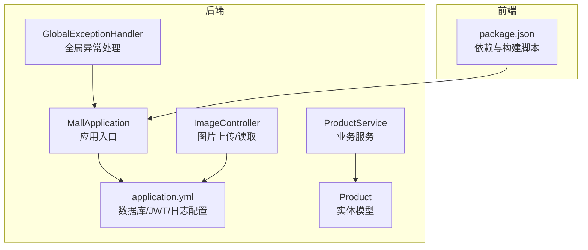
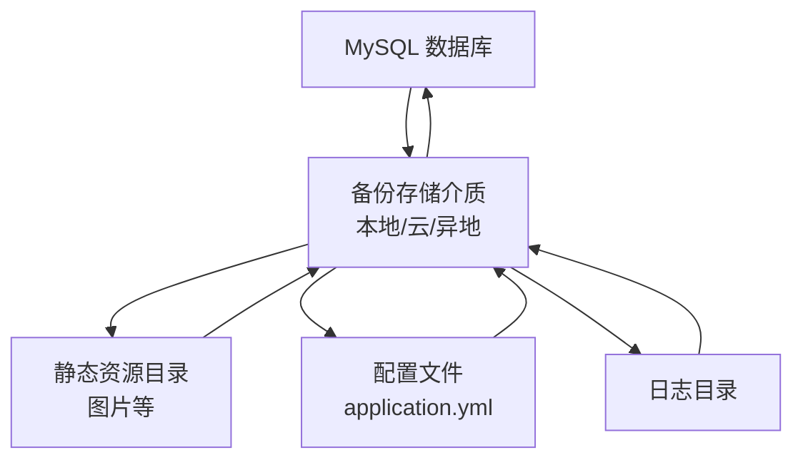
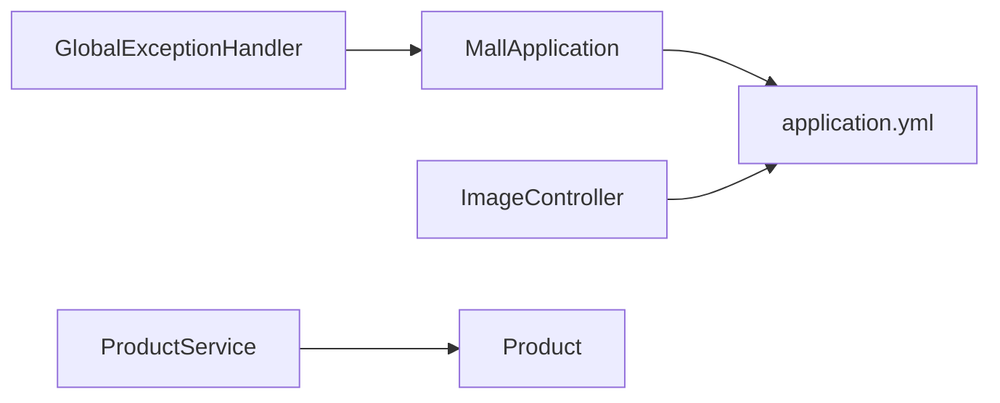

# 数据备份与恢复

<cite>
**本文引用的文件**
- [application.yml](file://backend/src/main/resources/application.yml)
- [pom.xml](file://backend/pom.xml)
- [MallApplication.java](file://backend/src/main/java/com/mall/MallApplication.java)
- [ImageController.java](file://backend/src/main/java/com/mall/controller/pub/ImageController.java)
- [ProductService.java](file://backend/src/main/java/com/mall/service/ProductService.java)
- [Product.java](file://backend/src/main/java/com/mall/entity/Product.java)
- [GlobalExceptionHandler.java](file://backend/src/main/java/com/mall/exception/GlobalExceptionHandler.java)
- [banner.sql](file://backend/src/main/resources/banner.sql)
- [package.json](file://frontend/package.json)
</cite>

## 目录
1. [简介](#简介)
2. [项目结构](#项目结构)
3. [核心组件](#核心组件)
4. [架构总览](#架构总览)
5. [详细组件分析](#详细组件分析)
6. [依赖分析](#依赖分析)
7. [性能考虑](#性能考虑)
8. [故障排查指南](#故障排查指南)
9. [结论](#结论)
10. [附录](#附录)

## 简介
本指南面向电商商城系统，提供一套可落地的数据备份与恢复方案，覆盖数据库备份（全量/增量/定时）、文件系统备份（图片等静态资源）、配置文件与日志备份、备份存储策略（本地/云/异地）、备份验证与恢复测试、灾难恢复预案（RTO/RPO）、自动化脚本与监控告警、以及恢复演练与业务一致性验证流程。文档基于仓库中实际存在的配置与代码进行分析与建议，确保方案与系统现状一致。

## 项目结构
系统由后端 Spring Boot 应用与前端 Vue 应用组成，数据库使用 MySQL，静态资源（图片）存储在后端指定目录并通过控制器提供访问。应用通过 Maven 构建，使用 Spring Data JPA 访问数据库。

**图表来源**
- [MallApplication.java:1-13](file://backend/src/main/java/com/mall/MallApplication.java#L1-L13)
- [application.yml:1-36](file://backend/src/main/resources/application.yml#L1-L36)
- [ImageController.java:1-155](file://backend/src/main/java/com/mall/controller/pub/ImageController.java#L1-L155)
- [ProductService.java:1-126](file://backend/src/main/java/com/mall/service/ProductService.java#L1-L126)
- [Product.java:1-101](file://backend/src/main/java/com/mall/entity/Product.java#L1-L101)
- [GlobalExceptionHandler.java:1-20](file://backend/src/main/java/com/mall/exception/GlobalExceptionHandler.java#L1-L20)
- [package.json:1-24](file://frontend/package.json#L1-L24)

**章节来源**
- [application.yml:1-36](file://backend/src/main/resources/application.yml#L1-L36)
- [MallApplication.java:1-13](file://backend/src/main/java/com/mall/MallApplication.java#L1-L13)
- [ImageController.java:1-155](file://backend/src/main/java/com/mall/controller/pub/ImageController.java#L1-L155)
- [ProductService.java:1-126](file://backend/src/main/java/com/mall/service/ProductService.java#L1-L126)
- [Product.java:1-101](file://backend/src/main/java/com/mall/entity/Product.java#L1-L101)
- [GlobalExceptionHandler.java:1-20](file://backend/src/main/java/com/mall/exception/GlobalExceptionHandler.java#L1-L20)
- [package.json:1-24](file://frontend/package.json#L1-L24)

## 核心组件
- 数据库与连接：后端通过 application.yml 中的 datasource 配置连接 MySQL；JPA 属性控制 DDL 行为与 SQL 输出格式。
- 静态资源与图片：ImageController 负责图片上传与读取，默认上传路径来自配置；前端通过构建产物提供页面与交互。
- 业务实体：Product 实体定义商品表结构，包含主图、详情图、品牌、属性、价格、库存、上下架状态等字段。
- 异常处理：全局异常处理器统一返回业务失败响应，避免前端出现未处理错误。

**章节来源**
- [application.yml:4-20](file://backend/src/main/resources/application.yml#L4-L20)
- [ImageController.java:25-32](file://backend/src/main/java/com/mall/controller/pub/ImageController.java#L25-L32)
- [Product.java:9-101](file://backend/src/main/java/com/mall/entity/Product.java#L9-L101)
- [GlobalExceptionHandler.java:13-17](file://backend/src/main/java/com/mall/exception/GlobalExceptionHandler.java#L13-L17)

## 架构总览
下图展示备份与恢复涉及的关键对象与数据流：数据库（MySQL）、静态资源目录、配置文件与日志目录、备份存储介质（本地/云/异地），以及备份验证与恢复测试流程。

[此图为概念性架构示意，不直接映射具体源码文件，故不提供图表来源]

## 详细组件分析

### 数据库备份策略
- 全量备份
  - 使用数据库自带工具进行全量导出，建议在业务低峰期执行，确保一致性。
  - 备份内容应包含所有业务表（如商品、订单、用户、Banner 等）。
- 增量备份
  - 启用数据库二进制日志（binlog），按时间点或位置增量备份，缩短 RPO。
- 定时任务配置
  - 在操作系统层面配置定时任务（如 crontab 或 Windows 任务计划程序），定期触发备份脚本。
  - 结合数据库快照或逻辑备份，确保备份周期与业务窗口匹配。
- 备份存储
  - 本地磁盘：用于快速恢复与离线归档。
  - 云存储：自动上传至对象存储（如 OSS/COS/S3），具备高可用与跨区域复制。
  - 异地备份：至少一个异地副本，满足灾难恢复需求。
- 备份验证
  - 定期执行还原演练，验证备份集的完整性与可恢复性。
  - 对比校验：对关键表进行抽样校验，确保数据一致性。
- 恢复测试流程
  - 准备测试环境，执行离线恢复，验证业务功能与数据正确性。
  - 记录恢复耗时与结果，持续优化备份策略。

[本节为通用实践说明，不直接分析具体源码文件，故不提供章节来源]

### 文件系统备份
- 图片与静态资源
  - ImageController 默认上传路径来自配置项，上传后的图片位于该目录。
  - 备份策略：定期打包静态资源目录，结合版本化存储与差异备份。
- 配置文件备份
  - application.yml 为核心配置，包含数据库连接、JWT 密钥、日志级别等。
  - 建议纳入版本控制或独立备份，变更需审批与审计。
- 日志文件备份
  - 日志目录由应用日志框架输出，建议按天滚动并压缩归档。
  - 保留一定周期的日志以便问题追溯与合规要求。

**章节来源**
- [ImageController.java:25-32](file://backend/src/main/java/com/mall/controller/pub/ImageController.java#L25-L32)
- [application.yml:32-36](file://backend/src/main/resources/application.yml#L32-L36)

### 备份存储方案
- 本地存储：适合快速恢复与短期保留，注意容量与可靠性。
- 云存储：适合长期归档与跨地域复制，便于自动化与集中管理。
- 异地备份：满足灾难恢复场景，降低区域性风险。

[本节为通用实践说明，不直接分析具体源码文件，故不提供章节来源]

### 备份验证与恢复测试
- 完整性检查
  - 校验备份文件大小与哈希值，确保传输与存储过程未损坏。
  - 执行逻辑校验：统计关键表记录数、抽样字段值，对比基准。
- 恢复测试流程
  - 在隔离环境中执行离线恢复，验证应用启动与核心接口可用性。
  - 进行端到端业务验证：登录、下单、支付、查看订单与商品详情等。
- RTO/RPO 指标
  - RTO：目标恢复时间，如 2 小时内完成恢复。
  - RPO：目标恢复点，如最多容忍 15 分钟前数据丢失。
- 业务连续性保障
  - 多活部署与热备切换（如适用），缩短停机时间。
  - 建立应急响应机制与沟通渠道，明确角色与职责。

[本节为通用实践说明，不直接分析具体源码文件，故不提供章节来源]

### 灾难恢复预案
- 场景定义
  - 单点故障：单台服务器或单个数据库实例不可用。
  - 区域性灾难：数据中心断电、网络中断或自然灾害。
- 恢复优先级
  - 先恢复核心数据库与静态资源，再恢复应用服务。
  - 通过负载均衡与健康检查实现自动切换。
- RTO/RPO 指标
  - 明确各模块的 RTO 与 RPO 目标，作为备份策略制定依据。
- 业务连续性
  - 提前演练，形成标准化流程与检查清单。
  - 建立监控告警与人工干预机制，确保快速处置。

[本节为通用实践说明，不直接分析具体源码文件，故不提供章节来源]

### 备份自动化脚本与监控告警
- 自动化脚本
  - 数据库：编写备份脚本，调用数据库客户端工具执行全量/增量备份。
  - 文件系统：编写打包脚本，压缩静态资源与配置文件。
  - 云存储：集成 SDK 或 CLI，自动上传备份文件并清理过期副本。
- 监控告警
  - 监控备份任务执行状态、存储空间、网络连通性。
  - 失败告警：邮件/IM 通知运维人员，明确失败原因与重试策略。
- 失败处理
  - 自动重试与最大重试次数限制。
  - 人工介入：失败后升级处理流程，回滚或修复后重新执行。

[本节为通用实践说明，不直接分析具体源码文件，故不提供章节来源]

### 恢复演练计划
- 计划与分工
  - 明确演练目标、参与人员、时间窗口与评估标准。
- 步骤
  - 准备阶段：准备测试环境与备份副本。
  - 执行阶段：按流程执行离线恢复与功能验证。
  - 总结阶段：记录耗时、问题与改进建议。
- 数据一致性验证
  - 关键表抽样核对、业务流程闭环测试。
- 业务验证流程
  - 登录、浏览商品、购物车、下单、支付、订单查询等。

[本节为通用实践说明，不直接分析具体源码文件，故不提供章节来源]

## 依赖分析
- 应用与配置
  - 应用入口负责启动 Spring Boot 应用；application.yml 提供数据库、JPA、服务器与日志配置。
- 业务与数据
  - ProductService 依赖 ProductRepository 访问数据库；Product 实体映射商品表。
- 静态资源
  - ImageController 读写静态资源目录中的图片文件；前端通过构建产物提供页面。
- 异常处理
  - GlobalExceptionHandler 统一捕获运行时异常，返回业务失败响应。

**图表来源**
- [MallApplication.java:1-13](file://backend/src/main/java/com/mall/MallApplication.java#L1-L13)
- [application.yml:1-36](file://backend/src/main/resources/application.yml#L1-L36)
- [ImageController.java:1-155](file://backend/src/main/java/com/mall/controller/pub/ImageController.java#L1-L155)
- [ProductService.java:1-126](file://backend/src/main/java/com/mall/service/ProductService.java#L1-L126)
- [Product.java:1-101](file://backend/src/main/java/com/mall/entity/Product.java#L1-L101)
- [GlobalExceptionHandler.java:1-20](file://backend/src/main/java/com/mall/exception/GlobalExceptionHandler.java#L1-L20)

**章节来源**
- [MallApplication.java:1-13](file://backend/src/main/java/com/mall/MallApplication.java#L1-L13)
- [application.yml:1-36](file://backend/src/main/resources/application.yml#L1-L36)
- [ImageController.java:1-155](file://backend/src/main/java/com/mall/controller/pub/ImageController.java#L1-L155)
- [ProductService.java:1-126](file://backend/src/main/java/com/mall/service/ProductService.java#L1-L126)
- [Product.java:1-101](file://backend/src/main/java/com/mall/entity/Product.java#L1-L101)
- [GlobalExceptionHandler.java:1-20](file://backend/src/main/java/com/mall/exception/GlobalExceptionHandler.java#L1-L20)

## 性能考虑
- 备份窗口与业务影响
  - 全量备份应在业务低峰期执行，避免影响在线交易。
  - 增量备份减少锁表时间，提升并发能力。
- 存储与网络
  - 云存储上传带宽与并发度需评估，避免占用生产网络。
  - 本地存储需考虑磁盘 IO 与空间规划。
- 恢复效率
  - 采用并行解压与批量导入，缩短恢复时间。
  - 预热缓存与索引重建，降低恢复后首笔请求延迟。

[本节为通用指导，不直接分析具体源码文件，故不提供章节来源]

## 故障排查指南
- 数据库连接与权限
  - 检查 application.yml 中的数据库 URL、用户名与密码是否正确。
  - 确认数据库服务可达与网络策略放行。
- 静态资源访问
  - 确认 ImageController 的上传路径配置与目录权限。
  - 检查文件名安全校验与媒体类型识别逻辑。
- 日志与异常
  - 查看应用日志级别与输出位置，定位异常根因。
  - 全局异常处理器会将运行时异常统一包装为业务失败响应，便于前端处理。

**章节来源**
- [application.yml:4-20](file://backend/src/main/resources/application.yml#L4-L20)
- [ImageController.java:37-68](file://backend/src/main/java/com/mall/controller/pub/ImageController.java#L37-L68)
- [GlobalExceptionHandler.java:13-17](file://backend/src/main/java/com/mall/exception/GlobalExceptionHandler.java#L13-L17)

## 结论
本指南基于系统现有配置与代码，提出了可操作的备份与恢复方案：以数据库全量/增量备份为核心，配合静态资源与配置文件的日志备份，采用本地/云/异地多级存储，建立完善的备份验证与恢复测试流程，并配套自动化脚本、监控告警与灾难恢复预案，最终实现业务连续性与数据安全的双重保障。

## 附录
- 数据库初始化参考
  - 可参考 banner 表结构定义进行数据库初始化与迁移。
- 前端构建与依赖
  - 前端通过 package.json 管理依赖与构建脚本，可用于打包静态资源参与备份。

**章节来源**
- [banner.sql:1-14](file://backend/src/main/resources/banner.sql#L1-L14)
- [package.json:1-24](file://frontend/package.json#L1-L24)