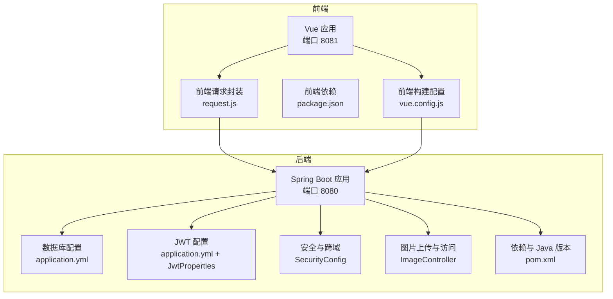
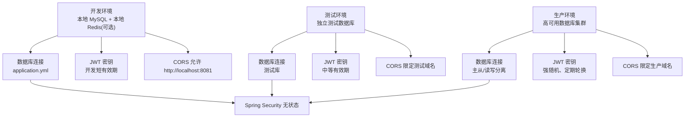
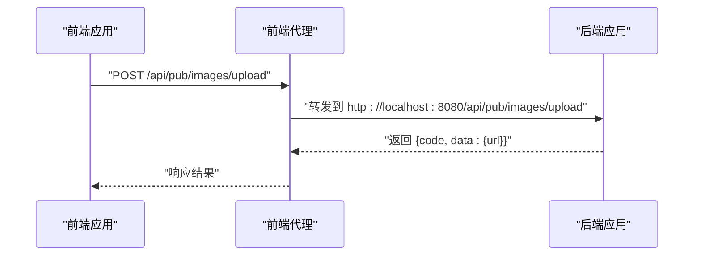
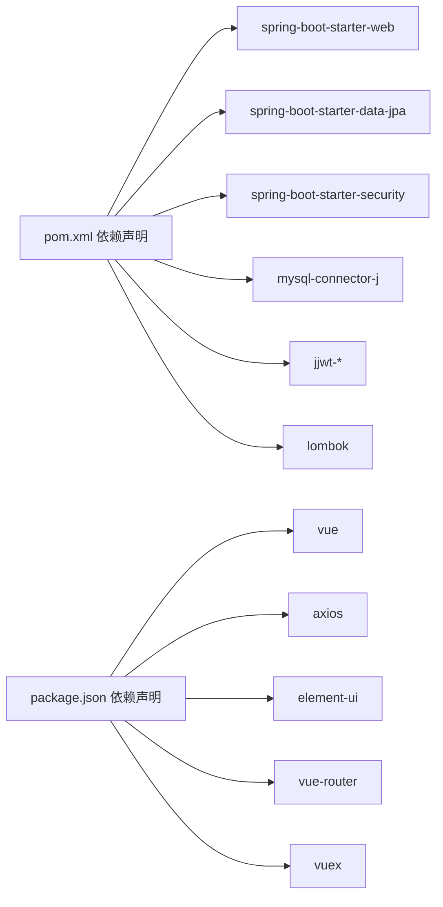

# 环境配置

<cite>
**本文引用的文件**
- [application.yml](file://backend/src/main/resources/application.yml)
- [JwtProperties.java](file://backend/src/main/java/com/mall/config/JwtProperties.java)
- [SecurityConfig.java](file://backend/src/main/java/com/mall/config/SecurityConfig.java)
- [JwtUtil.java](file://backend/src/main/java/com/mall/security/JwtUtil.java)
- [JwtAuthFilter.java](file://backend/src/main/java/com/mall/security/JwtAuthFilter.java)
- [ImageController.java](file://backend/src/main/java/com/mall/controller/pub/ImageController.java)
- [pom.xml](file://backend/pom.xml)
- [vue.config.js](file://frontend/vue.config.js)
- [package.json](file://frontend/package.json)
- [request.js](file://frontend/src/api/request.js)
- [MallApplication.java](file://backend/src/main/java/com/mall/MallApplication.java)
</cite>

## 目录
1. [简介](#简介)
2. [项目结构](#项目结构)
3. [核心组件](#核心组件)
4. [架构总览](#架构总览)
5. [详细组件分析](#详细组件分析)
6. [依赖分析](#依赖分析)
7. [性能考虑](#性能考虑)
8. [故障排查指南](#故障排查指南)
9. [结论](#结论)
10. [附录](#附录)

## 简介
本指南面向电商商城系统的运维与开发团队，提供从开发到生产的环境配置方法论与实操建议。内容覆盖：
- 开发、测试、生产环境的配置差异与最佳实践
- JVM 参数、数据库连接、JWT 密钥、文件存储路径等关键配置
- 环境变量管理、配置文件加密与敏感信息保护策略
- 前后端环境变量与端口映射、网络跨域配置
- 环境切换脚本、配置验证工具与一致性检查方法
- 常见配置错误排查、性能调优参数与资源限制设置

## 项目结构
系统由后端 Spring Boot 应用与前端 Vue 应用组成，采用前后端分离部署方式。后端负责业务逻辑、认证授权与静态资源服务；前端通过代理访问后端 API。



图表来源
- [vue.config.js:1-20](file://frontend/vue.config.js#L1-L20)
- [package.json:1-24](file://frontend/package.json#L1-L24)
- [request.js:1-38](file://frontend/src/api/request.js#L1-L38)
- [application.yml:1-36](file://backend/src/main/resources/application.yml#L1-L36)
- [JwtProperties.java:1-18](file://backend/src/main/java/com/mall/config/JwtProperties.java#L1-L18)
- [SecurityConfig.java:1-74](file://backend/src/main/java/com/mall/config/SecurityConfig.java#L1-L74)
- [ImageController.java:1-154](file://backend/src/main/java/com/mall/controller/pub/ImageController.java#L1-L154)
- [pom.xml:1-107](file://backend/pom.xml#L1-L107)

章节来源
- [vue.config.js:1-20](file://frontend/vue.config.js#L1-L20)
- [package.json:1-24](file://frontend/package.json#L1-L24)
- [request.js:1-38](file://frontend/src/api/request.js#L1-L38)
- [application.yml:1-36](file://backend/src/main/resources/application.yml#L1-L36)
- [JwtProperties.java:1-18](file://backend/src/main/java/com/mall/config/JwtProperties.java#L1-L18)
- [SecurityConfig.java:1-74](file://backend/src/main/java/com/mall/config/SecurityConfig.java#L1-L74)
- [ImageController.java:1-154](file://backend/src/main/java/com/mall/controller/pub/ImageController.java#L1-L154)
- [pom.xml:1-107](file://backend/pom.xml#L1-L107)

## 核心组件
- 数据库连接与 JPA 配置：集中于后端配置文件，定义数据源 URL、用户名、密码、驱动、方言与 DDL 行为等。
- JWT 配置：后端通过独立属性类绑定配置前缀，生成与解析令牌。
- 安全与跨域：基于 Spring Security 的无状态会话策略，开放特定公开接口，其余接口按角色鉴权；配置 CORS 允许前端本地开发域名。
- 图片上传与访问：后端统一处理图片上传、命名与访问 URL 拼接，并提供静态资源访问能力。
- 前端代理与请求封装：前端本地开发使用代理转发至后端，统一注入 Authorization 头。

章节来源
- [application.yml:1-36](file://backend/src/main/resources/application.yml#L1-L36)
- [JwtProperties.java:1-18](file://backend/src/main/java/com/mall/config/JwtProperties.java#L1-L18)
- [SecurityConfig.java:1-74](file://backend/src/main/java/com/mall/config/SecurityConfig.java#L1-L74)
- [ImageController.java:1-154](file://backend/src/main/java/com/mall/controller/pub/ImageController.java#L1-L154)
- [vue.config.js:1-20](file://frontend/vue.config.js#L1-L20)
- [request.js:1-38](file://frontend/src/api/request.js#L1-L38)

## 架构总览
下图展示开发、测试、生产三类环境在配置上的差异与对应要点。



## 详细组件分析

### 后端配置组件
- 数据库与 JPA
  - 数据源 URL、用户名、密码、驱动与时区参数位于配置文件中。
  - Hibernate 方言、DDL 自动更新策略、SQL 输出与格式化、open-in-view 等参数集中管理。
- 服务器与静态资源
  - 服务器端口与上下文路径在配置文件中定义。
  - 静态资源位置指向 classpath 下的静态目录。
- JWT
  - 密钥与过期时间通过配置前缀绑定到属性类，供工具类生成与解析令牌。
- 安全与跨域
  - CSRF 关闭、Session 策略无状态、公开接口白名单、受控接口按角色访问。
  - CORS 配置允许本地开发前端域名，支持凭证与常用方法头。
- 图片上传与访问
  - 上传路径通过配置注入，支持多种图片格式，生成唯一文件名并返回可访问 URL。
  - 访问接口根据文件扩展名动态设置媒体类型。

```mermaid
classDiagram
class JwtProperties {
+String secret
+long expirationMs
}
class JwtUtil {
+generateToken(userId, username, role) String
+parseToken(token) JwtClaims
}
class SecurityConfig {
+filterChain(http) SecurityFilterChain
+corsConfigurationSource() CorsConfigurationSource
+passwordEncoder() PasswordEncoder
}
class JwtAuthFilter {
+doFilterInternal(req, resp, chain) void
}
class ImageController {
+getImage(fileName) ResponseEntity
+uploadImage(file, request) Result
}
JwtUtil --> JwtProperties : "读取密钥与过期时间"
SecurityConfig --> JwtAuthFilter : "注册过滤器"
ImageController --> "配置 : file.upload.path"
```

图表来源
- [JwtProperties.java:1-18](file://backend/src/main/java/com/mall/config/JwtProperties.java#L1-L18)
- [JwtUtil.java:1-48](file://backend/src/main/java/com/mall/security/JwtUtil.java#L1-L48)
- [SecurityConfig.java:1-74](file://backend/src/main/java/com/mall/config/SecurityConfig.java#L1-L74)
- [JwtAuthFilter.java:1-57](file://backend/src/main/java/com/mall/security/JwtAuthFilter.java#L1-L57)
- [ImageController.java:1-154](file://backend/src/main/java/com/mall/controller/pub/ImageController.java#L1-L154)

章节来源
- [application.yml:1-36](file://backend/src/main/resources/application.yml#L1-L36)
- [JwtProperties.java:1-18](file://backend/src/main/java/com/mall/config/JwtProperties.java#L1-L18)
- [JwtUtil.java:1-48](file://backend/src/main/java/com/mall/security/JwtUtil.java#L1-L48)
- [SecurityConfig.java:1-74](file://backend/src/main/java/com/mall/config/SecurityConfig.java#L1-L74)
- [JwtAuthFilter.java:1-57](file://backend/src/main/java/com/mall/security/JwtAuthFilter.java#L1-L57)
- [ImageController.java:1-154](file://backend/src/main/java/com/mall/controller/pub/ImageController.java#L1-L154)

### 前端配置组件
- 本地开发代理
  - 将 /api、/pub、/images 路径代理到后端，默认目标为本地后端端口。
- 请求封装
  - 统一基础路径与超时；自动在请求头注入 Bearer Token；对 401/403 清理本地会话并跳转登录。



图表来源
- [vue.config.js:1-20](file://frontend/vue.config.js#L1-L20)
- [request.js:1-38](file://frontend/src/api/request.js#L1-L38)
- [ImageController.java:1-154](file://backend/src/main/java/com/mall/controller/pub/ImageController.java#L1-L154)

章节来源
- [vue.config.js:1-20](file://frontend/vue.config.js#L1-L20)
- [request.js:1-38](file://frontend/src/api/request.js#L1-L38)

## 依赖分析
- 后端运行时依赖
  - Spring Boot Web、Data JPA、Security、Validation、MySQL Connector、jjwt 生态、Lombok。
  - Java 版本要求与编译插件配置。
- 前端运行时依赖
  - Vue 2、Element UI、Axios、路由与状态管理等。



图表来源
- [pom.xml:1-107](file://backend/pom.xml#L1-L107)
- [package.json:1-24](file://frontend/package.json#L1-L24)

章节来源
- [pom.xml:1-107](file://backend/pom.xml#L1-L107)
- [package.json:1-24](file://frontend/package.json#L1-L24)

## 性能考虑
- JVM 参数建议
  - 堆内存：根据业务体量与 GC 行为设定初始与最大堆大小，结合容器资源限制。
  - GC：优先选择低停顿收集器，结合应用吞吐与延迟需求评估。
  - JIT 与元空间：确保元空间充足，避免类加载过多导致溢出。
- 数据库连接池
  - 连接数与超时：依据并发与 RTT 设定最大连接、空闲连接与超时。
  - 只读事务：对查询接口启用只读事务，减少锁竞争。
- 缓存与热点
  - 对热点商品、分类与推荐结果进行缓存，结合分布式缓存降低数据库压力。
- 日志与监控
  - 控制日志级别，避免在高并发场景产生 IO 放大；接入 APM 与指标采集。
- 前端代理与静态资源
  - 生产环境建议将静态资源交由 CDN 或反向代理缓存，减少后端压力。

## 故障排查指南
- 数据库连接失败
  - 检查数据源 URL、凭据与网络连通性；确认时区与 SSL 设置是否符合目标实例。
- JWT 解析异常
  - 校验密钥一致性与过期时间；确认客户端与服务端使用相同算法与密钥长度。
- CORS 报错
  - 确认后端 CORS 配置允许当前前端域名与凭证设置；浏览器控制台查看具体拒绝原因。
- 图片上传失败
  - 检查上传目录权限与磁盘配额；确认文件类型白名单与文件名清洗规则。
- 前端 401/403
  - 检查本地 Token 是否存在且未过期；确认后端安全链路与角色授权是否正确。
- 端口冲突
  - 开发环境默认端口为 8080/8081，若被占用请修改配置并重启服务。

章节来源
- [application.yml:1-36](file://backend/src/main/resources/application.yml#L1-L36)
- [SecurityConfig.java:1-74](file://backend/src/main/java/com/mall/config/SecurityConfig.java#L1-L74)
- [JwtUtil.java:1-48](file://backend/src/main/java/com/mall/security/JwtUtil.java#L1-L48)
- [ImageController.java:1-154](file://backend/src/main/java/com/mall/controller/pub/ImageController.java#L1-L154)
- [vue.config.js:1-20](file://frontend/vue.config.js#L1-L20)
- [request.js:1-38](file://frontend/src/api/request.js#L1-L38)

## 结论
通过将敏感配置外置、分环境差异化管理、严格的 CORS 与安全策略以及完善的日志与监控体系，可以显著提升系统的安全性与稳定性。建议在 CI/CD 中引入配置验证与一致性检查流程，确保部署质量。

## 附录

### 环境变量与配置文件管理
- 环境变量优先级（示例层级，实际以框架为准）
  - 开发：本地 IDE/Shell 环境变量覆盖默认配置
  - 测试：CI 环境变量注入，使用专用测试库
  - 生产：Kubernetes ConfigMap/Secret 或平台密钥管理服务
- 配置文件加密
  - 使用对称加密工具对敏感字段加密，启动时解密注入；或使用平台提供的密文存储与解密能力
- 敏感信息保护
  - 不在仓库中提交密钥、数据库密码与私有证书；使用只读权限的最小化密钥轮换策略

### 端口映射与网络配置
- 后端
  - 默认端口：8080；上下文路径：/api
- 前端
  - 默认端口：8081；代理到后端 /api、/pub、/images
- 生产网络
  - 反向代理暴露 80/443，后端容器内网通信；数据库与缓存使用内网域名解析

章节来源
- [application.yml:22-25](file://backend/src/main/resources/application.yml#L22-L25)
- [vue.config.js:2-18](file://frontend/vue.config.js#L2-L18)

### 环境切换脚本与验证工具
- 环境切换脚本（示例思路）
  - 通过环境变量区分配置文件（如 application-dev.yml、application-prod.yml），在启动时指定激活 profile
  - 在容器中通过环境变量覆盖关键配置项
- 配置验证工具
  - 启动时打印关键配置摘要（数据库 URL、JWT 密钥长度、CORS 允许域）
  - 提供健康检查端点与配置一致性自检任务
- 环境一致性检查
  - CI 中执行“配置清单比对”与“关键键存在性检查”
  - 对比各环境配置文件差异，生成变更报告

### 性能调优参数与资源限制
- JVM
  - 堆大小：根据 QPS 与对象生命周期设定；GC 优化：关注 Full GC 频率与停顿
  - 元空间：避免类加载过多导致溢出
- 数据库
  - 连接池大小：依据并发与 RTT；只读事务与慢查询日志
- 前端
  - CDN 与缓存策略；懒加载与骨架屏优化