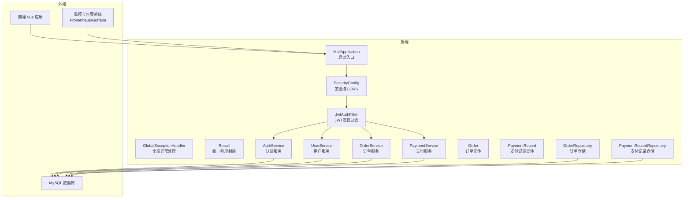
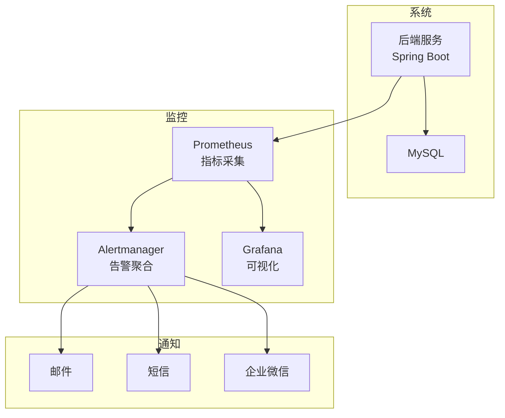
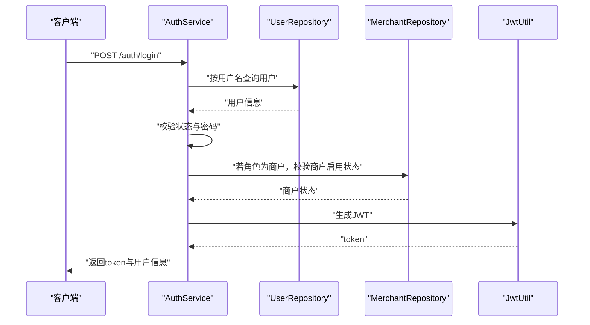
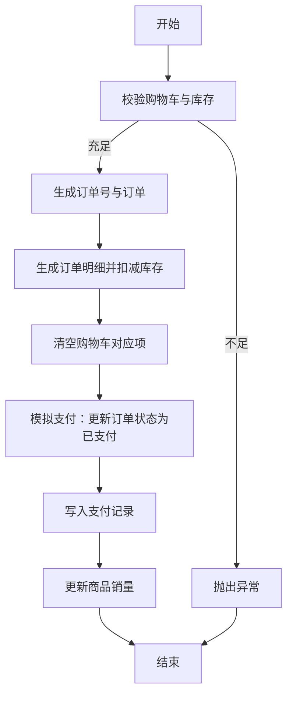
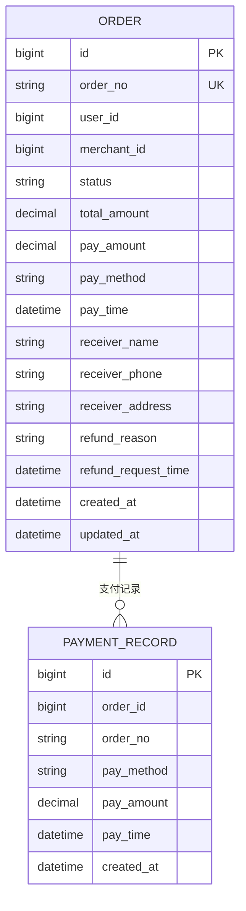
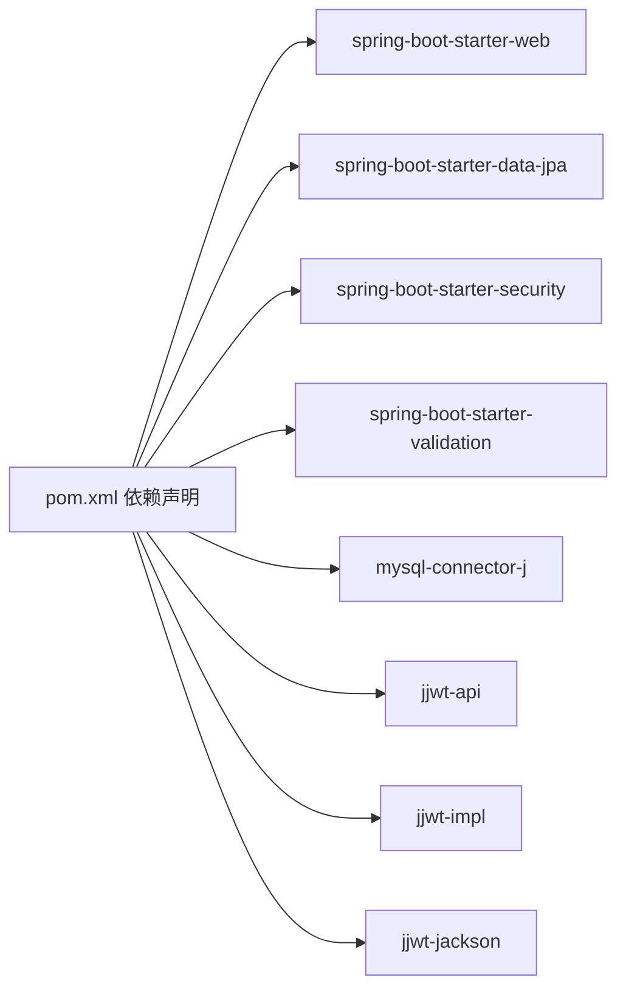

# 监控告警

<cite>
**本文引用的文件**
- [application.yml](file://backend/src/main/resources/application.yml)
- [pom.xml](file://backend/pom.xml)
- [MallApplication.java](file://backend/src/main/java/com/mall/MallApplication.java)
- [SecurityConfig.java](file://backend/src/main/java/com/mall/config/SecurityConfig.java)
- [JwtAuthFilter.java](file://backend/src/main/java/com/mall/security/JwtAuthFilter.java)
- [GlobalExceptionHandler.java](file://backend/src/main/java/com/mall/exception/GlobalExceptionHandler.java)
- [Result.java](file://backend/src/main/java/com/mall/dto/Result.java)
- [AuthService.java](file://backend/src/main/java/com/mall/service/AuthService.java)
- [UserService.java](file://backend/src/main/java/com/mall/service/UserService.java)
- [OrderService.java](file://backend/src/main/java/com/mall/service/OrderService.java)
- [PaymentService.java](file://backend/src/main/java/com/mall/service/PaymentService.java)
- [Order.java](file://backend/src/main/java/com/mall/entity/Order.java)
- [PaymentRecord.java](file://backend/src/main/java/com/mall/entity/PaymentRecord.java)
- [OrderRepository.java](file://backend/src/main/java/com/mall/repository/OrderRepository.java)
- [PaymentRecordRepository.java](file://backend/src/main/java/com/mall/repository/PaymentRecordRepository.java)
</cite>

## 目录
1. [简介](#简介)
2. [项目结构](#项目结构)
3. [核心组件](#核心组件)
4. [架构总览](#架构总览)
5. [详细组件分析](#详细组件分析)
6. [依赖分析](#依赖分析)
7. [性能考虑](#性能考虑)
8. [故障排查指南](#故障排查指南)
9. [结论](#结论)
10. [附录](#附录)

## 简介
本指南面向电商商城系统，提供一套可落地的监控告警配置方案，覆盖应用性能监控（CPU、内存、数据库连接、请求响应时间）、日志监控（错误日志收集、访问日志分析）、业务指标监控（订单量、用户活跃度、支付成功率），以及告警规则与通知渠道建议。同时给出 Prometheus 与 Grafana 的集成思路与仪表板设计建议，帮助实现监控数据可视化、趋势分析与容量规划。

## 项目结构
后端采用 Spring Boot 3.4.1 构建，使用 JPA/Hibernate 访问 MySQL 数据库，通过安全过滤器链进行鉴权，全局异常处理器统一返回业务结果对象。前端为 Vue 单页应用，通过 /api 前缀与后端交互。

图表来源
- [MallApplication.java:1-13](file://backend/src/main/java/com/mall/MallApplication.java#L1-L13)
- [SecurityConfig.java:1-74](file://backend/src/main/java/com/mall/config/SecurityConfig.java#L1-L74)
- [JwtAuthFilter.java:1-57](file://backend/src/main/java/com/mall/security/JwtAuthFilter.java#L1-L57)
- [GlobalExceptionHandler.java:1-20](file://backend/src/main/java/com/mall/exception/GlobalExceptionHandler.java#L1-L20)
- [Result.java:1-24](file://backend/src/main/java/com/mall/dto/Result.java#L1-L24)
- [AuthService.java:1-92](file://backend/src/main/java/com/mall/service/AuthService.java#L1-L92)
- [UserService.java:1-42](file://backend/src/main/java/com/mall/service/UserService.java#L1-L42)
- [OrderService.java:1-280](file://backend/src/main/java/com/mall/service/OrderService.java#L1-L280)
- [PaymentService.java:1-67](file://backend/src/main/java/com/mall/service/PaymentService.java#L1-L67)
- [Order.java:1-83](file://backend/src/main/java/com/mall/entity/Order.java#L1-L83)
- [PaymentRecord.java:1-46](file://backend/src/main/java/com/mall/entity/PaymentRecord.java#L1-L46)
- [OrderRepository.java:1-28](file://backend/src/main/java/com/mall/repository/OrderRepository.java#L1-L28)
- [PaymentRecordRepository.java:1-8](file://backend/src/main/java/com/mall/repository/PaymentRecordRepository.java#L1-L8)

章节来源
- [application.yml:1-36](file://backend/src/main/resources/application.yml#L1-L36)
- [pom.xml:1-107](file://backend/pom.xml#L1-L107)

## 核心组件
- 启动入口与应用配置：后端通过主类启动，端口与上下文路径在配置文件中定义；日志级别按包名设置。
- 安全与鉴权：基于 JWT 的无状态会话策略，CORS 允许本地开发环境访问。
- 异常处理：全局异常捕获运行时异常，统一返回业务失败响应，避免前端直接暴露系统异常。
- 服务层：认证、用户、订单、支付等核心业务均以服务类形式提供，事务性操作集中在服务层。
- 数据模型：订单与支付记录实体定义了关键字段，便于后续统计与监控。

章节来源
- [MallApplication.java:1-13](file://backend/src/main/java/com/mall/MallApplication.java#L1-L13)
- [application.yml:1-36](file://backend/src/main/resources/application.yml#L1-L36)
- [SecurityConfig.java:1-74](file://backend/src/main/java/com/mall/config/SecurityConfig.java#L1-L74)
- [JwtAuthFilter.java:1-57](file://backend/src/main/java/com/mall/security/JwtAuthFilter.java#L1-L57)
- [GlobalExceptionHandler.java:1-20](file://backend/src/main/java/com/mall/exception/GlobalExceptionHandler.java#L1-L20)
- [Result.java:1-24](file://backend/src/main/java/com/mall/dto/Result.java#L1-L24)
- [AuthService.java:1-92](file://backend/src/main/java/com/mall/service/AuthService.java#L1-L92)
- [UserService.java:1-42](file://backend/src/main/java/com/mall/service/UserService.java#L1-L42)
- [OrderService.java:1-280](file://backend/src/main/java/com/mall/service/OrderService.java#L1-L280)
- [PaymentService.java:1-67](file://backend/src/main/java/com/mall/service/PaymentService.java#L1-L67)
- [Order.java:1-83](file://backend/src/main/java/com/mall/entity/Order.java#L1-L83)
- [PaymentRecord.java:1-46](file://backend/src/main/java/com/mall/entity/PaymentRecord.java#L1-L46)
- [OrderRepository.java:1-28](file://backend/src/main/java/com/mall/repository/OrderRepository.java#L1-L28)
- [PaymentRecordRepository.java:1-8](file://backend/src/main/java/com/mall/repository/PaymentRecordRepository.java#L1-L8)

## 架构总览
下图展示系统与监控体系的交互关系，后端暴露 REST 接口，监控系统通过探针或拉取方式采集指标，Grafana 展示仪表板，告警通道对接邮件/短信/企业微信等。

## 详细组件分析

### 认证与用户服务
- 登录流程：校验用户状态、密码匹配、角色一致性与商户启用状态，签发 JWT。
- 注册流程：校验用户名唯一性，加密存储密码，构建用户信息。
- 用户资料更新：支持昵称、头像、性别、邮箱、电话及收货信息的更新。

图表来源
- [AuthService.java:28-59](file://backend/src/main/java/com/mall/service/AuthService.java#L28-L59)
- [SecurityConfig.java:33-54](file://backend/src/main/java/com/mall/config/SecurityConfig.java#L33-L54)
- [JwtAuthFilter.java:30-47](file://backend/src/main/java/com/mall/security/JwtAuthFilter.java#L30-L47)

章节来源
- [AuthService.java:1-92](file://backend/src/main/java/com/mall/service/AuthService.java#L1-L92)
- [UserService.java:1-42](file://backend/src/main/java/com/mall/service/UserService.java#L1-L42)
- [SecurityConfig.java:1-74](file://backend/src/main/java/com/mall/config/SecurityConfig.java#L1-L74)
- [JwtAuthFilter.java:1-57](file://backend/src/main/java/com/mall/security/JwtAuthFilter.java#L1-L57)

### 订单与支付服务
- 下单流程：从购物车筛选指定商户的商品，校验库存，生成订单与订单明细，扣减库存并清空对应购物车项。
- 支付流程：模拟支付成功，更新订单状态为已支付，写入支付记录，并更新商品销量。
- 退款流程：支持整单/单项/部分数量退款，同步订单整体退款状态。

图表来源
- [OrderService.java:34-88](file://backend/src/main/java/com/mall/service/OrderService.java#L34-L88)
- [PaymentService.java:30-65](file://backend/src/main/java/com/mall/service/PaymentService.java#L30-L65)

章节来源
- [OrderService.java:1-280](file://backend/src/main/java/com/mall/service/OrderService.java#L1-L280)
- [PaymentService.java:1-67](file://backend/src/main/java/com/mall/service/PaymentService.java#L1-L67)
- [Order.java:1-83](file://backend/src/main/java/com/mall/entity/Order.java#L1-L83)
- [PaymentRecord.java:1-46](file://backend/src/main/java/com/mall/entity/PaymentRecord.java#L1-L46)
- [OrderRepository.java:1-28](file://backend/src/main/java/com/mall/repository/OrderRepository.java#L1-L28)
- [PaymentRecordRepository.java:1-8](file://backend/src/main/java/com/mall/repository/PaymentRecordRepository.java#L1-L8)

### 数据模型与统计口径
- 订单实体包含状态、金额、支付方式、收货人信息、退款相关信息与时间戳，是统计订单量、支付成功率、退款率的基础。
- 支付记录实体包含订单关联、支付方式、金额与时间，用于核对支付流水与报表。

图表来源
- [Order.java:18-81](file://backend/src/main/java/com/mall/entity/Order.java#L18-L81)
- [PaymentRecord.java:19-44](file://backend/src/main/java/com/mall/entity/PaymentRecord.java#L19-L44)

章节来源
- [Order.java:1-83](file://backend/src/main/java/com/mall/entity/Order.java#L1-L83)
- [PaymentRecord.java:1-46](file://backend/src/main/java/com/mall/entity/PaymentRecord.java#L1-L46)

## 依赖分析
- 后端依赖 Spring Web、Data JPA、Security、Validation 等，数据库驱动为 MySQL Connector/J。
- JWT 实现依赖 jjwt-api/jackson/impl。
- 日志级别在配置文件中按包设置，便于区分业务与框架日志。

图表来源
- [pom.xml:19-73](file://backend/pom.xml#L19-L73)

章节来源
- [pom.xml:1-107](file://backend/pom.xml#L1-L107)
- [application.yml:32-36](file://backend/src/main/resources/application.yml#L32-L36)

## 性能考虑
- CPU 使用率与内存占用：建议通过操作系统级探针或 JVM 指标采集器（如 Micrometer + Prometheus）获取容器/主机维度指标，结合线程池大小、连接池参数调优。
- 数据库连接数：关注最大连接数、活跃连接、等待时间，结合 SQL 慢查询日志定位瓶颈。
- 请求响应时间：对关键接口（登录、下单、支付）建立 P95/P99 耗时基线，配合分布式追踪（如 Zipkin/SkyWalking）定位延迟热点。
- 缓存与限流：对热点接口增加缓存与限流策略，降低数据库压力。

## 故障排查指南
- 统一异常处理：全局异常捕获运行时异常，返回业务失败响应，避免前端红屏，便于前端统一提示与埋点上报。
- 安全日志：开启 Spring Security 与自定义过滤器的日志级别，定位鉴权失败、跨域问题与权限拦截异常。
- 数据库异常：检查慢查询与锁等待，结合仓储层方法命名与事务边界定位问题。
- 支付与退款：核对订单状态机流转、支付记录与商品销量更新是否一致。

章节来源
- [GlobalExceptionHandler.java:13-17](file://backend/src/main/java/com/mall/exception/GlobalExceptionHandler.java#L13-L17)
- [application.yml:32-36](file://backend/src/main/resources/application.yml#L32-L36)
- [OrderService.java:115-145](file://backend/src/main/java/com/mall/service/OrderService.java#L115-L145)
- [PaymentService.java:30-65](file://backend/src/main/java/com/mall/service/PaymentService.java#L30-L65)

## 结论
通过在现有 Spring Boot 架构上引入 Prometheus 指标采集与 Grafana 可视化，结合业务层面的订单、支付、退款等关键指标，可形成完整的监控告警闭环。建议优先覆盖 CPU/内存/数据库连接与关键接口耗时，再逐步扩展到业务指标与用户体验指标，持续优化容量与稳定性。

## 附录

### 监控指标清单与采集建议
- 应用性能指标
  - CPU 使用率、内存占用、GC 次数与停顿时间、线程数
  - HTTP 请求总量、错误码分布、P95/P99 响应时间
  - 数据库连接池活跃连接数、等待时间、慢查询数
- 日志监控
  - 错误日志收集：按包级别输出，结合告警规则触发
  - 访问日志分析：接口维度 QPS、错误率、响应时间分布
- 业务指标
  - 订单量：按日/小时/分钟统计
  - 用户活跃度：独立访客、登录用户、下单用户
  - 支付成功率：支付成功笔数/总支付笔数
- 告警规则与阈值
  - CPU 使用率 > 85% 持续 5 分钟
  - 内存使用率 > 90%
  - 数据库连接池等待时间 > 5 秒
  - 关键接口 P99 > 2 秒
  - 支付成功率 < 95%
- 告警级别
  - P1：系统不可用/核心接口不可用
  - P2：性能严重下降/核心指标异常
  - P3：一般性能波动/非关键指标异常
- 告警通知渠道
  - 邮件、短信、企业微信机器人
- 监控可视化与容量规划
  - Grafana 仪表板：趋势图、热力图、漏斗图
  - 基于历史峰值与增长趋势制定容量规划

### Prometheus 与 Grafana 集成要点
- 指标导出：启用 Micrometer 与 Prometheus 导出端点，采集 JVM 与业务指标
- 抓取配置：在 Prometheus 中配置抓取目标与标签
- 告警规则：在 Alertmanager 中编写规则与静默窗口
- 仪表板：在 Grafana 中导入或新建面板，绑定数据源与变量