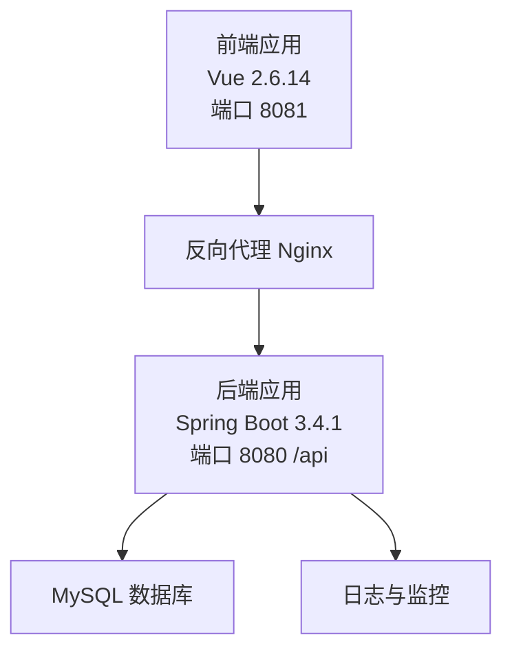
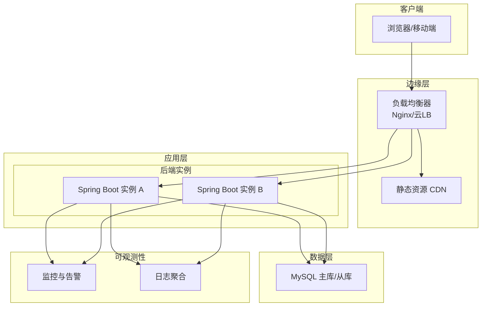
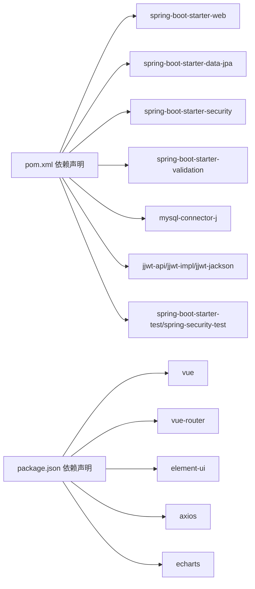

# 部署与运维

<cite>
**本文引用的文件**
- [application.yml](file://backend/src/main/resources/application.yml)
- [pom.xml](file://backend/pom.xml)
- [MallApplication.java](file://backend/src/main/java/com/mall/MallApplication.java)
- [SecurityConfig.java](file://backend/src/main/java/com/mall/config/SecurityConfig.java)
- [JwtProperties.java](file://backend/src/main/java/com/mall/config/JwtProperties.java)
- [banner.sql](file://backend/src/main/resources/banner.sql)
- [vue.config.js](file://frontend/vue.config.js)
- [package.json](file://frontend/package.json)
- [GlobalExceptionHandler.java](file://backend/src/main/java/com/mall/exception/GlobalExceptionHandler.java)
- [AdminReportController.java](file://backend/src/main/java/com/mall/controller/admin/AdminReportController.java)
- [AuthService.java](file://backend/src/main/java/com/mall/service/AuthService.java)
- [CartService.java](file://backend/src/main/java/com/mall/service/CartService.java)
- [mvnw.cmd](file://backend/mvnw.cmd)
</cite>

## 目录
1. [简介](#简介)
2. [项目结构](#项目结构)
3. [核心组件](#核心组件)
4. [架构总览](#架构总览)
5. [详细组件分析](#详细组件分析)
6. [依赖分析](#依赖分析)
7. [性能考虑](#性能考虑)
8. [故障排查指南](#故障排查指南)
9. [结论](#结论)
10. [附录](#附录)

## 简介
本指南面向电商商城系统的生产部署与运维，覆盖环境准备、依赖安装、配置文件设置、数据库部署、容器化与反向代理、负载均衡、CI/CD流水线、监控告警、日志管理、性能指标、故障排查、应急响应与数据备份恢复，以及云平台部署与弹性伸缩建议。文档以仓库现有代码为依据，结合可落地的工程实践，帮助团队安全、稳定地交付与维护系统。

## 项目结构
系统采用前后端分离架构：
- 后端基于 Spring Boot 3.4.1（Java 17），使用 Maven 构建，提供 REST API 服务，端口默认 8080，上下文路径为 /api。
- 前端基于 Vue 2.6.14，开发服务器默认端口 8081，通过代理将 /api、/pub、/images 请求转发至后端。
- 数据库使用 MySQL，JPA/Hibernate 自动建模，DDL 策略为 update；提供初始化表结构脚本。

章节来源
- [application.yml:1-36](file://backend/src/main/resources/application.yml#L1-L36)
- [vue.config.js:1-19](file://frontend/vue.config.js#L1-L19)
- [pom.xml:16-18](file://backend/pom.xml#L16-L18)

## 核心组件
- 应用入口与启动
  - 后端主类负责启动 Spring Boot 应用。
- 安全与认证
  - 基于 Spring Security 的无状态会话策略，开启 CORS 并对特定路径放行，JWT 过滤器在认证前执行。
  - JWT 参数由配置文件注入，支持密钥与过期时间配置。
- 数据访问与持久层
  - JPA/Hibernate 配置，MySQL 驱动，DDL 自动更新；提供 banner 表结构脚本。
- 异常处理
  - 全局异常处理器统一返回业务失败响应，避免前端直接暴露错误细节。
- 前后端联调
  - 前端开发服务器通过代理将 /api、/pub、/images 转发到后端 8080 端口，便于本地联调。

章节来源
- [MallApplication.java:1-13](file://backend/src/main/java/com/mall/MallApplication.java#L1-L13)
- [SecurityConfig.java:33-55](file://backend/src/main/java/com/mall/config/SecurityConfig.java#L33-L55)
- [JwtProperties.java:12-17](file://backend/src/main/java/com/mall/config/JwtProperties.java#L12-L17)
- [application.yml:4-36](file://backend/src/main/resources/application.yml#L4-L36)
- [banner.sql:1-14](file://backend/src/main/resources/banner.sql#L1-L14)
- [GlobalExceptionHandler.java:10-18](file://backend/src/main/java/com/mall/exception/GlobalExceptionHandler.java#L10-L18)
- [vue.config.js:4-17](file://frontend/vue.config.js#L4-L17)

## 架构总览
下图展示生产环境典型拓扑：Nginx 作为反向代理与静态资源分发，后端多实例水平扩展，数据库独立部署或托管，日志与监控集中采集。

## 详细组件分析

### 生产环境部署流程
- 环境准备
  - 操作系统：Linux（推荐 Ubuntu/AlmaLinux/CentOS）。
  - 运行时：JDK 17（与构建版本一致）。
  - 数据库：MySQL 8+ 或兼容的托管数据库（建议主从/高可用）。
  - 反向代理：Nginx（建议最新稳定版）。
  - 容器化：Docker（可选，便于标准化与弹性伸缩）。
- 依赖安装
  - 后端：使用 Maven 打包，生成可执行 JAR；如需源码构建，使用 mvnw.cmd（Windows）或 mvnw（Unix）。
  - 前端：使用 npm/yarn 安装依赖后构建静态资源。
- 配置文件设置
  - 数据库连接：在生产环境替换 application.yml 中的数据库 URL、用户名、密码。
  - JWT 参数：根据安全策略调整密钥与过期时间。
  - 日志级别：按需降低为 WARN/ERROR 以减少 IO。
  - 服务器端口与上下文路径：确保与反向代理配置一致。
- 数据库部署
  - 初始化表结构：执行 banner.sql 或通过 JPA 自动建模（生产建议手动迁移）。
  - 权限与网络：限制数据库访问白名单，启用 SSL 连接（如可用）。
- 部署步骤
  - 构建后端：mvnw clean package（或使用 CI 提供的缓存）。
  - 构建前端：npm run build 输出静态文件至后端静态目录或独立托管。
  - 启动后端：nohup java -jar mall-backend.jar &。
  - 启动 Nginx：配置反向代理与静态资源映射。
  - 健康检查：对外暴露 /health（如自定义）或基于 8080/200 响应判断。

章节来源
- [application.yml:4-36](file://backend/src/main/resources/application.yml#L4-L36)
- [pom.xml:16-18](file://backend/pom.xml#L16-L18)
- [mvnw.cmd:98-128](file://backend/mvnw.cmd#L98-L128)
- [banner.sql:1-14](file://backend/src/main/resources/banner.sql#L1-L14)

### Docker 容器化部署方案
- 镜像构建
  - 使用多阶段构建：基础镜像（OpenJDK 17）、打包产物复制、最小化运行时镜像。
  - 暴露端口：8080；挂载外部配置文件与日志目录。
- 容器编排
  - docker-compose：定义后端服务、数据库服务、Nginx 服务及其网络与卷。
  - Kubernetes：Deployment + Service + ConfigMap/Secret；为后端与 Nginx 分别创建资源。
- 健康检查与探针
  - Liveness/Readiness 探针：基于 HTTP GET /actuator/health（如启用）或应用端口探测。
- 环境变量
  - 通过环境变量覆盖 application.yml 中的敏感配置（数据库凭据、JWT 密钥等）。

章节来源
- [pom.xml:16-18](file://backend/pom.xml#L16-L18)
- [application.yml:4-36](file://backend/src/main/resources/application.yml#L4-L36)

### Nginx 反向代理与静态资源
- 代理规则
  - 将 /api、/pub、/images 请求转发至后端 8080 端口。
  - 设置超时、缓冲区与请求大小限制。
- 静态资源
  - 前端构建产物放置于 Nginx 静态目录，开启 gzip/缓存头。
- 安全加固
  - 仅允许必要方法与来源；开启 HTTPS 与 HSTS；隐藏后端版本信息。

章节来源
- [vue.config.js:4-17](file://frontend/vue.config.js#L4-L17)
- [application.yml:22-25](file://backend/src/main/resources/application.yml#L22-L25)

### 负载均衡策略
- 节点健康检查：基于 TCP/HTTP 探针与应用健康端点。
- 调度算法：轮询/最少连接/IP 哈希（按需选择）。
- 会话保持：无状态设计（JWT 无状态），无需粘性会话。
- 灰度与蓝绿：结合网关/SLB 支持的权重路由与金丝雀发布。

章节来源
- [SecurityConfig.java:38-52](file://backend/src/main/java/com/mall/config/SecurityConfig.java#L38-L52)

### CI/CD 流水线与自动化测试
- 构建阶段
  - 后端：mvn clean package（含单元测试），生成 JAR 与覆盖率报告。
  - 前端：npm ci + npm run build，产出静态资源。
- 测试阶段
  - 单元测试：Spring Boot Test 与 Security Test。
  - 集成测试：数据库初始化脚本 + API 测试套件。
- 部署阶段
  - 制作镜像并推送至镜像仓库；Kubernetes 部署或 Docker Compose 启动。
  - 发布后进行健康检查与端到端验证。
- 回滚策略
  - 版本标签与镜像回滚；蓝绿/金丝雀快速切回。

章节来源
- [pom.xml:65-73](file://backend/pom.xml#L65-L73)
- [mvnw.cmd:98-128](file://backend/mvnw.cmd#L98-L128)

### 监控告警与日志管理
- 指标采集
  - JVM/应用指标：Prometheus Exporter（Micrometer）+ Grafana 展示。
  - 关键指标：请求量、错误率、P95/P99 延迟、并发连接数、GC 时间、堆内存使用。
- 日志管理
  - 结构化日志：JSON 格式输出，统一字段（traceId、level、service、method、uri）。
  - 日志收集：Filebeat/Fluent Bit → ES/OpenSearch/ Loki；集中检索与告警。
- 告警策略
  - 错误率阈值、延迟突增、CPU/内存/磁盘/连接数告警；分级响应（电话/邮件/机器人）。

章节来源
- [application.yml:32-36](file://backend/src/main/resources/application.yml#L32-L36)

### 性能监控指标
- 应用层
  - QPS、错误率、响应时间（P50/P90/P95/P99）、线程池饱和度、数据库连接池使用率。
- 数据层
  - 慢查询、锁等待、连接数、缓冲池命中率、主从延迟。
- 前端层
  - 首屏时间、TTFB、静态资源加载时间、离线可用性。

章节来源
- [AdminReportController.java:128-147](file://backend/src/main/java/com/mall/controller/admin/AdminReportController.java#L128-L147)

### 故障排查指南
- 启动失败
  - 检查 JDK 版本与依赖是否匹配；查看日志文件定位异常。
- 认证问题
  - 校验 JWT 密钥与过期时间；确认 CORS 配置允许前端来源；检查过滤器链顺序。
- 数据库连接
  - 校验连接串、用户名/密码、网络连通性与防火墙；确认时区与字符集。
- 前后端联调
  - 确认 Nginx 代理路径与后端上下文路径一致；检查静态资源目录映射。
- 全局异常
  - 查看全局异常处理器返回的业务错误信息，定位具体服务方法。

章节来源
- [JwtProperties.java:12-17](file://backend/src/main/java/com/mall/config/JwtProperties.java#L12-L17)
- [SecurityConfig.java:57-67](file://backend/src/main/java/com/mall/config/SecurityConfig.java#L57-L67)
- [GlobalExceptionHandler.java:10-18](file://backend/src/main/java/com/mall/exception/GlobalExceptionHandler.java#L10-L18)
- [vue.config.js:4-17](file://frontend/vue.config.js#L4-L17)

### 应急响应预案
- 一级事件（服务不可用）
  - 快速回滚至上一稳定版本；隔离故障实例；扩容至备用节点。
- 二级事件（性能退化）
  - 熔断与降级（如限流/缓存穿透保护）；临时关闭非关键接口；扩容。
- 三级事件（单点异常）
  - 主备切换/重调度；修复后自动恢复；复盘优化。

章节来源
- [AuthService.java:62-91](file://backend/src/main/java/com/mall/service/AuthService.java#L62-L91)
- [CartService.java:45-61](file://backend/src/main/java/com/mall/service/CartService.java#L45-L61)

### 数据备份与恢复
- 备份策略
  - 全量/增量备份：定时任务导出 SQL；对象存储归档；保留 7/30 天滚动副本。
  - 热点数据：Redis/Memcached 缓存快照与持久化。
- 恢复演练
  - 定期进行 RTO/RPO 验证；模拟故障场景；记录恢复时间与成功率。
- 安全与合规
  - 备份加密传输与存储；最小权限访问；审计日志。

章节来源
- [banner.sql:1-14](file://backend/src/main/resources/banner.sql#L1-14)

### 云平台部署与弹性伸缩
- 云平台选项
  - AWS/GCP/Azure：ECS/EKS/GKE/Tencent TKE/OSS/CDN/ALB。
- 容器编排
  - K8s：Deployment/Service/Ingress/ConfigMap/Secret/PDB；HPA/VPA 自动扩缩。
- 弹性伸缩
  - CPU/内存/自定义指标触发；多可用区部署；自动故障转移。
- 网络与安全
  - VPC/子网/安全组；WAF/DDoS 防护；TLS/证书管理。

章节来源
- [pom.xml:16-18](file://backend/pom.xml#L16-L18)
- [application.yml:4-36](file://backend/src/main/resources/application.yml#L4-L36)

## 依赖分析
后端主要依赖包括 Web、JPA、Security、Validation、MySQL 驱动与 JWT 实现；前端依赖 Vue 生态与 UI 组件库；开发服务器通过代理与后端对接。

图表来源
- [pom.xml:19-74](file://backend/pom.xml#L19-L74)
- [package.json:9-22](file://frontend/package.json#L9-L22)

章节来源
- [pom.xml:19-74](file://backend/pom.xml#L19-L74)
- [package.json:9-22](file://frontend/package.json#L9-L22)

## 性能考虑
- 连接池与数据库
  - 合理配置最大连接数、空闲超时与查询超时；慢查询日志与索引优化。
- 缓存策略
  - 读多写少热点数据使用缓存；注意缓存一致性与失效策略。
- 并发与线程
  - 控制并发与队列长度；避免阻塞操作；异步化耗时任务。
- 静态资源
  - CDN 加速、压缩与缓存头；预加载关键资源。
- 监控与压测
  - 基准测试与容量规划；持续观察关键指标变化。

## 故障排查指南
- 常见症状与定位
  - 登录失败：检查 JWT 密钥与过期时间、CORS 允许来源、过滤器链顺序。
  - 数据库异常：核对连接参数、时区与字符集、网络连通性。
  - 前端空白页：确认 Nginx 静态目录映射与代理路径。
  - 全局异常：查看异常处理器返回的业务提示，定位具体服务方法。
- 快速恢复
  - 回滚至上一稳定版本；临时关闭非关键接口；扩容实例。

章节来源
- [JwtProperties.java:12-17](file://backend/src/main/java/com/mall/config/JwtProperties.java#L12-L17)
- [SecurityConfig.java:57-67](file://backend/src/main/java/com/mall/config/SecurityConfig.java#L57-L67)
- [GlobalExceptionHandler.java:10-18](file://backend/src/main/java/com/mall/exception/GlobalExceptionHandler.java#L10-L18)
- [vue.config.js:4-17](file://frontend/vue.config.js#L4-L17)

## 结论
本指南提供了从环境准备到生产运维的完整路径：明确的部署步骤、容器化与反向代理配置、负载均衡与弹性伸缩建议、CI/CD 与可观测性实践，以及故障排查与应急响应方案。建议在上线前完成压测与演练，确保系统在高并发与异常场景下的稳定性与可恢复性。

## 附录
- 关键配置项参考
  - 数据库连接：application.yml 中 datasource 节点。
  - JWT 参数：application.yml 中 jwt 节点与 JwtProperties。
  - 服务器端口与上下文：application.yml server 节点。
  - 前端开发代理：vue.config.js devServer.proxy。
- 参考实现位置
  - 后端启动类：MallApplication.java。
  - 安全配置：SecurityConfig.java。
  - 全局异常处理：GlobalExceptionHandler.java。
  - 数据库初始化：banner.sql。

章节来源
- [application.yml:4-36](file://backend/src/main/resources/application.yml#L4-L36)
- [JwtProperties.java:12-17](file://backend/src/main/java/com/mall/config/JwtProperties.java#L12-L17)
- [MallApplication.java:1-13](file://backend/src/main/java/com/mall/MallApplication.java#L1-L13)
- [SecurityConfig.java:33-55](file://backend/src/main/java/com/mall/config/SecurityConfig.java#L33-L55)
- [GlobalExceptionHandler.java:10-18](file://backend/src/main/java/com/mall/exception/GlobalExceptionHandler.java#L10-L18)
- [banner.sql:1-14](file://backend/src/main/resources/banner.sql#L1-L14)
- [vue.config.js:1-19](file://frontend/vue.config.js#L1-L19)