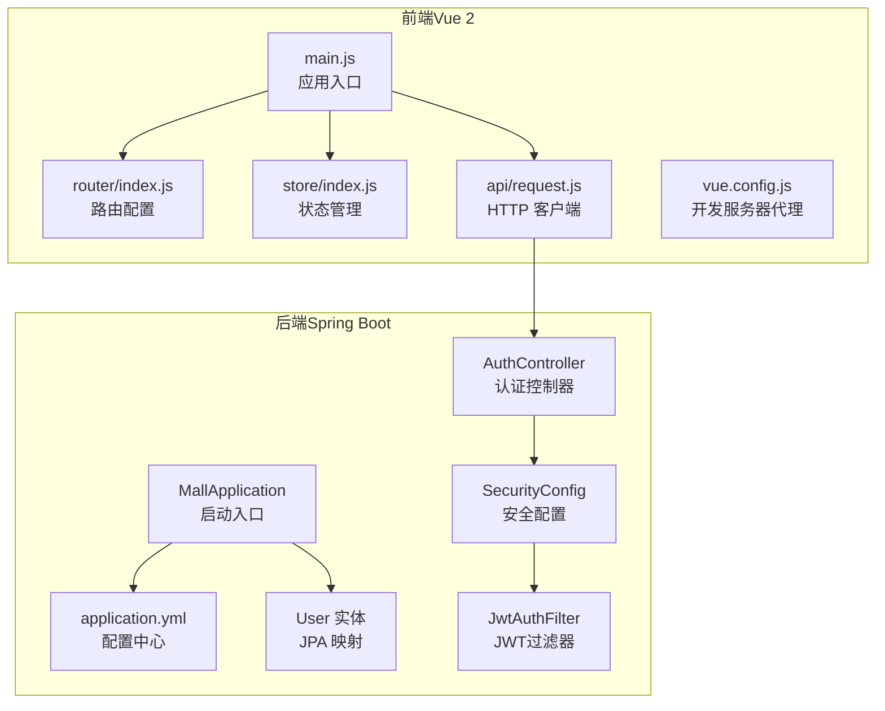
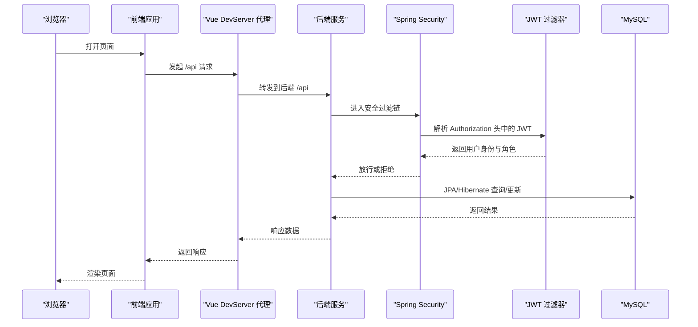
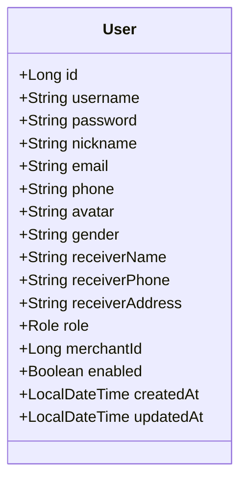
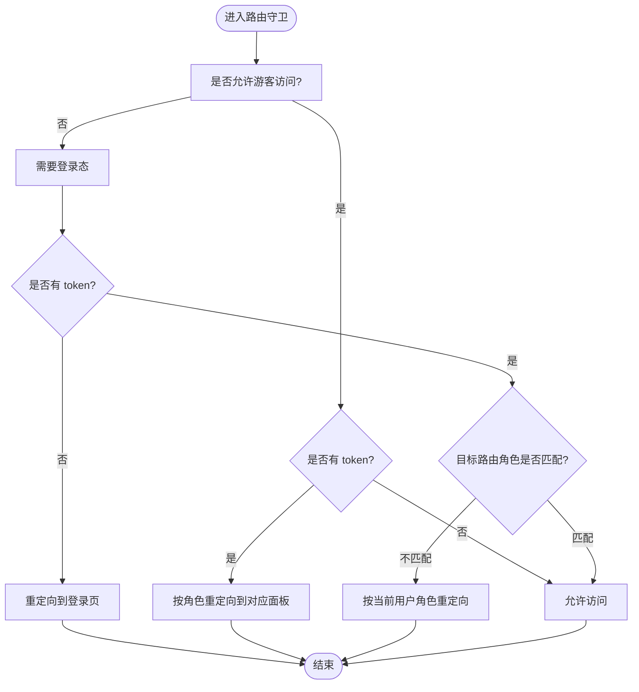
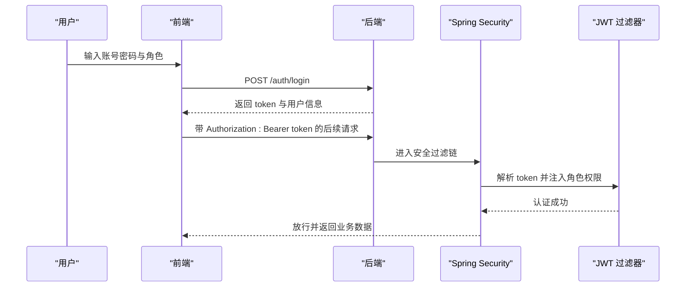
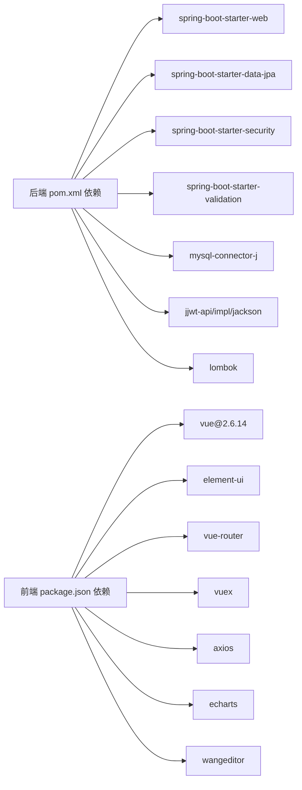

# 技术栈概览

<cite>
**本文引用的文件**
- [backend/pom.xml](file://backend/pom.xml)
- [backend/src/main/resources/application.yml](file://backend/src/main/resources/application.yml)
- [backend/src/main/java/com/mall/MallApplication.java](file://backend/src/main/java/com/mall/MallApplication.java)
- [backend/src/main/java/com/mall/config/SecurityConfig.java](file://backend/src/main/java/com/mall/config/SecurityConfig.java)
- [backend/src/main/java/com/mall/security/JwtAuthFilter.java](file://backend/src/main/java/com/mall/security/JwtAuthFilter.java)
- [backend/src/main/java/com/mall/controller/AuthController.java](file://backend/src/main/java/com/mall/controller/AuthController.java)
- [backend/src/main/java/com/mall/entity/User.java](file://backend/src/main/java/com/mall/entity/User.java)
- [frontend/package.json](file://frontend/package.json)
- [frontend/src/main.js](file://frontend/src/main.js)
- [frontend/src/router/index.js](file://frontend/src/router/index.js)
- [frontend/src/store/index.js](file://frontend/src/store/index.js)
- [frontend/src/api/request.js](file://frontend/src/api/request.js)
- [frontend/vue.config.js](file://frontend/vue.config.js)
</cite>

## 目录
1. [引言](#引言)
2. [项目结构](#项目结构)
3. [核心组件](#核心组件)
4. [架构总览](#架构总览)
5. [详细组件分析](#详细组件分析)
6. [依赖分析](#依赖分析)
7. [性能考虑](#性能考虑)
8. [故障排查指南](#故障排查指南)
9. [结论](#结论)
10. [附录](#附录)

## 引言
本文件面向电商商城系统，系统采用前后端分离架构：后端基于 Spring Boot 3.4.1，配合 Spring Security 提供安全控制，使用 JPA/Hibernate 实现 ORM 映射，MySQL 作为持久化存储，Lombok 简化实体与工具类代码；前端采用 Vue.js 2.6.14，结合 Element UI、Axios、Vue Router、Vuex 以及 ECharts 构建交互式界面与可视化展示。本文将从技术选型理由、特性优势、在项目中的职责、技术栈协作关系与集成方式、版本兼容性与升级注意事项等方面进行全面阐述。

## 项目结构
系统采用前后端分离目录组织，后端以 Maven 工程构建，前端以 Vue CLI 工程构建，通过本地代理实现跨域访问与联调。

**图表来源**
- [backend/src/main/java/com/mall/MallApplication.java:1-13](file://backend/src/main/java/com/mall/MallApplication.java#L1-L13)
- [backend/src/main/resources/application.yml:1-36](file://backend/src/main/resources/application.yml#L1-L36)
- [backend/src/main/java/com/mall/config/SecurityConfig.java:1-74](file://backend/src/main/java/com/mall/config/SecurityConfig.java#L1-L74)
- [backend/src/main/java/com/mall/security/JwtAuthFilter.java:1-57](file://backend/src/main/java/com/mall/security/JwtAuthFilter.java#L1-L57)
- [backend/src/main/java/com/mall/controller/AuthController.java:1-73](file://backend/src/main/java/com/mall/controller/AuthController.java#L1-L73)
- [backend/src/main/java/com/mall/entity/User.java:1-88](file://backend/src/main/java/com/mall/entity/User.java#L1-L88)
- [frontend/src/main.js:1-20](file://frontend/src/main.js#L1-L20)
- [frontend/src/router/index.js:1-208](file://frontend/src/router/index.js#L1-L208)
- [frontend/src/store/index.js:1-31](file://frontend/src/store/index.js#L1-L31)
- [frontend/src/api/request.js:1-38](file://frontend/src/api/request.js#L1-L38)
- [frontend/vue.config.js:1-20](file://frontend/vue.config.js#L1-L20)

**章节来源**
- [backend/pom.xml:1-107](file://backend/pom.xml#L1-L107)
- [frontend/package.json:1-24](file://frontend/package.json#L1-L24)

## 核心组件
- 后端核心框架：Spring Boot 3.4.1，负责应用启动、自动配置、依赖注入与 Web 层装配。
- 安全控制：Spring Security + JWT，提供基于角色的访问控制与无状态鉴权。
- ORM 映射：Spring Data JPA + Hibernate，提供对象关系映射与数据库操作抽象。
- 数据存储：MySQL，承载用户、商品、订单等业务数据。
- 代码简化：Lombok，通过注解减少样板代码，提升开发效率。
- 前端核心：Vue.js 2.6.14，响应式数据绑定与组件化开发。
- UI 组件：Element UI，提供丰富的桌面端组件与主题样式。
- HTTP 客户端：Axios，统一请求与响应拦截，集中处理鉴权与错误。
- 路由管理：Vue Router，支持多角色布局与权限守卫。
- 状态管理：Vuex，集中管理用户登录态与本地持久化。
- 可视化：ECharts，用于后台报表与销售统计等可视化展示。
- 开发代理：Vue CLI DevServer 代理，解决前后端跨域与联调问题。

**章节来源**
- [backend/pom.xml:16-63](file://backend/pom.xml#L16-L63)
- [backend/src/main/resources/application.yml:1-36](file://backend/src/main/resources/application.yml#L1-L36)
- [frontend/package.json:9-22](file://frontend/package.json#L9-L22)

## 架构总览
系统采用前后端分离模式，前端通过 Axios 发起请求，后端通过 Spring MVC 接收请求，Spring Security 进行鉴权与授权，JWT 在请求头中传递身份信息，JPA/Hibernate 访问 MySQL 数据库。Vue Router 与 Vuex 协同完成页面导航与登录态管理。

**图表来源**
- [frontend/src/api/request.js:1-38](file://frontend/src/api/request.js#L1-L38)
- [frontend/vue.config.js:1-20](file://frontend/vue.config.js#L1-L20)
- [backend/src/main/java/com/mall/config/SecurityConfig.java:33-55](file://backend/src/main/java/com/mall/config/SecurityConfig.java#L33-L55)
- [backend/src/main/java/com/mall/security/JwtAuthFilter.java:30-47](file://backend/src/main/java/com/mall/security/JwtAuthFilter.java#L30-L47)
- [backend/src/main/resources/application.yml:4-25](file://backend/src/main/resources/application.yml#L4-L25)

## 详细组件分析

### 后端技术栈与集成
- Spring Boot 3.4.1
  - 版本特性：模块化启动器、Java 17+ 默认、改进的自动配置与安全默认值。
  - 在项目中的作用：统一依赖管理、快速启动与运行 Web 应用。
  - 关键配置：主类、端口、上下文路径、数据源与 JPA 设置。
- Spring Security + JWT
  - 角色与路径匹配：对 /auth/** 放行，对 /user/**、/merchant/**、/admin/** 按角色放行，其余需认证。
  - CORS：允许前端本地开发域名，支持凭证与常用方法。
  - 密码编码：BCrypt。
  - JWT 过滤器：从 Authorization 头解析 Bearer Token，解析失败则忽略。
- JPA/Hibernate
  - DDL 自动更新、SQL 输出关闭、MySQL 方言、Open in View 关闭。
  - 实体示例：User 表包含用户基本信息、角色枚举、收货信息与时间戳。
- MySQL
  - 连接参数：时区、字符集、SSL、驱动类名。
- Lombok
  - 注解简化：Getter/Setter/NoArgsConstructor/AllArgsConstructor/Builder。
  - 编译期处理：Maven 编译插件配置处理器。

**图表来源**
- [backend/src/main/java/com/mall/entity/User.java:10-88](file://backend/src/main/java/com/mall/entity/User.java#L10-L88)

**章节来源**
- [backend/pom.xml:6-18](file://backend/pom.xml#L6-L18)
- [backend/src/main/resources/application.yml:4-25](file://backend/src/main/resources/application.yml#L4-L25)
- [backend/src/main/java/com/mall/config/SecurityConfig.java:33-73](file://backend/src/main/java/com/mall/config/SecurityConfig.java#L33-L73)
- [backend/src/main/java/com/mall/security/JwtAuthFilter.java:21-47](file://backend/src/main/java/com/mall/security/JwtAuthFilter.java#L21-L47)
- [backend/src/main/java/com/mall/entity/User.java:10-88](file://backend/src/main/java/com/mall/entity/User.java#L10-L88)

### 前端技术栈与集成
- Vue.js 2.6.14
  - 应用入口：注册 Element UI、挂载根实例。
- Element UI
  - 全局引入主题样式与覆盖样式。
- Vue Router
  - 多角色布局：用户、管理员、商户三套布局。
  - 权限守卫：根据本地存储的用户角色与 token 决定是否放行或重定向。
- Vuex
  - 状态：用户信息与 token 的本地持久化。
  - 动作：登录与登出变更状态。
- Axios
  - 统一基础路径 /api、超时设置。
  - 请求拦截：自动附加 Authorization 头。
  - 响应拦截：401/403 清理本地会话并跳转登录。
- 开发代理
  - 将 /api、/pub、/images 代理至后端 8080 端口，解决跨域问题。

**图表来源**
- [frontend/src/router/index.js:182-205](file://frontend/src/router/index.js#L182-L205)

**章节来源**
- [frontend/src/main.js:1-20](file://frontend/src/main.js#L1-L20)
- [frontend/src/router/index.js:1-208](file://frontend/src/router/index.js#L1-L208)
- [frontend/src/store/index.js:1-31](file://frontend/src/store/index.js#L1-L31)
- [frontend/src/api/request.js:1-38](file://frontend/src/api/request.js#L1-L38)
- [frontend/vue.config.js:1-20](file://frontend/vue.config.js#L1-L20)

### 认证流程与安全集成
- 登录接口：后端提供 /auth/login 与 /auth/register，返回 JWT 与用户信息。
- 前端登录：Axios 请求拦截自动附加 Bearer Token。
- 后端鉴权：SecurityConfig 配置路径白名单与角色权限，JwtAuthFilter 解析并注入认证信息。
- 会话持久化：前端使用 localStorage 存储用户与 token，退出时清理。

**图表来源**
- [backend/src/main/java/com/mall/controller/AuthController.java:18-35](file://backend/src/main/java/com/mall/controller/AuthController.java#L18-L35)
- [backend/src/main/java/com/mall/config/SecurityConfig.java:39-53](file://backend/src/main/java/com/mall/config/SecurityConfig.java#L39-L53)
- [backend/src/main/java/com/mall/security/JwtAuthFilter.java:30-47](file://backend/src/main/java/com/mall/security/JwtAuthFilter.java#L30-L47)
- [frontend/src/api/request.js:9-16](file://frontend/src/api/request.js#L9-L16)

**章节来源**
- [backend/src/main/java/com/mall/controller/AuthController.java:1-73](file://backend/src/main/java/com/mall/controller/AuthController.java#L1-L73)
- [frontend/src/api/request.js:1-38](file://frontend/src/api/request.js#L1-L38)

## 依赖分析
- 后端依赖要点
  - Web、Data JPA、Security、Validation、MySQL Connector、JWT、Lombok。
  - Java 17、Lombok 注解处理器。
- 前端依赖要点
  - Vue 2.6.14、Element UI、Vue Router、Vuex、Axios、ECharts、WangEditor。
  - 开发工具：@vue/cli-service、babel 插件、vue-template-compiler。

**图表来源**
- [backend/pom.xml:19-74](file://backend/pom.xml#L19-L74)
- [frontend/package.json:9-22](file://frontend/package.json#L9-L22)

**章节来源**
- [backend/pom.xml:16-103](file://backend/pom.xml#L16-L103)
- [frontend/package.json:1-24](file://frontend/package.json#L1-L24)

## 性能考虑
- 无状态鉴权：JWT 与 Spring Security 无 Session，降低服务器内存压力。
- SQL 输出关闭：生产环境建议保持关闭，避免日志膨胀。
- Open in View 关闭：避免延迟加载导致的 N+1 问题与事务延长。
- Axios 超时设置：合理超时可避免前端长时间等待。
- 前端组件懒加载：路由按需加载组件，减少首屏体积。
- ECharts 按需引入：避免不必要的包体积。

## 故障排查指南
- 登录后 401/403
  - 检查前端是否正确写入 token 到 localStorage，并在请求头附加 Authorization。
  - 检查后端 SecurityConfig 是否正确配置 CORS 与路径放行。
- 跨域问题
  - 确认 Vue DevServer 代理已配置 /api、/pub、/images。
- 数据库连接失败
  - 检查 application.yml 中的数据库 URL、用户名、密码与时区配置。
- JWT 解析异常
  - 检查后端 JWT 密钥与过期时间配置，确认前端 token 未被篡改或过期。

**章节来源**
- [frontend/src/api/request.js:18-35](file://frontend/src/api/request.js#L18-L35)
- [frontend/vue.config.js:4-17](file://frontend/vue.config.js#L4-L17)
- [backend/src/main/resources/application.yml:4-25](file://backend/src/main/resources/application.yml#L4-L25)
- [backend/src/main/java/com/mall/config/SecurityConfig.java:58-67](file://backend/src/main/java/com/mall/config/SecurityConfig.java#L58-L67)

## 结论
该技术栈在电商系统中实现了清晰的分层与职责边界：后端以 Spring 生态为核心，提供安全、数据与业务能力；前端以 Vue 生态为核心，提供良好的用户体验与可视化能力。通过 JWT 与路由守卫实现多角色权限控制，通过 Axios 与代理实现前后端联调与跨域处理。整体方案成熟稳定，适合中小型电商系统的快速迭代与扩展。

## 附录

### 版本兼容性与升级注意事项
- 后端
  - Spring Boot 3.4.1：要求 Java 17+，注意移除旧版 starter 与废弃 API。
  - Spring Security：默认禁用 CSRF、无 Session，确保前端无状态设计。
  - JPA/Hibernate：MySQL 方言与方言相关配置需与数据库版本匹配。
  - Lombok：确保编译插件与 IDE 插件版本一致，避免生成代码不生效。
- 前端
  - Vue 2.6.14：仍处于维护期，升级需评估生态与兼容性。
  - Element UI：与 Vue 2 兼容，注意主题与样式覆盖策略。
  - Vue Router/Vuex/Axios：版本需与 Vue 2 生态匹配，升级前做回归测试。
  - ECharts：按需引入与主题配置需保持一致。

**章节来源**
- [backend/pom.xml:16-18](file://backend/pom.xml#L16-L18)
- [backend/src/main/resources/application.yml:14-16](file://backend/src/main/resources/application.yml#L14-L16)
- [frontend/package.json:9-22](file://frontend/package.json#L9-L22)