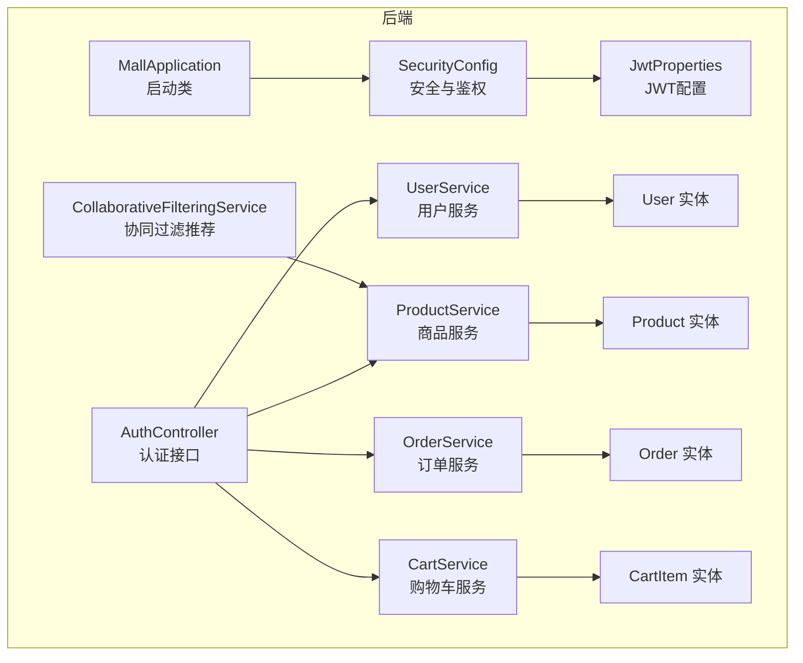
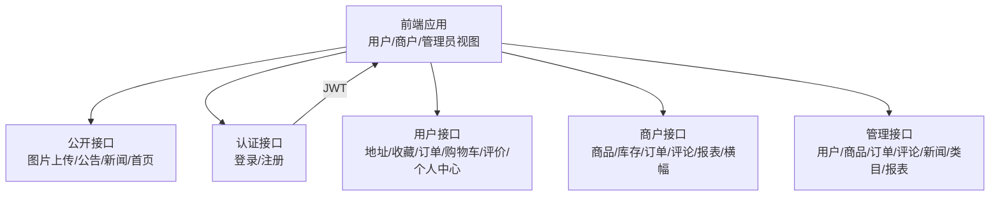
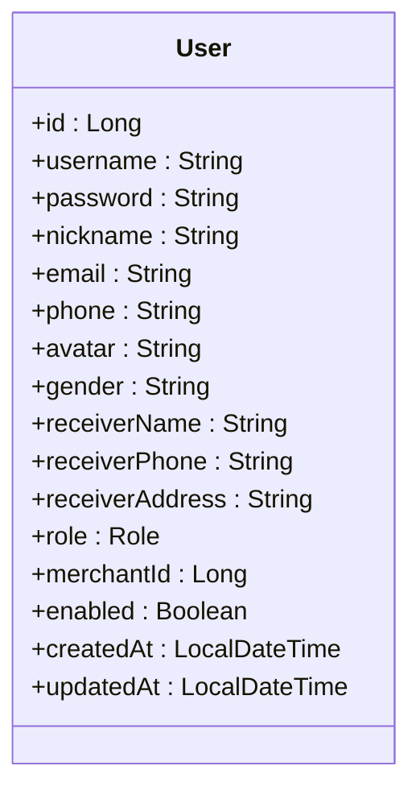
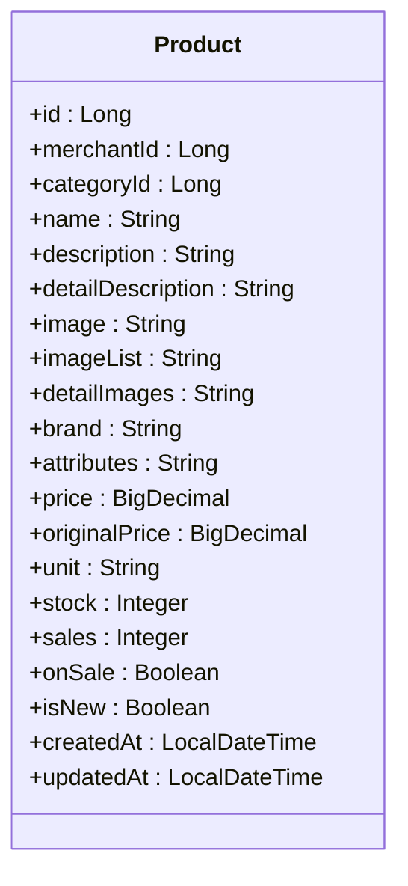
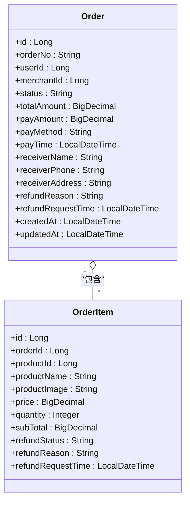
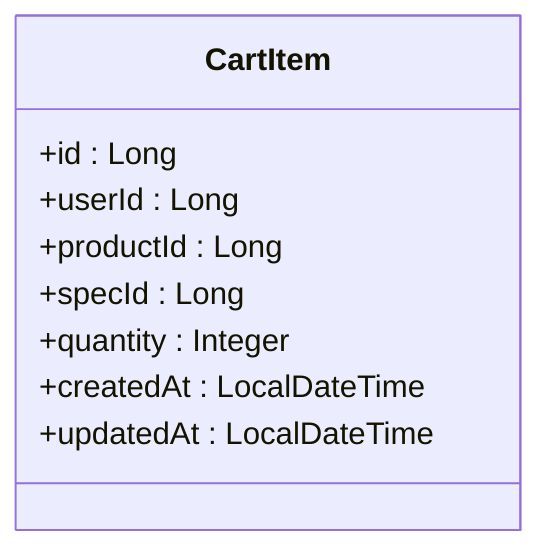
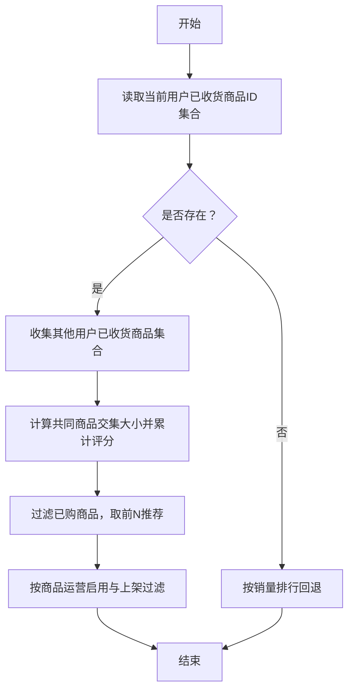
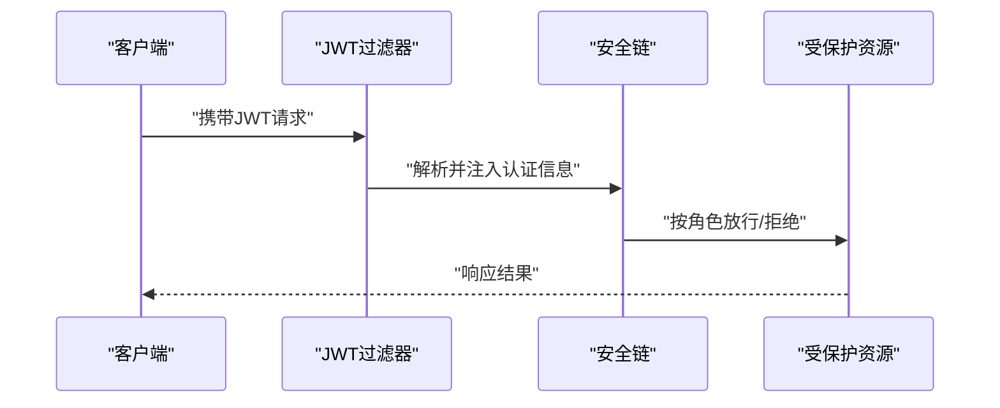
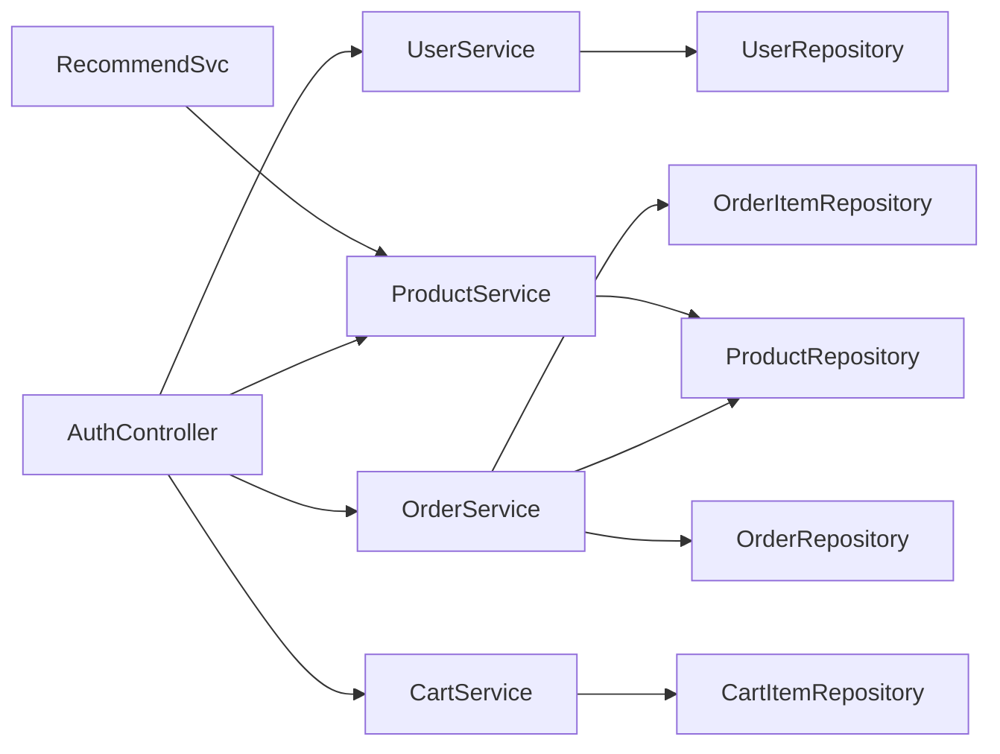

# 核心功能模块

<cite>
**本文引用的文件**
- [MallApplication.java](file://backend/src/main/java/com/mall/MallApplication.java)
- [application.yml](file://backend/src/main/resources/application.yml)
- [Role.java](file://backend/src/main/java/com/mall/common/Role.java)
- [SecurityConfig.java](file://backend/src/main/java/com/mall/config/SecurityConfig.java)
- [JwtProperties.java](file://backend/src/main/java/com/mall/config/JwtProperties.java)
- [AuthController.java](file://backend/src/main/java/com/mall/controller/AuthController.java)
- [UserService.java](file://backend/src/main/java/com/mall/service/UserService.java)
- [ProductService.java](file://backend/src/main/java/com/mall/service/ProductService.java)
- [OrderService.java](file://backend/src/main/java/com/mall/service/OrderService.java)
- [CartService.java](file://backend/src/main/java/com/mall/service/CartService.java)
- [CollaborativeFilteringService.java](file://backend/src/main/java/com/mall/service/CollaborativeFilteringService.java)
- [User.java](file://backend/src/main/java/com/mall/entity/User.java)
- [Product.java](file://backend/src/main/java/com/mall/entity/Product.java)
- [Order.java](file://backend/src/main/java/com/mall/entity/Order.java)
- [CartItem.java](file://backend/src/main/java/com/mall/entity/CartItem.java)
</cite>

## 目录
1. [简介](#简介)
2. [项目结构](#项目结构)
3. [核心组件](#核心组件)
4. [架构总览](#架构总览)
5. [详细组件分析](#详细组件分析)
6. [依赖分析](#依赖分析)
7. [性能考虑](#性能考虑)
8. [故障排查指南](#故障排查指南)
9. [结论](#结论)
10. [附录](#附录)

## 简介
本文件面向电商商城系统的核心功能模块，围绕用户管理、商品管理、订单处理、内容管理、推荐系统、权限控制等六大领域进行系统化梳理。文档解释各模块的作用与价值、模块间关联关系与数据流转、技术实现要点与关键设计决策，并给出面向不同角色（用户、商户、管理员）的功能入口与使用场景，以及模块优先级与实现顺序建议。

## 项目结构
后端采用 Spring Boot 架构，按功能域划分包结构：
- controller 层：按角色划分为 admin、merchant、user、pub 与认证模块，统一通过 /api 前缀对外提供 REST 接口。
- service 层：封装业务逻辑，如用户、商品、订单、购物车、推荐等。
- repository 层：数据访问层，基于 Spring Data JPA。
- entity 层：领域模型，映射数据库表结构。
- config 层：安全配置、JWT 参数等。
- resources：应用配置与静态资源路径。

图表来源
- [MallApplication.java:1-13](file://backend/src/main/java/com/mall/MallApplication.java#L1-L13)
- [SecurityConfig.java:1-74](file://backend/src/main/java/com/mall/config/SecurityConfig.java#L1-L74)
- [JwtProperties.java:1-18](file://backend/src/main/java/com/mall/config/JwtProperties.java#L1-L18)
- [AuthController.java:1-73](file://backend/src/main/java/com/mall/controller/AuthController.java#L1-L73)
- [UserService.java:1-42](file://backend/src/main/java/com/mall/service/UserService.java#L1-L42)
- [ProductService.java:1-126](file://backend/src/main/java/com/mall/service/ProductService.java#L1-L126)
- [OrderService.java:1-280](file://backend/src/main/java/com/mall/service/OrderService.java#L1-L280)
- [CartService.java:1-62](file://backend/src/main/java/com/mall/service/CartService.java#L1-L62)
- [CollaborativeFilteringService.java:1-81](file://backend/src/main/java/com/mall/service/CollaborativeFilteringService.java#L1-L81)
- [User.java:1-88](file://backend/src/main/java/com/mall/entity/User.java#L1-L88)
- [Product.java:1-101](file://backend/src/main/java/com/mall/entity/Product.java#L1-L101)
- [Order.java:1-83](file://backend/src/main/java/com/mall/entity/Order.java#L1-L83)
- [CartItem.java:1-50](file://backend/src/main/java/com/mall/entity/CartItem.java#L1-L50)

章节来源
- [application.yml:1-36](file://backend/src/main/resources/application.yml#L1-L36)
- [MallApplication.java:1-13](file://backend/src/main/java/com/mall/MallApplication.java#L1-L13)

## 核心组件
- 权限与安全
  - 角色枚举：ADMIN、MERCHANT、USER。
  - 安全配置：基于方法级安全与请求路径授权，禁用 CSRF、无状态会话，开放部分公开接口，其余接口按角色校验。
  - JWT：配置密钥与过期时间，结合过滤器在请求链路中注入身份信息。
- 认证与用户中心
  - 登录/注册：统一认证控制器，支持角色选择，返回令牌与用户信息。
  - 用户资料：支持更新昵称、头像、性别、邮箱、手机号及默认收货地址等。
- 商品与内容
  - 商品服务：提供管理端与用户端的查询、分页、搜索、上下架、库存统计、销量与新品排行等能力。
  - 内容管理：公开接口提供图片上传、轮播图、公告、新闻等。
- 订单与支付
  - 订单服务：支持按用户/商户/全站分页查询、订单状态变更、取消、退货退款申请与审批、订单项拆分与同步。
  - 购物车：支持添加、修改数量、删除、按用户聚合。
- 推荐系统
  - 协同过滤：基于“已收货商品”相似度生成“猜你喜欢”，无历史则回退到销量榜。
- 数据模型
  - 用户、商品、订单、购物车等实体定义字段与生命周期钩子。

章节来源
- [Role.java:1-8](file://backend/src/main/java/com/mall/common/Role.java#L1-L8)
- [SecurityConfig.java:1-74](file://backend/src/main/java/com/mall/config/SecurityConfig.java#L1-L74)
- [JwtProperties.java:1-18](file://backend/src/main/java/com/mall/config/JwtProperties.java#L1-L18)
- [AuthController.java:1-73](file://backend/src/main/java/com/mall/controller/AuthController.java#L1-L73)
- [UserService.java:1-42](file://backend/src/main/java/com/mall/service/UserService.java#L1-L42)
- [ProductService.java:1-126](file://backend/src/main/java/com/mall/service/ProductService.java#L1-L126)
- [OrderService.java:1-280](file://backend/src/main/java/com/mall/service/OrderService.java#L1-L280)
- [CartService.java:1-62](file://backend/src/main/java/com/mall/service/CartService.java#L1-L62)
- [CollaborativeFilteringService.java:1-81](file://backend/src/main/java/com/mall/service/CollaborativeFilteringService.java#L1-L81)
- [User.java:1-88](file://backend/src/main/java/com/mall/entity/User.java#L1-L88)
- [Product.java:1-101](file://backend/src/main/java/com/mall/entity/Product.java#L1-L101)
- [Order.java:1-83](file://backend/src/main/java/com/mall/entity/Order.java#L1-L83)
- [CartItem.java:1-50](file://backend/src/main/java/com/mall/entity/CartItem.java#L1-L50)

## 架构总览
系统采用前后端分离，后端以 Spring MVC 提供 REST API，前端通过路由与布局组件承载不同角色的视图。认证与授权贯穿所有业务接口，确保数据与操作的安全边界。

图表来源
- [SecurityConfig.java:33-54](file://backend/src/main/java/com/mall/config/SecurityConfig.java#L33-L54)
- [application.yml:22-25](file://backend/src/main/resources/application.yml#L22-L25)

## 详细组件分析

### 用户管理模块
- 功能职责
  - 用户注册与登录：统一认证接口，支持角色选择，返回令牌与用户信息。
  - 个人资料管理：昵称、头像、性别、邮箱、手机号、默认收货地址等字段更新。
- 关键实现点
  - 认证控制器对必填参数进行校验，调用认证服务完成登录/注册。
  - 用户服务根据传入字段动态更新用户记录，保证空字符串清理与非空约束。
- 数据模型
  - 用户实体包含基础字段、角色枚举、商户关联标识、启用状态与时间戳。
- 技术要点
  - 密码加密策略由安全配置提供编码器。
  - 角色驱动的接口授权，避免越权访问。

图表来源
- [User.java:1-88](file://backend/src/main/java/com/mall/entity/User.java#L1-L88)

章节来源
- [AuthController.java:18-71](file://backend/src/main/java/com/mall/controller/AuthController.java#L18-L71)
- [UserService.java:22-34](file://backend/src/main/java/com/mall/service/UserService.java#L22-L34)
- [Role.java:3-7](file://backend/src/main/java/com/mall/common/Role.java#L3-L7)

### 商品管理模块
- 功能职责
  - 管理端：商品详情、分页列表、按类目筛选、上下架、删除、库存统计与低库存提醒。
  - 用户端：商品详情（仅运营启用且上架）、新品、销量排行、分类筛选、关键词搜索。
  - 商户维度：按商户查询商品、库存管理与筛选。
- 关键实现点
  - 商品服务提供多维度查询方法，区分管理端与用户端可见性。
  - 库存管理支持关键字与缺货/低库存/正常状态组合筛选。
- 数据模型
  - 商品实体包含价格、库存、销量、上下架状态、是否新品、品牌、图片与详情字段等。

图表来源
- [Product.java:1-101](file://backend/src/main/java/com/mall/entity/Product.java#L1-L101)

章节来源
- [ProductService.java:22-124](file://backend/src/main/java/com/mall/service/ProductService.java#L22-L124)

### 订单处理模块
- 功能职责
  - 下单：从购物车按商户聚合创建订单，校验库存并扣减。
  - 查询：按用户/商户/全站分页查询，支持订单明细查询。
  - 状态管理：状态变更、取消（收货前）、退货退款申请与审批。
  - 订单项处理：单项/批量退款申请、部分数量退款拆分、订单整体状态同步。
- 关键实现点
  - 事务边界覆盖库存扣减与订单项保存，保证一致性。
  - 取消与退款流程严格校验状态机，防止重复操作。
  - 订单项退款与订单整体状态联动，提升退款处理效率。
- 数据模型
  - 订单实体包含订单号、用户与商户标识、金额、收货信息、退款原因与时间等。
  - 订单项实体与商品关联，支持退款状态与数量拆分。

图表来源
- [Order.java:1-83](file://backend/src/main/java/com/mall/entity/Order.java#L1-L83)

章节来源
- [OrderService.java:33-88](file://backend/src/main/java/com/mall/service/OrderService.java#L33-L88)
- [OrderService.java:115-161](file://backend/src/main/java/com/mall/service/OrderService.java#L115-L161)
- [OrderService.java:166-278](file://backend/src/main/java/com/mall/service/OrderService.java#L166-L278)

### 购物车管理模块
- 功能职责
  - 添加商品：校验商品存在与上架状态，若已存在则累加数量。
  - 修改数量：数量小于等于 0 时删除该项。
  - 删除与查询：按用户维度聚合显示。
- 关键实现点
  - 事务内完成库存校验与持久化，避免并发问题。
  - 统一的查询接口便于前端购物车页面渲染。

图表来源
- [CartItem.java:1-50](file://backend/src/main/java/com/mall/entity/CartItem.java#L1-L50)

章节来源
- [CartService.java:25-60](file://backend/src/main/java/com/mall/service/CartService.java#L25-L60)

### 内容管理模块
- 功能职责
  - 图片上传：公开接口支持图片上传至静态资源目录。
  - 轮播图、公告、新闻：面向公众展示内容。
- 关键实现点
  - 静态资源路径在配置中声明，便于前端直接访问。
  - 公开接口无需鉴权，便于内容展示。

章节来源
- [application.yml:18-20](file://backend/src/main/resources/application.yml#L18-L20)

### 推荐系统模块
- 功能职责
  - “猜您想买”：基于协同过滤，统计与当前用户有共同收货商品的其他用户，按交集大小打分推荐。
  - 回退策略：若无足够历史，按销量排行回退。
- 关键实现点
  - 使用订单项收货记录构建用户-商品集合，计算最小公共交集阈值。
  - 推荐结果按分数降序取上限，最终按商品可见性过滤。

图表来源
- [CollaborativeFilteringService.java:32-79](file://backend/src/main/java/com/mall/service/CollaborativeFilteringService.java#L32-L79)

章节来源
- [CollaborativeFilteringService.java:14-79](file://backend/src/main/java/com/mall/service/CollaborativeFilteringService.java#L14-L79)

### 权限控制模块
- 功能职责
  - 基于角色的访问控制：/user/** 仅 USER，/merchant/** 仅 MERCHANT，/admin/** 仅 ADMIN。
  - 公开接口：登录、图片读取、部分公开内容。
- 关键实现点
  - 方法级安全注解启用，结合自定义 JWT 过滤器在请求链路中注入身份。
  - CORS 配置允许本地前端跨域访问。

图表来源
- [SecurityConfig.java:33-54](file://backend/src/main/java/com/mall/config/SecurityConfig.java#L33-L54)

章节来源
- [SecurityConfig.java:33-73](file://backend/src/main/java/com/mall/config/SecurityConfig.java#L33-L73)
- [JwtProperties.java:13-17](file://backend/src/main/java/com/mall/config/JwtProperties.java#L13-L17)

## 依赖分析
- 组件耦合
  - 控制器依赖服务层；服务层依赖仓库层；实体作为数据载体。
  - 订单服务与商品、购物车、订单项仓库紧密耦合，体现强事务边界。
- 外部依赖
  - MySQL 数据源、JPA/Hibernate、Spring Security、BCrypt 密码编码器。
- 授权与鉴权
  - 安全配置集中管理，统一拦截规则与 CORS 设置。

图表来源
- [AuthController.java:16-17](file://backend/src/main/java/com/mall/controller/AuthController.java#L16-L17)
- [UserService.java:16](file://backend/src/main/java/com/mall/service/UserService.java#L16)
- [ProductService.java:20](file://backend/src/main/java/com/mall/service/ProductService.java#L20)
- [OrderService.java:28-31](file://backend/src/main/java/com/mall/service/OrderService.java#L28-L31)
- [CartService.java:18-19](file://backend/src/main/java/com/mall/service/CartService.java#L18-L19)

章节来源
- [application.yml:4-17](file://backend/src/main/resources/application.yml#L4-L17)

## 性能考虑
- 数据访问
  - 使用分页查询与排序，避免一次性加载大结果集。
  - 对高频查询建立合适索引（如用户、商户、商品、订单状态等）。
- 事务与锁
  - 订单创建与库存扣减在单事务内执行，减少并发冲突。
  - 购物车与库存相关操作建议引入乐观锁或行级锁策略。
- 缓存与热点
  - 商品详情、类目、热销榜可引入缓存，降低数据库压力。
  - 推荐结果可做短期缓存，结合定时刷新。
- 接口幂等
  - 订单状态变更与退款审批需保证幂等，避免重复处理。
- 日志与监控
  - 开启必要的 SQL 日志与慢查询日志，配合 APM 监控关键链路。

## 故障排查指南
- 认证失败
  - 检查请求头是否携带有效 JWT，确认密钥与过期时间配置正确。
  - 核对角色与接口匹配关系，确认未误用其他角色路径。
- 商品相关异常
  - 上架状态与运营启用状态判断，确保用户端仅可见上架且启用商品。
  - 库存不足时下单会抛出异常，需提示用户或引导修改数量。
- 订单状态异常
  - 取消与退款仅允许特定状态，检查状态机流转是否符合预期。
  - 部分退款拆分会生成新的订单项，注意前端展示与对账。
- 购物车异常
  - 添加商品时校验上架状态，避免向已下架商品添加。
  - 数量为 0 时自动删除，避免残留无效数据。

章节来源
- [SecurityConfig.java:48-51](file://backend/src/main/java/com/mall/config/SecurityConfig.java#L48-L51)
- [JwtProperties.java:15-16](file://backend/src/main/java/com/mall/config/JwtProperties.java#L15-L16)
- [ProductService.java:28-30](file://backend/src/main/java/com/mall/service/ProductService.java#L28-L30)
- [OrderService.java:123-145](file://backend/src/main/java/com/mall/service/OrderService.java#L123-L145)
- [OrderService.java:166-240](file://backend/src/main/java/com/mall/service/OrderService.java#L166-L240)
- [CartService.java:26-29](file://backend/src/main/java/com/mall/service/CartService.java#L26-L29)

## 结论
本系统以清晰的角色边界与安全策略为基础，围绕用户、商品、订单、内容、推荐与权限六大模块构建完整闭环。通过事务化订单处理、严格的权限控制与可扩展的服务层设计，能够支撑从用户浏览到商户运营再到管理后台的全链路需求。建议优先实现认证与用户中心、商品与内容、购物车与订单，再逐步完善推荐与报表体系。

## 附录
- 角色与接口映射
  - 用户：/user/**
  - 商户：/merchant/**
  - 管理员：/admin/**
  - 公开：/pub/**、/images/**、登录与注册
- 技术选型要点
  - 安全：Spring Security + JWT + 方法级安全
  - 存储：MySQL + JPA/Hibernate
  - 配置：application.yml 中数据库、JPA、JWT、端口与静态资源路径
- 最佳实践
  - 明确状态机与异常分支，保证业务一致性。
  - 对高并发场景进行压测与优化，关注锁粒度与缓存命中率。
  - 前后端联调时统一错误码与响应格式，提升可观测性。

章节来源
- [application.yml:1-36](file://backend/src/main/resources/application.yml#L1-L36)
- [SecurityConfig.java:39-51](file://backend/src/main/java/com/mall/config/SecurityConfig.java#L39-L51)