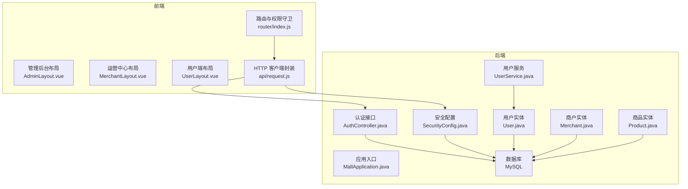
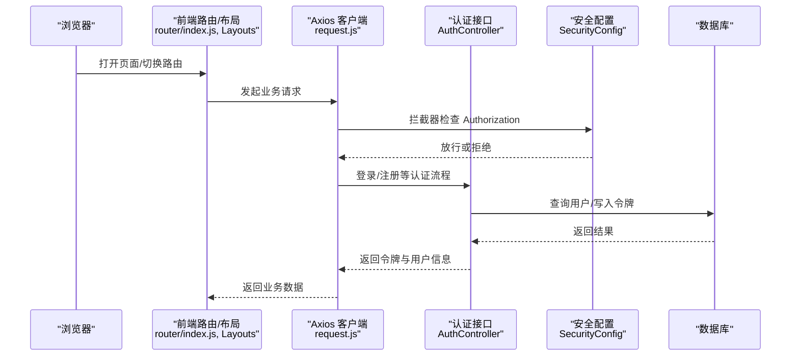
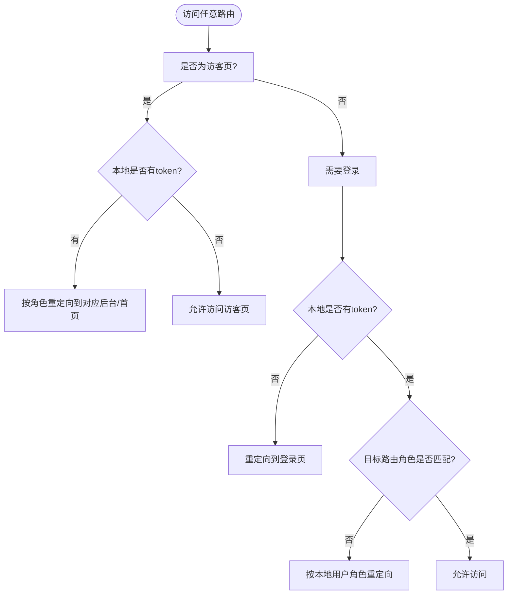
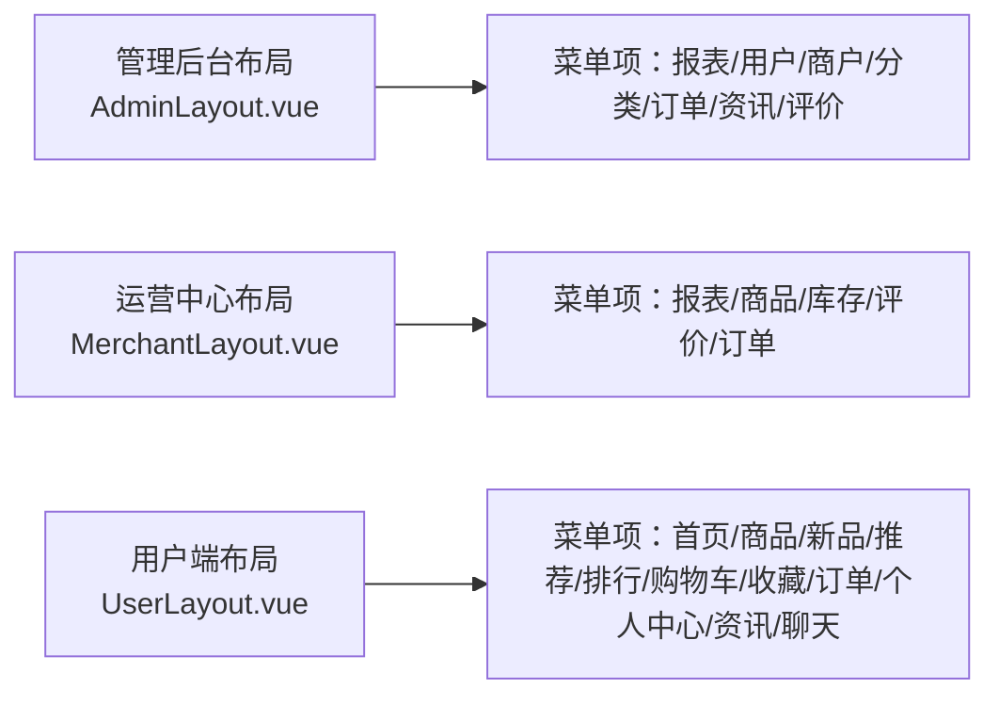
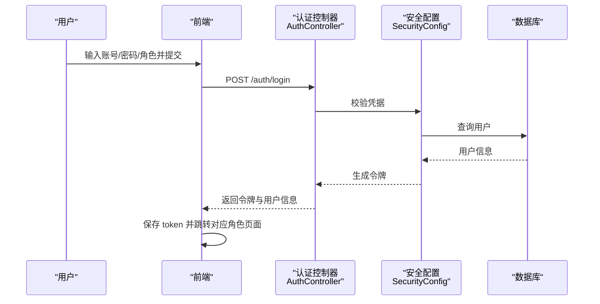
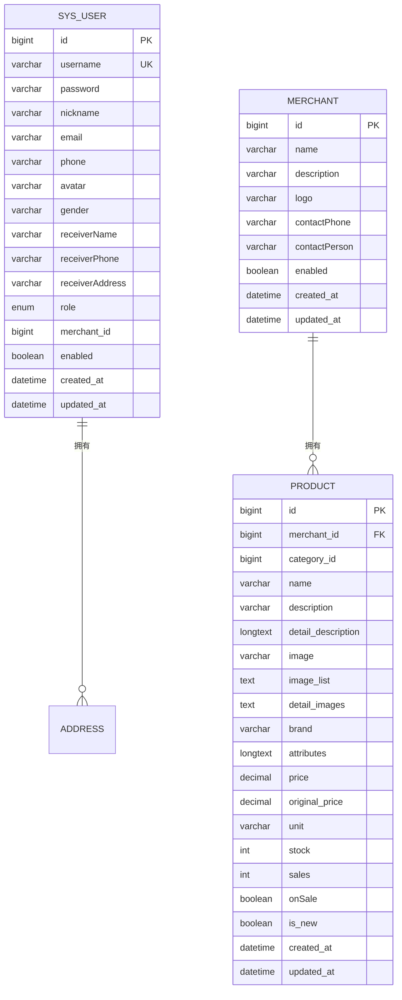
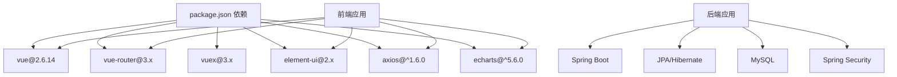

# 系统介绍与目标

<cite>
**本文引用的文件**
- [Role.java](file://backend/src/main/java/com/mall/common/Role.java)
- [MallApplication.java](file://backend/src/main/java/com/mall/MallApplication.java)
- [application.yml](file://backend/src/main/resources/application.yml)
- [SecurityConfig.java](file://backend/src/main/java/com/mall/config/SecurityConfig.java)
- [AuthController.java](file://backend/src/main/java/com/mall/controller/AuthController.java)
- [User.java](file://backend/src/main/java/com/mall/entity/User.java)
- [Merchant.java](file://backend/src/main/java/com/mall/entity/Merchant.java)
- [Product.java](file://backend/src/main/java/com/mall/entity/Product.java)
- [UserService.java](file://backend/src/main/java/com/mall/service/UserService.java)
- [AdminLayout.vue](file://frontend/src/layouts/AdminLayout.vue)
- [MerchantLayout.vue](file://frontend/src/layouts/MerchantLayout.vue)
- [UserLayout.vue](file://frontend/src/layouts/UserLayout.vue)
- [router/index.js](file://frontend/src/router/index.js)
- [request.js](file://frontend/src/api/request.js)
- [package.json](file://frontend/package.json)
</cite>

## 目录
1. [引言](#引言)
2. [项目结构](#项目结构)
3. [核心组件](#核心组件)
4. [架构总览](#架构总览)
5. [详细组件分析](#详细组件分析)
6. [依赖分析](#依赖分析)
7. [性能考虑](#性能考虑)
8. [故障排查指南](#故障排查指南)
9. [结论](#结论)
10. [附录](#附录)

## 引言
本电商商城系统旨在构建一个“多角色协同”的开放平台，围绕管理员（ADMIN）、商户（MERCHANT）与普通用户（USER）三大角色，提供从商品管理、订单交易到内容运营与用户服务的全链路能力。系统以“价值定位”为核心：为平台方提供统一治理与运营能力，为商户提供高效的商品与库存管理工具，为用户提供流畅的浏览、购买与售后服务体验。

- 设计目标
  - 多角色权限隔离与协作：通过角色路由与后端鉴权实现清晰边界。
  - 前后端分离：前端专注交互与体验，后端专注业务与数据，提升开发效率与可维护性。
  - 安全与可扩展：基于 JWT 的认证体系与 Spring Security 的细粒度授权，配合模块化控制器与服务层，便于横向扩展。
  - 数据驱动：以实体模型为中心，结合仓储与服务层，支撑商品、订单、评价、用户等核心业务。

- 核心价值主张
  - 对平台方：统一后台治理、数据看板、风控与合规能力。
  - 对商户：商品上下架、库存与销售统计、订单履约与评价管理。
  - 对用户：个性化推荐、便捷购物流程、售后与客服通道。

## 项目结构
系统采用典型的前后端分离架构：
- 后端：Spring Boot 应用，使用 JPA/Hibernate 访问 MySQL，提供 REST 接口与安全策略。
- 前端：Vue 2 应用，基于 Element-UI 组件库，通过 Axios 发起请求并与后端交互。

**图表来源**
- [MallApplication.java:1-13](file://backend/src/main/java/com/mall/MallApplication.java#L1-L13)
- [SecurityConfig.java:1-74](file://backend/src/main/java/com/mall/config/SecurityConfig.java#L1-L74)
- [AuthController.java:1-73](file://backend/src/main/java/com/mall/controller/AuthController.java#L1-L73)
- [User.java:1-88](file://backend/src/main/java/com/mall/entity/User.java#L1-L88)
- [Merchant.java:1-56](file://backend/src/main/java/com/mall/entity/Merchant.java#L1-L56)
- [Product.java:1-101](file://backend/src/main/java/com/mall/entity/Product.java#L1-L101)
- [UserService.java:1-42](file://backend/src/main/java/com/mall/service/UserService.java#L1-L42)
- [router/index.js:1-208](file://frontend/src/router/index.js#L1-L208)
- [request.js:1-38](file://frontend/src/api/request.js#L1-L38)

**章节来源**
- [MallApplication.java:1-13](file://backend/src/main/java/com/mall/MallApplication.java#L1-L13)
- [application.yml:1-36](file://backend/src/main/resources/application.yml#L1-L36)
- [router/index.js:1-208](file://frontend/src/router/index.js#L1-L208)
- [request.js:1-38](file://frontend/src/api/request.js#L1-L38)

## 核心组件
- 角色枚举与实体
  - 角色定义：ADMIN、MERCHANT、USER，用于后端授权与前端路由控制。
  - 用户实体：包含基础资料、收货信息、角色与商户关联字段等。
  - 商户实体：描述商户基本信息与状态。
  - 商品实体：描述商品属性、价格、库存、销售统计与上下架状态等。

- 安全与认证
  - 基于 Spring Security 的无状态会话策略，结合 JWT 过滤器进行请求拦截与鉴权。
  - 路由级权限：根据路径前缀（/admin、/merchant、/user）与角色绑定，未登录或角色不匹配将被重定向至登录页。

- 前后端交互
  - 前端通过统一的 Axios 实例发起请求，自动附加 Bearer Token；对 401/403 响应进行统一处理，清理本地会话并跳转登录。

**章节来源**
- [Role.java:1-8](file://backend/src/main/java/com/mall/common/Role.java#L1-L8)
- [User.java:1-88](file://backend/src/main/java/com/mall/entity/User.java#L1-L88)
- [Merchant.java:1-56](file://backend/src/main/java/com/mall/entity/Merchant.java#L1-L56)
- [Product.java:1-101](file://backend/src/main/java/com/mall/entity/Product.java#L1-L101)
- [SecurityConfig.java:1-74](file://backend/src/main/java/com/mall/config/SecurityConfig.java#L1-L74)
- [router/index.js:1-208](file://frontend/src/router/index.js#L1-L208)
- [request.js:1-38](file://frontend/src/api/request.js#L1-L38)

## 架构总览
系统采用“前端单页应用 + 后端无状态服务”的经典组合，通过 CORS 与 JWT 实现跨域与鉴权，路由与布局组件分别承载不同角色的导航与页面容器。

**图表来源**
- [router/index.js:182-205](file://frontend/src/router/index.js#L182-L205)
- [request.js:9-35](file://frontend/src/api/request.js#L9-L35)
- [SecurityConfig.java:33-54](file://backend/src/main/java/com/mall/config/SecurityConfig.java#L33-L54)
- [AuthController.java:18-71](file://backend/src/main/java/com/mall/controller/AuthController.java#L18-L71)

## 详细组件分析

### 角色与权限模型
系统通过“角色枚举 + 路由元信息 + 后端授权规则”形成闭环：
- 角色枚举：定义 ADMIN、MERCHANT、USER 三种角色。
- 前端路由：每条路由携带 meta.role 或 guest 标记，全局守卫在进入前进行登录态与角色校验。
- 后端授权：基于路径前缀与角色进行细粒度放行与限制。

**图表来源**
- [router/index.js:182-205](file://frontend/src/router/index.js#L182-L205)
- [SecurityConfig.java:39-51](file://backend/src/main/java/com/mall/config/SecurityConfig.java#L39-L51)
- [Role.java:3-7](file://backend/src/main/java/com/mall/common/Role.java#L3-L7)

**章节来源**
- [Role.java:1-8](file://backend/src/main/java/com/mall/common/Role.java#L1-L8)
- [router/index.js:6-208](file://frontend/src/router/index.js#L6-L208)
- [SecurityConfig.java:22-55](file://backend/src/main/java/com/mall/config/SecurityConfig.java#L22-L55)

### 布局与导航
- 管理后台布局：提供数据报表、用户管理、商户管理、分类管理、交易管理、资讯管理、评价管理等菜单项。
- 运营中心布局：提供数据报表、商品管理、库存管理、评价管理、交易管理等菜单项。
- 用户端布局：提供首页、全部商品、新品上架、猜您想买、销量排行、购物车、我的收藏、我的订单、个人中心、通知与资讯等导航。

**图表来源**
- [AdminLayout.vue:21-29](file://frontend/src/layouts/AdminLayout.vue#L21-L29)
- [MerchantLayout.vue:21-27](file://frontend/src/layouts/MerchantLayout.vue#L21-L27)
- [UserLayout.vue:26-37](file://frontend/src/layouts/UserLayout.vue#L26-L37)

**章节来源**
- [AdminLayout.vue:1-129](file://frontend/src/layouts/AdminLayout.vue#L1-L129)
- [MerchantLayout.vue:1-127](file://frontend/src/layouts/MerchantLayout.vue#L1-L127)
- [UserLayout.vue:1-177](file://frontend/src/layouts/UserLayout.vue#L1-L177)

### 认证与会话
- 登录接口：接收用户名、密码与角色，返回令牌与用户信息。
- 注册接口：接收用户基础资料，创建用户并返回成功信息。
- 前端请求拦截：自动附加 Authorization: Bearer token；对 401/403 响应清理本地会话并跳转登录。

**图表来源**
- [AuthController.java:18-71](file://backend/src/main/java/com/mall/controller/AuthController.java#L18-L71)
- [SecurityConfig.java:33-54](file://backend/src/main/java/com/mall/config/SecurityConfig.java#L33-L54)
- [request.js:9-16](file://frontend/src/api/request.js#L9-L16)

**章节来源**
- [AuthController.java:1-73](file://backend/src/main/java/com/mall/controller/AuthController.java#L1-L73)
- [request.js:1-38](file://frontend/src/api/request.js#L1-L38)

### 数据模型与业务要点
- 用户模型：包含基础资料、性别、头像、收货信息、角色与商户关联字段，以及创建/更新时间戳。
- 商户模型：包含名称、简介、Logo、联系方式与启用状态，以及创建/更新时间戳。
- 商品模型：包含名称、描述、图片、品牌、参数、价格、原价、单位、库存、销量、上下架状态、是否新品等。

**图表来源**
- [User.java:17-87](file://backend/src/main/java/com/mall/entity/User.java#L17-L87)
- [Merchant.java:15-55](file://backend/src/main/java/com/mall/entity/Merchant.java#L15-L55)
- [Product.java:16-99](file://backend/src/main/java/com/mall/entity/Product.java#L16-L99)

**章节来源**
- [User.java:1-88](file://backend/src/main/java/com/mall/entity/User.java#L1-L88)
- [Merchant.java:1-56](file://backend/src/main/java/com/mall/entity/Merchant.java#L1-L56)
- [Product.java:1-101](file://backend/src/main/java/com/mall/entity/Product.java#L1-L101)

## 依赖分析
- 技术栈与版本
  - 后端：Spring Boot、JPA/Hibernate、MySQL、Spring Security、JWT 工具。
  - 前端：Vue 2.6.14、Vue Router、Vuex、Element UI、Axios、ECharts。
- 关键依赖关系
  - 前端通过 Axios 实例统一请求，拦截器负责注入 Token 与错误处理。
  - 后端通过 SecurityConfig 配置 CORS、CSRF、会话策略与路径授权。
  - 应用入口 MallApplication 启动 Spring Boot 服务，暴露 /api 前缀接口。

**图表来源**
- [package.json:9-22](file://frontend/package.json#L9-L22)
- [MallApplication.java:6-12](file://backend/src/main/java/com/mall/MallApplication.java#L6-L12)
- [application.yml:4-25](file://backend/src/main/resources/application.yml#L4-L25)
- [SecurityConfig.java:22-55](file://backend/src/main/java/com/mall/config/SecurityConfig.java#L22-L55)

**章节来源**
- [package.json:1-24](file://frontend/package.json#L1-L24)
- [application.yml:1-36](file://backend/src/main/resources/application.yml#L1-L36)

## 性能考虑
- 前端
  - 使用路由懒加载与按需组件加载，减少首屏体积。
  - 统一的请求拦截器与错误处理，避免重复逻辑与异常泄漏。
- 后端
  - 无状态会话与数据库连接池配置，降低长连接占用。
  - 合理的实体字段长度与索引设计，提升查询效率。
- 可扩展性
  - 控制器按角色拆分（admin、merchant、pub、user），便于独立演进。
  - 服务层抽象用户、商品、订单等核心领域，利于单元测试与替换实现。

## 故障排查指南
- 登录后无法访问对应角色页面
  - 检查前端路由守卫是否正确识别本地用户角色与 token。
  - 确认后端 SecurityConfig 是否对 /admin、/merchant、/user 路径进行了角色放行。
- 401/403 错误
  - 前端拦截器会自动清理本地 token 并跳转登录页；确认后端 JWT 配置与签名密钥一致。
- 图片上传与静态资源
  - 确认后端静态资源映射与 /images/** 路径放行策略。
- CORS 问题
  - 检查前端开发服务器与后端 CORS 配置是否允许本地调试域名。

**章节来源**
- [router/index.js:182-205](file://frontend/src/router/index.js#L182-L205)
- [SecurityConfig.java:33-67](file://backend/src/main/java/com/mall/config/SecurityConfig.java#L33-L67)
- [request.js:18-35](file://frontend/src/api/request.js#L18-L35)
- [application.yml:18-25](file://backend/src/main/resources/application.yml#L18-L25)

## 结论
本系统以“多角色协同”为核心，通过前后端分离与安全鉴权机制，实现了平台治理、商户运营与用户服务的有机统一。其模块化设计与清晰的角色边界，既满足了当前业务需求，也为后续的功能扩展与性能优化提供了良好基础。

## 附录
- 业务场景与目标用户
  - 平台方：需要统一的数据看板、用户与商户管理、订单与评价治理。
  - 商户：需要商品与库存管理、销售统计、订单处理与评价反馈。
  - 用户：需要便捷的商品浏览、搜索与购买、订单与收藏管理、资讯与客服互动。
- 技术选型背景
  - 前端采用 Vue 生态，强调组件化与路由权限控制；后端采用 Spring 生态，强调安全与数据持久化。
- 架构设计理念
  - 前后端分离提升开发效率与用户体验；无状态会话与细粒度授权保障系统安全与可维护性。