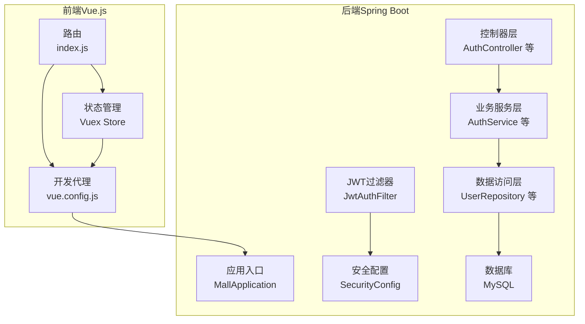
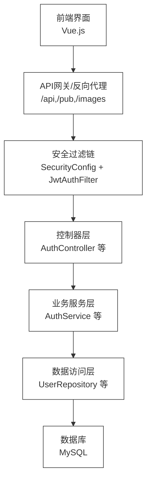
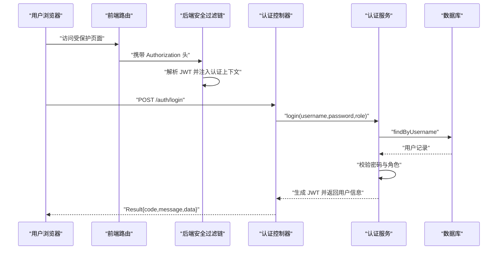
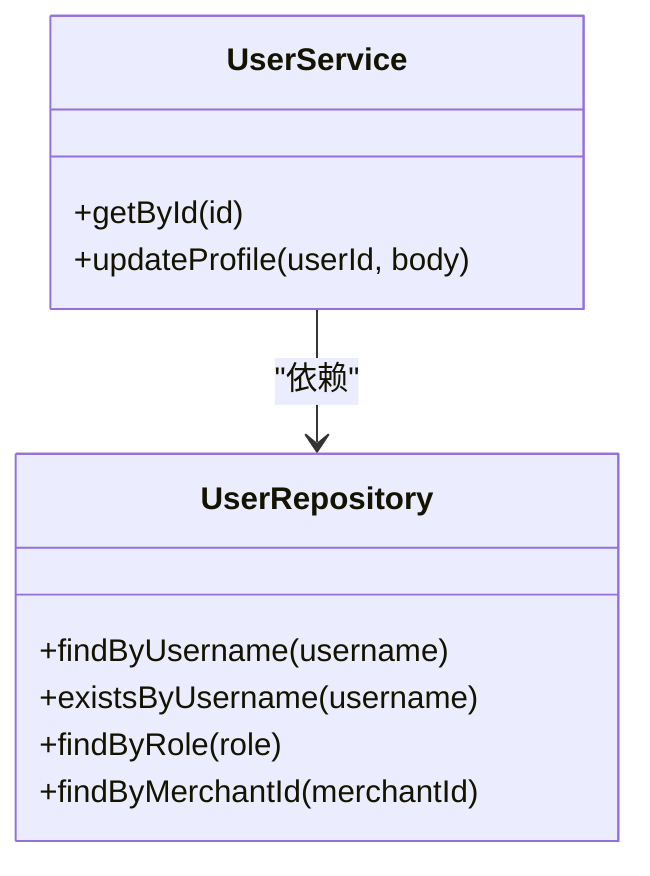
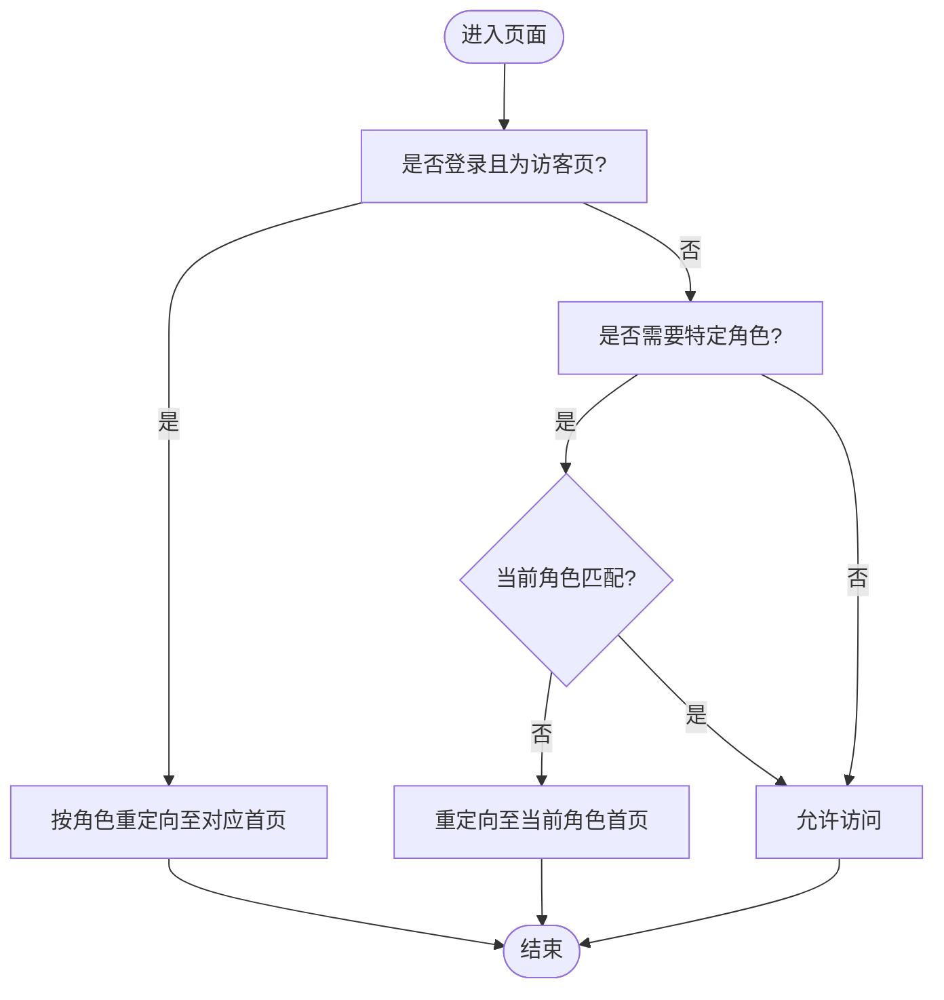
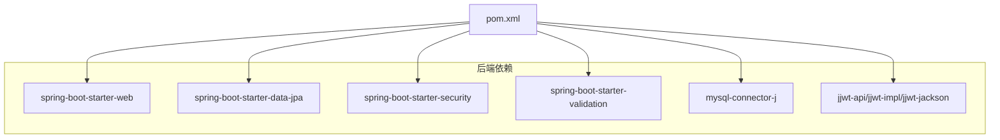

# 系统架构设计

<cite>
**本文引用的文件**
- [MallApplication.java](file://backend/src/main/java/com/mall/MallApplication.java)
- [application.yml](file://backend/src/main/resources/application.yml)
- [pom.xml](file://backend/pom.xml)
- [SecurityConfig.java](file://backend/src/main/java/com/mall/config/SecurityConfig.java)
- [JwtAuthFilter.java](file://backend/src/main/java/com/mall/security/JwtAuthFilter.java)
- [AuthController.java](file://backend/src/main/java/com/mall/controller/AuthController.java)
- [AuthService.java](file://backend/src/main/java/com/mall/service/AuthService.java)
- [UserService.java](file://backend/src/main/java/com/mall/service/UserService.java)
- [UserRepository.java](file://backend/src/main/java/com/mall/repository/UserRepository.java)
- [Result.java](file://backend/src/main/java/com/mall/dto/Result.java)
- [GlobalExceptionHandler.java](file://backend/src/main/java/com/mall/exception/GlobalExceptionHandler.java)
- [package.json](file://frontend/package.json)
- [vue.config.js](file://frontend/vue.config.js)
- [index.js（前端路由）](file://frontend/src/router/index.js)
- [index.js（前端Vuex）](file://frontend/src/store/index.js)
</cite>

## 目录
1. [引言](#引言)
2. [项目结构](#项目结构)
3. [核心组件](#核心组件)
4. [架构总览](#架构总览)
5. [详细组件分析](#详细组件分析)
6. [依赖分析](#依赖分析)
7. [性能考虑](#性能考虑)
8. [故障排查指南](#故障排查指南)
9. [结论](#结论)
10. [附录](#附录)

## 引言
本文件面向电商商城系统，基于“前端 Vue.js + 后端 Spring Boot”的前后端分离架构，给出系统架构设计文档。重点阐述三层架构（表现层、业务层、数据层）、MVC 分层与模块化组织、微服务演进思路与单体应用优势、JWT 认证机制在整体架构中的位置与作用、数据流向与组件交互模式（含 API 设计原则、错误处理与安全控制策略），并提供架构图与组件关系图以帮助读者快速把握系统全貌。

## 项目结构
系统采用典型的前后端分离工程布局：
- 后端（Spring Boot）：使用 Maven 构建，集中于 com.mall 包下，按领域与职责划分为 controller、service、repository、entity、dto、config、security、exception 等包，体现清晰的 MVC 分层与领域模型组织。
- 前端（Vue.js 2.x）：通过 Vue CLI 构建，采用路由分角色（用户/商户/管理）与 Vuex 管理登录态，开发服务器通过代理将 /api、/pub、/images 请求转发至后端。

图表来源
- [MallApplication.java:1-13](file://backend/src/main/java/com/mall/MallApplication.java#L1-L13)
- [SecurityConfig.java:1-74](file://backend/src/main/java/com/mall/config/SecurityConfig.java#L1-L74)
- [JwtAuthFilter.java:1-57](file://backend/src/main/java/com/mall/security/JwtAuthFilter.java#L1-L57)
- [AuthController.java:1-73](file://backend/src/main/java/com/mall/controller/AuthController.java#L1-L73)
- [AuthService.java:1-92](file://backend/src/main/java/com/mall/service/AuthService.java#L1-L92)
- [UserRepository.java:1-20](file://backend/src/main/java/com/mall/repository/UserRepository.java#L1-L20)
- [vue.config.js:1-20](file://frontend/vue.config.js#L1-L20)
- [index.js（前端路由）:1-208](file://frontend/src/router/index.js#L1-L208)
- [index.js（前端Vuex）:1-31](file://frontend/src/store/index.js#L1-L31)

章节来源
- [MallApplication.java:1-13](file://backend/src/main/java/com/mall/MallApplication.java#L1-L13)
- [application.yml:1-36](file://backend/src/main/resources/application.yml#L1-L36)
- [pom.xml:1-107](file://backend/pom.xml#L1-L107)
- [package.json:1-24](file://frontend/package.json#L1-L24)
- [vue.config.js:1-20](file://frontend/vue.config.js#L1-L20)
- [index.js（前端路由）:1-208](file://frontend/src/router/index.js#L1-L208)
- [index.js（前端Vuex）:1-31](file://frontend/src/store/index.js#L1-L31)

## 核心组件
- 应用入口与配置
  - 后端应用入口负责启动 Spring Boot 应用。
  - 配置文件定义数据源、JPA、服务器端口与上下文路径、JWT 密钥与过期时间、日志级别等。
  - Maven 依赖包含 Web、JPA、Security、Validation、MySQL Connector、JWT 以及 Lombok 等。
- 安全与认证
  - 安全配置启用 CORS、禁用 CSRF、设置会话策略为无状态，按角色开放公开接口并保护受控接口，注入 JWT 过滤器。
  - JWT 过滤器从请求头解析 Bearer Token，解析失败则放行但不认证。
  - 认证控制器提供登录与注册接口，返回统一结果对象。
  - 认证服务完成用户校验、角色匹配、商户启用状态校验与 JWT 签发。
- 控制器与服务
  - 控制器层负责接收请求、参数校验与调用服务层。
  - 服务层封装业务规则，如用户资料更新、认证流程等。
  - 数据访问层基于 JPA 接口，提供查询与保存能力。
- 前端
  - 路由按角色划分用户、商户、管理后台，全局前置守卫进行登录态与角色校验。
  - Vuex 管理用户信息与令牌持久化到本地存储。
  - 开发代理将 /api、/pub、/images 请求转发至后端。

章节来源
- [application.yml:1-36](file://backend/src/main/resources/application.yml#L1-L36)
- [pom.xml:1-107](file://backend/pom.xml#L1-L107)
- [SecurityConfig.java:1-74](file://backend/src/main/java/com/mall/config/SecurityConfig.java#L1-L74)
- [JwtAuthFilter.java:1-57](file://backend/src/main/java/com/mall/security/JwtAuthFilter.java#L1-L57)
- [AuthController.java:1-73](file://backend/src/main/java/com/mall/controller/AuthController.java#L1-L73)
- [AuthService.java:1-92](file://backend/src/main/java/com/mall/service/AuthService.java#L1-L92)
- [UserService.java:1-42](file://backend/src/main/java/com/mall/service/UserService.java#L1-L42)
- [UserRepository.java:1-20](file://backend/src/main/java/com/mall/repository/UserRepository.java#L1-L20)
- [Result.java:1-24](file://backend/src/main/java/com/mall/dto/Result.java#L1-L24)
- [GlobalExceptionHandler.java:1-20](file://backend/src/main/java/com/mall/exception/GlobalExceptionHandler.java#L1-L20)
- [vue.config.js:1-20](file://frontend/vue.config.js#L1-L20)
- [index.js（前端路由）:1-208](file://frontend/src/router/index.js#L1-L208)
- [index.js（前端Vuex）:1-31](file://frontend/src/store/index.js#L1-L31)

## 架构总览
系统采用三层架构与前后端分离：
- 表现层（前端 Vue.js）：负责页面渲染、用户交互、路由与状态管理，通过 Axios 发起 API 请求，开发阶段经代理转发至后端。
- 业务层（后端 Spring Boot）：负责业务编排、安全控制、数据访问与统一响应包装。
- 数据层（数据库）：MySQL 存储用户、商品、订单等实体数据，JPA 提供 ORM 能力。

图表来源
- [SecurityConfig.java:34-55](file://backend/src/main/java/com/mall/config/SecurityConfig.java#L34-L55)
- [JwtAuthFilter.java:30-47](file://backend/src/main/java/com/mall/security/JwtAuthFilter.java#L30-L47)
- [AuthController.java:18-35](file://backend/src/main/java/com/mall/controller/AuthController.java#L18-L35)
- [AuthService.java:28-59](file://backend/src/main/java/com/mall/service/AuthService.java#L28-L59)
- [UserRepository.java:12-14](file://backend/src/main/java/com/mall/repository/UserRepository.java#L12-L14)
- [vue.config.js:4-17](file://frontend/vue.config.js#L4-L17)

## 详细组件分析

### 安全与认证组件
- 角色与权限
  - 后端通过请求路径前缀区分用户、商户、管理员接口，并结合角色注解进行方法级安全控制。
  - 前端路由根据用户角色进行导航限制与重定向。
- JWT 机制
  - 登录成功后签发包含用户标识、用户名、角色等声明的令牌；前端将令牌写入本地存储并在后续请求头携带。
  - 过滤器解析令牌并注入认证上下文，供授权与审计使用。
- 统一响应与异常处理
  - 所有接口返回统一 Result 结构；全局异常处理器将运行时异常转换为业务失败响应，避免前端暴露内部错误细节。

图表来源
- [SecurityConfig.java:39-53](file://backend/src/main/java/com/mall/config/SecurityConfig.java#L39-L53)
- [JwtAuthFilter.java:30-47](file://backend/src/main/java/com/mall/security/JwtAuthFilter.java#L30-L47)
- [AuthController.java:18-35](file://backend/src/main/java/com/mall/controller/AuthController.java#L18-L35)
- [AuthService.java:28-59](file://backend/src/main/java/com/mall/service/AuthService.java#L28-L59)
- [UserRepository.java:12-14](file://backend/src/main/java/com/mall/repository/UserRepository.java#L12-L14)
- [Result.java:16-22](file://backend/src/main/java/com/mall/dto/Result.java#L16-L22)

章节来源
- [SecurityConfig.java:1-74](file://backend/src/main/java/com/mall/config/SecurityConfig.java#L1-L74)
- [JwtAuthFilter.java:1-57](file://backend/src/main/java/com/mall/security/JwtAuthFilter.java#L1-L57)
- [AuthController.java:1-73](file://backend/src/main/java/com/mall/controller/AuthController.java#L1-L73)
- [AuthService.java:1-92](file://backend/src/main/java/com/mall/service/AuthService.java#L1-L92)
- [Result.java:1-24](file://backend/src/main/java/com/mall/dto/Result.java#L1-L24)
- [GlobalExceptionHandler.java:1-20](file://backend/src/main/java/com/mall/exception/GlobalExceptionHandler.java#L1-L20)
- [index.js（前端路由）:182-205](file://frontend/src/router/index.js#L182-L205)
- [index.js（前端Vuex）:6-31](file://frontend/src/store/index.js#L6-L31)

### 数据模型与仓储
- 实体与仓库
  - UserRepository 提供按用户名、是否存在、角色、商户 ID 查询等方法，支撑认证与用户管理功能。
  - 其他领域仓库（如 Product、Order、Banner 等）遵循相同模式，均继承 JPA 基础能力。
- 数据一致性与事务
  - 服务层对需要修改的操作使用事务注解，确保业务原子性。

图表来源
- [UserRepository.java:10-19](file://backend/src/main/java/com/mall/repository/UserRepository.java#L10-L19)
- [UserService.java:14-42](file://backend/src/main/java/com/mall/service/UserService.java#L14-L42)

章节来源
- [UserRepository.java:1-20](file://backend/src/main/java/com/mall/repository/UserRepository.java#L1-L20)
- [UserService.java:1-42](file://backend/src/main/java/com/mall/service/UserService.java#L1-L42)

### 前端交互与路由
- 路由分层
  - 用户、商户、管理后台分别对应不同布局与子路由，支持商品浏览、购物车、订单、收藏、公告、聊天等场景。
- 登录态与角色守卫
  - 全局前置守卫读取本地存储中的用户信息，未登录或角色不匹配时重定向至登录页或对应角色首页。
- 开发代理
  - 将 /api、/pub、/images 请求转发至后端，便于前后端联调。

图表来源
- [index.js（前端路由）:182-205](file://frontend/src/router/index.js#L182-L205)
- [index.js（前端Vuex）:8-20](file://frontend/src/store/index.js#L8-L20)
- [vue.config.js:4-17](file://frontend/vue.config.js#L4-L17)

章节来源
- [index.js（前端路由）:1-208](file://frontend/src/router/index.js#L1-L208)
- [index.js（前端Vuex）:1-31](file://frontend/src/store/index.js#L1-L31)
- [vue.config.js:1-20](file://frontend/vue.config.js#L1-L20)

## 依赖分析
- 技术栈与版本
  - 后端：Spring Boot 3.4.1、Java 17、Spring Security、Spring Data JPA、MySQL Connector、JWT（jjwt）。
  - 前端：Vue 2.6.14、Vue Router、Vuex、Axios、Element UI。
- 关键外部依赖
  - 后端通过 Maven 管理依赖，引入 Web、JPA、Security、Validation、MySQL 驱动与 JWT 实现。
  - 前端通过 npm 管理依赖，构建脚本与开发代理配置清晰。

图表来源
- [pom.xml:19-74](file://backend/pom.xml#L19-L74)

章节来源
- [pom.xml:1-107](file://backend/pom.xml#L1-L107)
- [package.json:1-24](file://frontend/package.json#L1-L24)

## 性能考虑
- 无状态认证：JWT 无状态特性降低服务端会话开销，适合水平扩展。
- 代理与跨域：开发阶段通过代理减少跨域问题；生产环境建议在网关层统一处理 CORS 与限流。
- 数据访问：合理使用 JPA 查询方法与分页，避免 N+1 查询；对热点数据可引入缓存（如 Redis）。
- 日志与监控：开启必要的日志级别，结合 APM 工具定位性能瓶颈。
- 前端优化：按需加载组件与路由，减少首屏体积；图片资源走静态资源服务。

## 故障排查指南
- 登录失败
  - 检查用户名是否存在、密码是否匹配、角色是否正确、商户启用状态是否正常。
  - 查看后端日志与全局异常处理器返回的业务错误信息。
- 403/401 权限问题
  - 确认请求头是否包含有效的 Bearer 令牌；检查角色是否匹配目标接口。
  - 核对安全配置中放行规则与受控路径。
- 跨域与代理
  - 确认前端代理配置是否指向后端地址；检查后端 CORS 配置允许的来源与方法。
- 统一响应
  - 所有接口返回 Result 结构，前端应统一解析 code/message/data 字段，避免直接显示异常堆栈。

章节来源
- [AuthService.java:28-59](file://backend/src/main/java/com/mall/service/AuthService.java#L28-L59)
- [SecurityConfig.java:39-53](file://backend/src/main/java/com/mall/config/SecurityConfig.java#L39-L53)
- [GlobalExceptionHandler.java:13-17](file://backend/src/main/java/com/mall/exception/GlobalExceptionHandler.java#L13-L17)
- [Result.java:16-22](file://backend/src/main/java/com/mall/dto/Result.java#L16-L22)
- [vue.config.js:4-17](file://frontend/vue.config.js#L4-L17)

## 结论
该电商商城系统采用成熟的前后端分离架构，后端以 Spring Boot 实现 MVC 分层与领域驱动，前端以 Vue.js 构建多角色界面，配合 JWT 无状态认证与 Spring Security 的统一安全控制，形成清晰、可维护、易扩展的整体方案。对于未来演进，可在保持单体应用敏捷性的基础上，逐步拆分出独立微服务（如订单、支付、商品、用户中心），并引入 API 网关、消息队列与缓存体系，持续提升性能与可靠性。

## 附录
- API 设计原则
  - 统一响应结构：所有接口返回 Result{code,message,data}。
  - 路径规范：/api 为受控接口前缀，/pub 为公开接口前缀，/images 为静态资源前缀。
  - 错误处理：运行时异常统一转为业务失败响应，避免泄露内部错误。
- 安全控制策略
  - 无状态会话：禁用会话，使用 JWT。
  - 方法级安全：按角色开放接口，受控接口要求认证。
  - CORS：仅允许指定来源，支持常用方法与凭据。
- 微服务演进思路
  - 单体优势：开发效率高、部署简单、内聚性强。
  - 演进步骤：先沉淀公共能力（认证、日志、监控），再按业务域拆分服务，引入网关与消息中间件，最后落地容器化与 CI/CD。