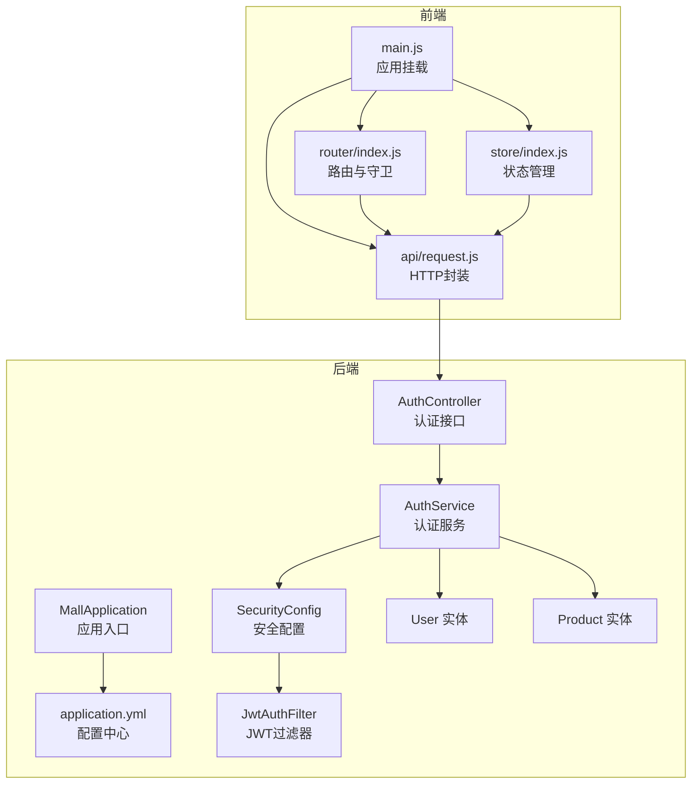
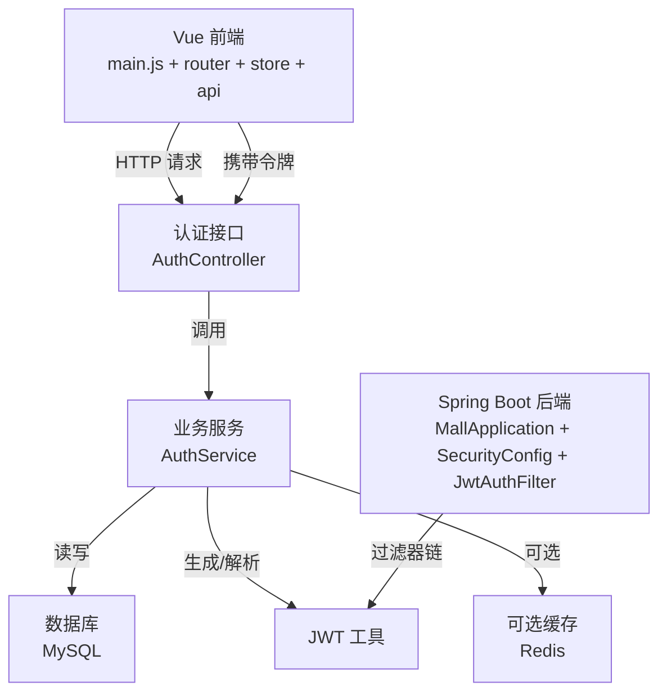
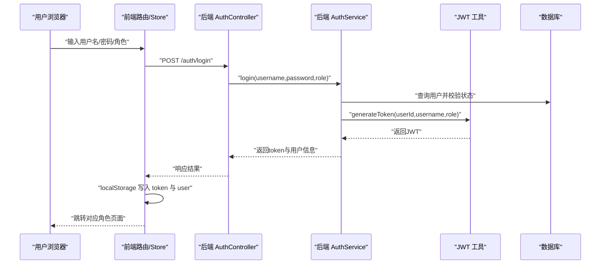
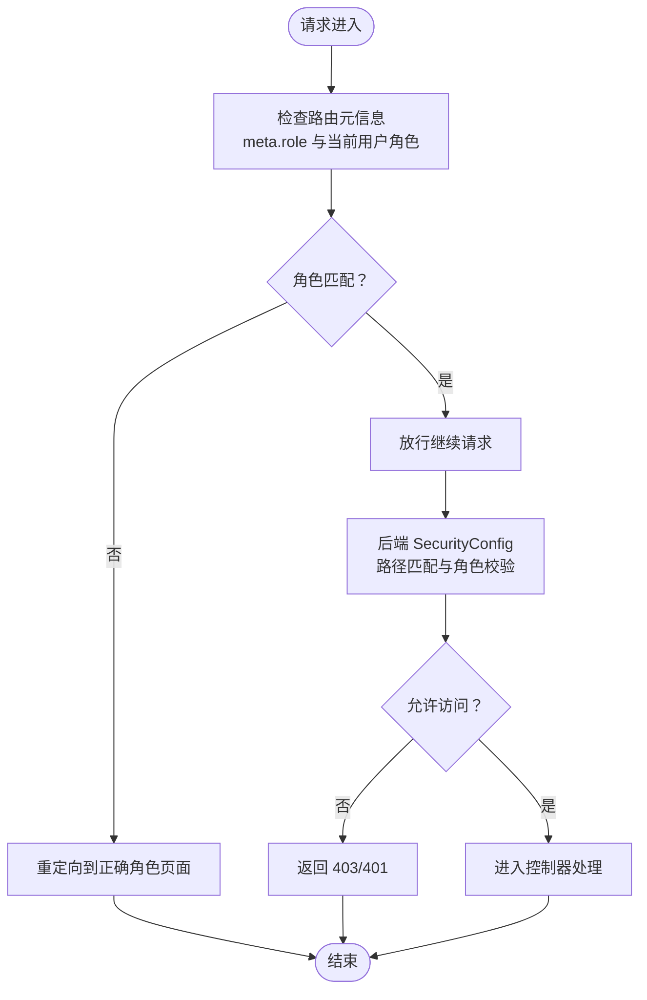
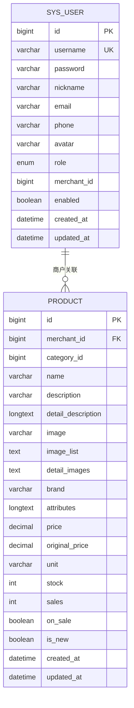
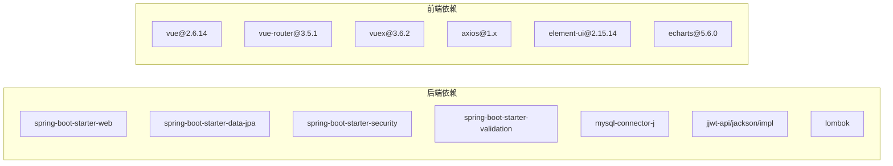

# 项目概述

<cite>
**本文引用的文件**
- [MallApplication.java](file://backend/src/main/java/com/mall/MallApplication.java)
- [pom.xml](file://backend/pom.xml)
- [application.yml](file://backend/src/main/resources/application.yml)
- [Role.java](file://backend/src/main/java/com/mall/common/Role.java)
- [SecurityConfig.java](file://backend/src/main/java/com/mall/config/SecurityConfig.java)
- [JwtAuthFilter.java](file://backend/src/main/java/com/mall/security/JwtAuthFilter.java)
- [AuthController.java](file://backend/src/main/java/com/mall/controller/AuthController.java)
- [AuthService.java](file://backend/src/main/java/com/mall/service/AuthService.java)
- [User.java](file://backend/src/main/java/com/mall/entity/User.java)
- [Product.java](file://backend/src/main/java/com/mall/entity/Product.java)
- [index.js](file://frontend/src/router/index.js)
- [main.js](file://frontend/src/main.js)
- [request.js](file://frontend/src/api/request.js)
- [index.js](file://frontend/src/store/index.js)
- [package.json](file://frontend/package.json)
</cite>

## 目录
1. [引言](#引言)
2. [项目结构](#项目结构)
3. [核心组件](#核心组件)
4. [架构总览](#架构总览)
5. [详细组件分析](#详细组件分析)
6. [依赖分析](#依赖分析)
7. [性能考虑](#性能考虑)
8. [故障排查指南](#故障排查指南)
9. [结论](#结论)
10. [附录](#附录)

## 引言
本项目是一个基于 Spring Boot 与 Vue.js 的电商商城系统，采用前后端分离架构，支持多角色体系（管理员、商户、普通用户）。系统提供完整的电商功能模块，包括商品管理、订单与支付、用户与地址、收藏与购物车、评论与公告等。项目通过 JWT 实现无状态认证与授权，结合 Spring Security 提供细粒度的访问控制；前端使用 Vue 2 + Element UI 构建多角色界面，配合路由守卫实现权限导航。

本概述面向初学者解释电商系统的基本概念，同时为有经验的开发者提供架构决策的技术细节与实现参考。

## 项目结构
项目采用典型的前后端分离目录组织方式：
- 后端（Spring Boot）：位于 backend 目录，包含控制器、服务、数据访问层、安全配置、实体与资源文件。
- 前端（Vue.js）：位于 frontend 目录，包含路由、状态管理、API 封装、布局与视图组件。

图表来源
- [MallApplication.java:1-13](file://backend/src/main/java/com/mall/MallApplication.java#L1-L13)
- [application.yml:1-36](file://backend/src/main/resources/application.yml#L1-L36)
- [SecurityConfig.java:1-74](file://backend/src/main/java/com/mall/config/SecurityConfig.java#L1-L74)
- [JwtAuthFilter.java:1-57](file://backend/src/main/java/com/mall/security/JwtAuthFilter.java#L1-L57)
- [AuthController.java:1-73](file://backend/src/main/java/com/mall/controller/AuthController.java#L1-L73)
- [AuthService.java:1-92](file://backend/src/main/java/com/mall/service/AuthService.java#L1-L92)
- [User.java:1-88](file://backend/src/main/java/com/mall/entity/User.java#L1-L88)
- [Product.java:1-101](file://backend/src/main/java/com/mall/entity/Product.java#L1-L101)
- [main.js:1-20](file://frontend/src/main.js#L1-L20)
- [index.js:1-208](file://frontend/src/router/index.js#L1-L208)
- [index.js:1-31](file://frontend/src/store/index.js#L1-L31)
- [request.js:1-38](file://frontend/src/api/request.js#L1-L38)

章节来源
- [MallApplication.java:1-13](file://backend/src/main/java/com/mall/MallApplication.java#L1-L13)
- [application.yml:1-36](file://backend/src/main/resources/application.yml#L1-L36)
- [main.js:1-20](file://frontend/src/main.js#L1-L20)
- [index.js:1-208](file://frontend/src/router/index.js#L1-L208)
- [index.js:1-31](file://frontend/src/store/index.js#L1-L31)
- [request.js:1-38](file://frontend/src/api/request.js#L1-L38)

## 核心组件
- 多角色枚举与权限模型
  - 角色定义：管理员、商户、普通用户，用于后端接口与前端路由的权限控制。
- 安全与认证
  - 基于 Spring Security 的无状态安全策略，启用 CORS、禁用 CSRF、设置会话策略为无状态。
  - JWT 过滤器解析请求头中的令牌，构建认证上下文，支持按角色路径访问控制。
- 认证服务
  - 登录：校验用户状态、密码匹配、角色一致性与商户启用状态，签发 JWT 并返回用户信息。
  - 注册：校验用户名唯一性，对密码进行编码后保存为普通用户。
- 数据模型
  - 用户实体：包含基础信息、角色、收货人信息、运营关联字段等。
  - 商品实体：包含名称、描述、图片、价格、库存、销量、上下架状态等。
- 前端集成
  - 路由按角色划分，全局前置守卫校验登录态与角色匹配。
  - 状态管理持久化用户信息与令牌，HTTP 封装统一添加 Authorization 头并处理 401/403。

章节来源
- [Role.java:1-8](file://backend/src/main/java/com/mall/common/Role.java#L1-L8)
- [SecurityConfig.java:1-74](file://backend/src/main/java/com/mall/config/SecurityConfig.java#L1-L74)
- [JwtAuthFilter.java:1-57](file://backend/src/main/java/com/mall/security/JwtAuthFilter.java#L1-L57)
- [AuthService.java:1-92](file://backend/src/main/java/com/mall/service/AuthService.java#L1-L92)
- [User.java:1-88](file://backend/src/main/java/com/mall/entity/User.java#L1-L88)
- [Product.java:1-101](file://backend/src/main/java/com/mall/entity/Product.java#L1-L101)
- [index.js:1-208](file://frontend/src/router/index.js#L1-L208)
- [index.js:1-31](file://frontend/src/store/index.js#L1-L31)
- [request.js:1-38](file://frontend/src/api/request.js#L1-L38)

## 架构总览
系统采用前后端分离架构，后端以 Spring Boot 提供 REST 接口，前端通过 Axios 发起请求并携带 JWT。安全层在后端通过过滤器链完成认证与授权，前端通过路由守卫与状态管理保障用户体验与安全性。

图表来源
- [main.js:1-20](file://frontend/src/main.js#L1-L20)
- [index.js:1-208](file://frontend/src/router/index.js#L1-L208)
- [request.js:1-38](file://frontend/src/api/request.js#L1-L38)
- [MallApplication.java:1-13](file://backend/src/main/java/com/mall/MallApplication.java#L1-L13)
- [SecurityConfig.java:1-74](file://backend/src/main/java/com/mall/config/SecurityConfig.java#L1-L74)
- [JwtAuthFilter.java:1-57](file://backend/src/main/java/com/mall/security/JwtAuthFilter.java#L1-L57)
- [AuthController.java:1-73](file://backend/src/main/java/com/mall/controller/AuthController.java#L1-L73)
- [AuthService.java:1-92](file://backend/src/main/java/com/mall/service/AuthService.java#L1-L92)

## 详细组件分析

### 认证与授权流程
该流程展示从前端登录到后端签发令牌再到前端存储与使用的完整过程。

图表来源
- [AuthController.java:1-73](file://backend/src/main/java/com/mall/controller/AuthController.java#L1-L73)
- [AuthService.java:1-92](file://backend/src/main/java/com/mall/service/AuthService.java#L1-L92)
- [request.js:1-38](file://frontend/src/api/request.js#L1-L38)
- [index.js:1-31](file://frontend/src/store/index.js#L1-L31)

章节来源
- [AuthController.java:1-73](file://backend/src/main/java/com/mall/controller/AuthController.java#L1-L73)
- [AuthService.java:1-92](file://backend/src/main/java/com/mall/service/AuthService.java#L1-L92)
- [request.js:1-38](file://frontend/src/api/request.js#L1-L38)
- [index.js:1-31](file://frontend/src/store/index.js#L1-L31)

### 多角色权限控制
系统通过后端路径前缀与前端路由元信息共同实现角色级访问控制。

图表来源
- [SecurityConfig.java:1-74](file://backend/src/main/java/com/mall/config/SecurityConfig.java#L1-L74)
- [index.js:1-208](file://frontend/src/router/index.js#L1-L208)

章节来源
- [SecurityConfig.java:1-74](file://backend/src/main/java/com/mall/config/SecurityConfig.java#L1-L74)
- [index.js:1-208](file://frontend/src/router/index.js#L1-L208)

### 数据模型与关系
系统核心实体围绕用户与商品展开，体现电商基本业务关系。

图表来源
- [User.java:1-88](file://backend/src/main/java/com/mall/entity/User.java#L1-L88)
- [Product.java:1-101](file://backend/src/main/java/com/mall/entity/Product.java#L1-L101)

章节来源
- [User.java:1-88](file://backend/src/main/java/com/mall/entity/User.java#L1-L88)
- [Product.java:1-101](file://backend/src/main/java/com/mall/entity/Product.java#L1-L101)

## 依赖分析
后端依赖以 Spring Boot 3.4.1 为核心，引入 Web、JPA、Security、Validation、MySQL Connector 与 JWT 库；前端使用 Vue 2、Element UI、Vuex 与 Vue Router，并通过 Axios 进行 HTTP 通信。

图表来源
- [pom.xml:1-107](file://backend/pom.xml#L1-L107)
- [package.json:1-24](file://frontend/package.json#L1-L24)

章节来源
- [pom.xml:1-107](file://backend/pom.xml#L1-L107)
- [package.json:1-24](file://frontend/package.json#L1-L24)

## 性能考虑
- 无状态认证：JWT 使服务端无需维护会话，降低扩展复杂度。
- 数据库连接与方言：配置 MySQL 方言与 DDL 自动更新，便于开发环境快速迭代；生产建议关闭自动更新并使用迁移工具。
- 日志级别：后端对包 com.mall 与 Spring Security 设置日志级别，便于问题定位。
- 前端静态资源：后端配置静态资源映射，减少不必要的后端处理。
- 可选缓存：可在商品列表、热门推荐等场景引入 Redis 缓存热点数据。

章节来源
- [application.yml:1-36](file://backend/src/main/resources/application.yml#L1-L36)

## 故障排查指南
- 登录失败
  - 检查用户名是否存在且账户启用；确认密码匹配；核对所选角色与用户角色一致；若为商户，确认其运营主体启用状态。
- 401/403 错误
  - 前端：确认本地 token 是否存在且未过期；查看请求拦截器是否正确附加 Authorization 头；检查响应拦截器是否触发了登出逻辑。
  - 后端：确认 SecurityConfig 中路径白名单与角色路径规则；检查 JwtAuthFilter 是否正确解析令牌；核对角色前缀是否为 ROLE_。
- 跨域问题
  - 确认前端运行端口与后端允许的 CORS 来源一致；检查请求方法与头部是否在允许列表中。
- 数据库连接
  - 检查 application.yml 中的数据库 URL、用户名、密码与驱动类名；确认 MySQL 服务可用。

章节来源
- [AuthService.java:1-92](file://backend/src/main/java/com/mall/service/AuthService.java#L1-L92)
- [request.js:1-38](file://frontend/src/api/request.js#L1-L38)
- [SecurityConfig.java:1-74](file://backend/src/main/java/com/mall/config/SecurityConfig.java#L1-L74)
- [JwtAuthFilter.java:1-57](file://backend/src/main/java/com/mall/security/JwtAuthFilter.java#L1-L57)
- [application.yml:1-36](file://backend/src/main/resources/application.yml#L1-L36)

## 结论
本项目以清晰的多角色架构与前后端分离设计，提供了电商系统的核心能力与可扩展性。后端通过 Spring Security 与 JWT 实现安全可控的认证授权，前端通过路由守卫与状态管理保障用户体验。建议在生产环境中完善缓存策略、接入数据库迁移工具与可观测性方案，持续提升系统稳定性与性能。

## 附录
- 技术栈选择理由
  - Spring Boot：成熟的企业级 Java 微服务框架，生态完善，适合快速搭建 REST 服务。
  - Vue.js：轻量易用的渐进式前端框架，适合多角色界面与组件化开发。
  - Spring Security + JWT：无状态认证，便于水平扩展与跨域部署。
  - MySQL + JPA：稳定的关系型数据库与 ORM 映射，适合中小规模业务。
  - Element UI：成熟的桌面端 UI 组件库，提升开发效率与一致性。